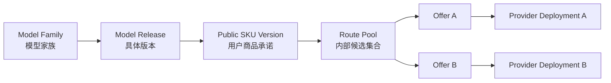
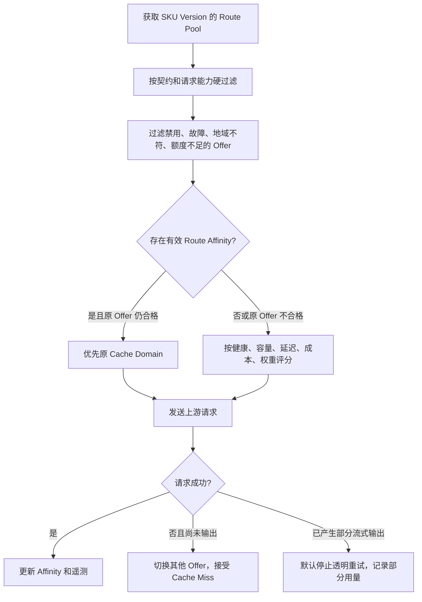
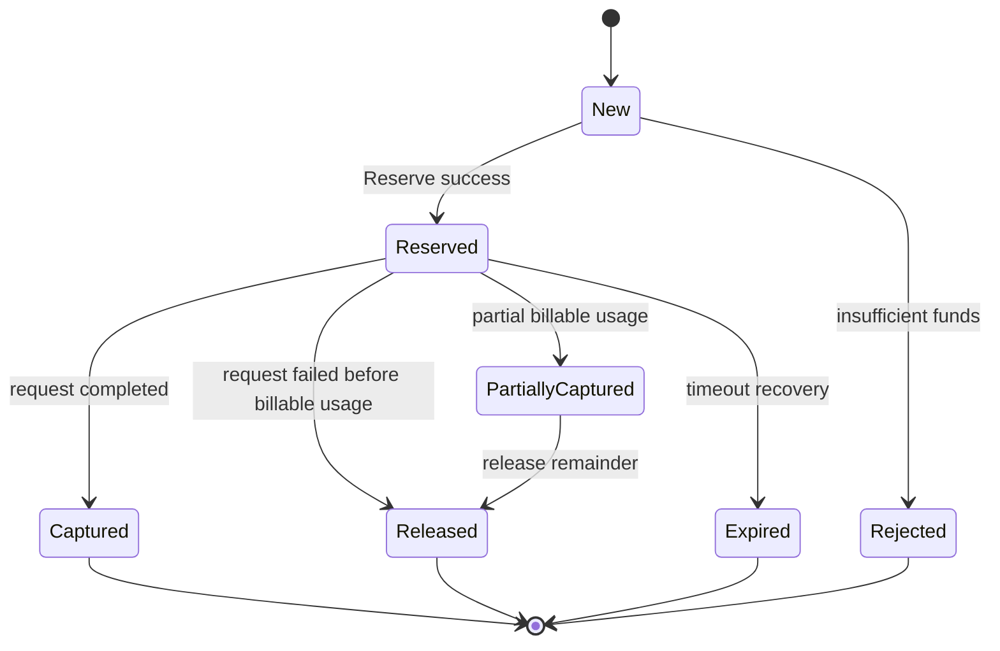
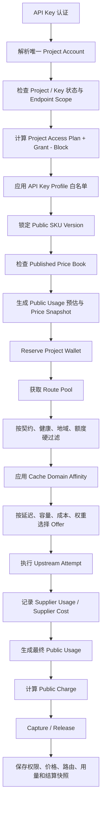
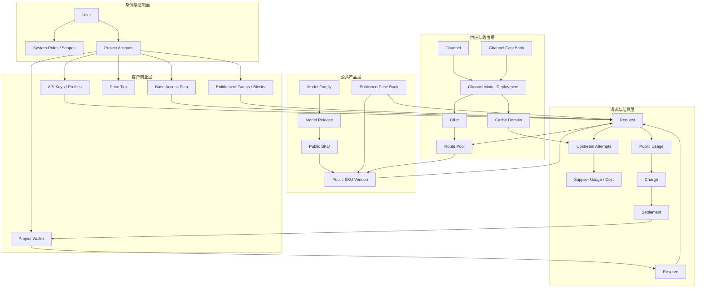

# Conduit API 领域模型与实施方案

> 文档状态：目标架构基线
> 日期：2026-08-04
> 适用阶段：当前一个用户只拥有一个 Project，一个 Project 只对应一个用户；所有消费从 Project 账户扣除。
> 核心目标：管理员聚合上游供应，发布稳定的公共模型商品；客户通过 Project、API Key、模型权益、订阅与余额消费这些商品。

---

## 0. 最终结论

本项目应采用以下核心定义：

> **User 是登录和操作身份；Project 是客户账户、租户边界和计费主体；Public SKU 是用户购买的模型商品；Offer 是平台内部使用某个上游部署履约该商品的方式。**

所有关键概念必须拆成六个互相独立的层次：

1. **后台权限**：这个 User 能操作哪些管理功能。
2. **商业权益**：这个 Project 能消费哪些 Public SKU。
3. **Key 限制**：这把 API Key 在 Project 权益内还能调用哪些 SKU。
4. **供应路由**：平台内部用哪个 Offer、Deployment、Channel 完成请求。
5. **价格计量**：用户按什么公共价格、什么公共用量计费。
6. **资金结算**：费用从 Project 的哪些订阅额度或永久 Credit 中扣除。

必须坚持以下唯一事实来源：

| 事项 | 唯一事实来源 |
|---|---|
| 后台功能权限 | Role / Scope |
| Project 可用模型 | Access Plan + Project Entitlement Override |
| API Key 可用模型 | API Key Profile，只能收窄 |
| 用户看到的模型商品 | Public SKU / Public SKU Version |
| 公共模型与上游部署映射 | Offer |
| 内部候选路由集合 | Route Pool |
| 用户零售价 | Published Price Book |
| 上游采购成本 | Channel Cost Book |
| 用户可用资金 | Project Wallet Ledger + Allowance Buckets |
| 请求最终扣款 | Reservation + Settlement |
| 同名模型身份 | Model Release / Compatibility Class，而不是名称字符串 |
| 提示缓存可复用边界 | Cache Domain |

---

## 1. 当前场景应被建模成什么问题

这不是一个简单的“模型转发器”，而是一个同时包含以下角色的多租户商业网关：

```text
供应聚合器
+ 公共模型目录
+ 客户权限系统
+ API Key 网关
+ 多上游路由器
+ 用量计量系统
+ 预付费钱包
+ 订阅额度系统
+ 可审计结算系统
```

系统需要同时满足：

- 多个上游可能使用相同模型名称，但实际版本、能力、价格和缓存语义不同。
- 普通用户不应知道具体 Channel、上游密钥、Base URL 和采购成本。
- 同一个 Public SKU 的用户价格不能因随机路由到不同上游而变化。
- 同一个会话应尽量保持缓存亲和，但上游故障时仍能切换。
- 管理员需要按客户账户控制可见模型、价格层级、订阅和余额。
- API Key 只能限制 Project 已有权限，不能绕过或扩大权限。
- 所有请求必须能够解释“为什么允许、按什么价格、走了哪里、扣了哪笔钱”。

---

## 2. 已拍板的产品决策

| 问题 | 最终决定 |
|---|---|
| 当前一个 Project 对应几个用户 | 1 个 |
| 当前一个用户对应几个 Project | 1 个 |
| 钱包、订阅和消费属于谁 | Project |
| User 的职责 | 身份、登录、系统后台权限 |
| Project 的职责 | 客户账户、数据隔离、API Key、权益、价格、钱包、账单 |
| 管理员给“用户”开模型时实际修改什么 | 该用户唯一 Project 的商业权益 |
| User Group 是否继续参与复杂运行时求值 | 否 |
| Group 的保留用途 | 管理标签、客户分群、批量分配模板 |
| Project 的基础模型权限来自哪里 | 一个 Base Access Plan |
| 特殊模型权限如何表达 | Project 级临时 Grant / Explicit Block |
| API Key 是否能扩大 Project 权限 | 不能，只能收窄 |
| Project / Group 是否能直接指定 Channel ID | 不能 |
| 同名上游模型是否自动合并 | 不能 |
| 用户请求的稳定对象是什么 | Public SKU |
| 内部路由到什么对象 | Offer / Deployment |
| 上游成本不同是否改变用户价格 | 不改变 |
| 能力或品质明显不同怎么办 | 拆成不同 Public SKU 或服务档位 |
| 缓存命中是否立即给用户折扣 | 第一阶段不提供，先作为平台成本优化 |
| 没有已发布价格是否允许调用上游 | 不允许 |
| 没有成功 Reserve 是否允许调用上游 | Hard Enforce 阶段不允许 |
| 同一请求是否允许重复扣费 | 不允许，必须幂等 |

---

## 3. 领域边界

### 3.1 控制面：人能做什么

控制面只处理后台操作权限：

```text
User Session
→ System Role / Scope
→ 是否有权管理用户、渠道、价格表、订阅计划、财务和分析
```

Role / Scope 不得决定：

- 用户能调用哪些模型；
- 模型价格；
- 上游路由；
- Project 钱包；
- 订阅额度。

### 3.2 数据面：一次模型请求是否能执行

```text
API Key
→ Project
→ Key Scope
→ Project Entitlement
→ Key Model Restriction
→ Public SKU Version
→ Published Price
→ Route Pool
→ Reserve Project Funds
→ Upstream Attempt
→ Usage
→ Charge
→ Settlement
```

### 3.3 供应面：平台如何履约

```text
Channel
→ Channel Model Deployment
→ Offer
→ Route Pool
→ Public SKU Version
```

### 3.4 商业面：客户买什么、付多少钱

```text
Project
→ Access Plan
→ Public SKU Entitlement
→ Price Tier
→ Published Retail Price
→ Project Wallet
```

---

## 4. 统一术语与职责

| 概念 | 正确职责 | 明确禁止承担的职责 |
|---|---|---|
| User | 登录身份、状态、系统后台权限 | 钱包、零售价、上游路由 |
| Project Account | 客户账户、租户、请求和资金归属 | 上游供应配置 |
| Role / Scope | 后台功能权限 | 模型商业权益 |
| Customer Segment | 管理标签、批量操作 | 直接参与请求授权计算 |
| Access Plan | Project 的基础公共 SKU 白名单 | Channel 选择、后台权限 |
| Entitlement Override | 临时 Grant 或 Explicit Block | 上游成本、钱包余额 |
| Price Tier | Project 的基础零售价格倍率 | 模型授权、渠道路由 |
| API Key Profile | Key 的模型子集、端点、速率、IP、有效期 | 扩大 Project 权益、决定套餐 |
| Model Family | 展示和归类模型家族 | 直接路由、计价 |
| Model Release | 尽量不可变的具体模型版本身份 | 用户钱包 |
| Public SKU | 用户购买和请求的稳定商品 | 上游密钥和地址 |
| Public SKU Version | 某一时刻对能力、版本和计量的不可变承诺 | 动态修改已发生账单 |
| Channel | 上游供应商账号、密钥、Base URL、代理 | 普通用户模型权限 |
| Deployment | 某 Channel 下一个具体 upstream model 部署 | 用户价格 |
| Offer | 声明某 Deployment 能履约某 SKU Version | 用户余额 |
| Route Pool | 一个 SKU Version 的内部可替换 Offer 集合 | 用户组 |
| Compatibility Class | 判断多个部署是否可被视为行为兼容 | 用户价格 |
| Cache Domain | 上游 Prompt Cache 可复用的实际边界 | 模型商业授权 |
| Price Book | Public SKU 的用户零售价 | 上游采购成本 |
| Channel Cost Book | Deployment / Offer 的采购成本 | 用户最终售价 |
| Project Wallet | Project 的永久 Credit 与订阅额度 | 后台权限 |
| Reservation | 请求执行前占用资金 | 最终用量 |
| Charge | 公共用量乘公共价格得到的应收费用 | 具体从哪里扣钱 |
| Settlement | Charge 从哪些资金来源支付 | 模型路由 |

---

## 5. Project 的最终定义

当前阶段：

```text
User 1 ─── 1 Project Account
                   │
                   ├── N API Keys
                   ├── 1 Base Access Plan
                   ├── 1 Base Price Tier
                   ├── 0..N Entitlement Overrides
                   ├── 1 Wallet / Currency
                   ├── 0..N Subscriptions
                   ├── 0..N Allowance Buckets
                   └── N Requests / Usage / Charges
```

### 5.1 推荐约束

```text
projects.owner_user_id UNIQUE NOT NULL
api_keys.project_id NOT NULL
requests.project_id NOT NULL
subscriptions.project_id NOT NULL
wallet_accounts.project_id UNIQUE NOT NULL
```

`projects.owner_user_id` 应成为当前 Owner 关系的唯一事实来源。

不要同时让以下两个地方都表达 Owner：

```text
projects.owner_user_id
user_projects.is_owner
```

如果保留 `user_projects` 是为了未来多人协作，则当前不要让它承担第二套所有权事实。未来多人 Project 再增加：

```text
project_members
- project_id
- user_id
- role
- status
```

无论未来有多少成员，钱包、价格和消费仍然属于 Project。

---

## 6. 管理不同客户可接触模型的最终方案

### 6.1 不再使用多个运行时 User Group 叠加

当前多组并集、Explicit Deny、旧字段再求交集，会造成：

- 管理员无法预测最终结果；
- 新页面允许后仍被旧字段拦截；
- 订阅、价格、模型和渠道相互污染；
- 很难解释某次拒绝来自哪里。

目标模型应改为：

```text
每个 Project
├── 1 个 Base Access Plan
├── 0..N 个临时模型 Grant
├── 0..N 个 Explicit Block
├── 1 个 Base Price Tier
└── 0..N 个临时价格调整
```

### 6.2 模型权益公式

```text
BaseAllowed = 当前生效 Access Plan Version 中的 SKU 集合
ActiveGrants = 当前有效的 Project Grant 集合
ActiveBlocks = 当前有效的 Project Explicit Block 集合

ProjectAllowed = (BaseAllowed ∪ ActiveGrants) - ActiveBlocks
```

API Key 再进一步收窄：

```text
如果 Key Profile 没有模型白名单：
    EffectiveKeyModels = ProjectAllowed

如果 Key Profile 有模型白名单：
    EffectiveKeyModels = ProjectAllowed ∩ KeyProfileAllowed
```

规则必须明确：

- Explicit Block 永远优先；
- 未知 SKU 默认拒绝；
- Key 不能扩大 Project 权限；
- 新建 Project 时必须显式写入 Default Access Plan；
- 不再在运行时使用“没有组则回退 Default Group”；
- 订阅权益通过带来源和有效期的 Grant 表达，不通过普通组成员关系表达。

### 6.3 Group 的最终定位

原 `user_groups` 可迁移为：

```text
customer_segments
```

用途仅限：

- 管理员筛选客户；
- 批量将某 Access Plan 或 Price Tier 分配给一批 Project；
- 营销、合作伙伴、Beta、内部账号等标签；
- 报表维度。

Customer Segment 不应再被请求路径实时读取。

### 6.4 订阅赋权

订阅不得直接“把用户加入普通组”。应创建来源明确的临时权益：

```text
project_entitlement_overrides
- project_id
- public_sku_id
- effect = grant | block
- source_type = subscription | admin | promotion | compliance
- source_id
- valid_from
- valid_until
- reason
```

订阅结束后，来源为该订阅的 Grant 自动失效；不会误删管理员手工赋予的同类权限。

---

## 7. 同名模型的最终解决方案

### 7.1 核心原则

> **模型名称只是字符串，不是模型身份，也不是可替换性证明。**

两个提供商都返回 `gpt-4o` 或 `claude-sonnet`，只说明它们使用了相同名称。它们可能在以下方面不同：

- 实际模型版本；
- 上下文长度；
- 最大输出长度；
- 视觉、音频、工具调用和 JSON Schema；
- Tokenizer 与 Usage 统计；
- Prompt Cache 能力与价格；
- 隐藏 System Prompt、审核策略或二次微调；
- 数据地域、保留政策和 SLA；
- 上游采购成本。

因此，同名模型不得自动合并。

### 7.2 四层模型身份



#### Model Family

用于展示和归类：

```text
GPT-4o
Claude Sonnet
Gemini Flash
```

不直接路由、计价或授权。

#### Model Release

尽量表示不可变版本：

```text
claude-sonnet-4@2025-05-14
gpt-4o@2024-11-20
```

上游只提供浮动别名时，必须记录：

```text
verification_status = verified | claimed | unknown | incompatible
```

#### Public SKU

用户真正请求和购买的商品，例如：

```text
claude-sonnet-4-standard
claude-sonnet-4-economy
claude-sonnet-4-20250514
claude-sonnet-4-latest
```

Public SKU 的 `api_slug` 必须全局唯一，`display_name` 可以相似但必须明确档位或版本。

#### Deployment / Offer

```text
Deployment = 某个 Channel 下的具体 upstream_model_id
Offer = 某个 Deployment 被认证为可以履约某个 Public SKU Version
```

上游名称只要求在 Channel 内唯一：

```text
UNIQUE(channel_id, upstream_model_id)
```

绝不能用 `display_name` 或 `upstream_model_id` 作为跨供应商模型主键。

### 7.3 Public SKU Version 是用户承诺

每个已发布 SKU Version 必须保存不可变契约：

```text
release_policy
- pinned_release
- rolling_release
- compatibility_class

contract
- min_context_tokens
- max_output_tokens
- input_modalities
- output_modalities
- supports_tools
- supports_parallel_tools
- supports_json_schema
- supports_streaming
- public_usage_meter_version
- data_region_policy
- retention_policy
- service_level
- cache_contract
```

已发布的 SKU Version 不得原地修改。能力、版本或行为承诺变化时，创建新版本。

对于 `latest` SKU：

```text
旧 SKU Version → Release A
新 SKU Version → Release B
```

新请求锁定新版本，历史请求仍保存旧版本快照。Route Affinity 包含 SKU Version，因此升级后缓存亲和自动失效。

### 7.4 什么时候放进同一个 Route Pool

只有同时满足以下条件，Offer 才能进入同一个可替换 Route Pool：

1. 能履行 SKU Version 的全部保证能力；
2. 模型 Release 或 Compatibility Class 符合要求；
3. Usage 能被规范化到相同公共计量语义；
4. 数据地域和保留政策符合 SKU 契约；
5. 行为差异不会构成对用户的明显降级；
6. 已通过能力探测和回归测试；
7. Offer 状态为 verified / eligible。

严格规则：

> SKU Version 声明为“保证支持”的能力，Route Pool 内每个正常 Offer 都必须支持。不能依靠随机路由后再发现能力不足。

请求前仍需做硬过滤，以处理：

- 当前上下文长度；
- 模态；
- 实时健康；
- 地域；
- 上游额度；
- 临时能力降级。

### 7.5 拆 SKU 还是放入同一路由池

| 差异 | 处理方式 |
|---|---|
| 仅采购成本不同 | 同一个 SKU、同一个 Route Pool，用户价格不变 |
| 同版本、同能力，仅延迟略有差异 | 同一个 Route Pool |
| Prompt Cache 支持不同，但缓存只作为内部优化 | 可在同一 SKU；路由器做缓存亲和 |
| 一个支持 200k、一个只支持 64k，而 SKU 承诺 200k | 不能放同一 Pool；较弱者排除或建 Economy SKU |
| 一个支持视觉、一个不支持，而 SKU 承诺视觉 | 不能放同一 Pool |
| 实际版本不同 | 固定版本 SKU 必须拆分；rolling SKU 通过新 Version 升级 |
| 行为质量或审核策略差异明显 | 拆 SKU 或单独 Compatibility Class |
| 数据地域、保留政策或 SLA 不同 | 拆 SKU / 服务档位 |
| 用户明确选择某供应来源 | 建立 provider-pinned SKU，不暴露密钥和原始 Channel 配置 |
| 向用户承诺缓存折扣，但部分 Offer 无法统一上报缓存用量 | 不得混用；拆缓存型 SKU 或排除不支持 Offer |

### 7.6 Compatibility Class

当无法严格确认同一 Release，但经过测试认为可互换时，使用：

```text
compatibility_classes
- id
- name
- contract_hash
- verification_level
- test_suite_version
```

Offer 进入 Compatibility Class 前至少验证：

- 能力探测；
- 上下文上限；
- Tool / JSON Schema；
- Usage 统计；
- 错误格式；
- 流式行为；
- 典型回归集；
- 数据政策；
- 缓存语义。

`claimed` 或 `unknown` 的第三方模型默认不能进入高可信公共 SKU 的 Route Pool。它可以：

- 保持未发布；
- 进入隔离测试池；
- 建立明确标记的兼容型或 Economy SKU。

---

## 8. Route Pool 与 Offer

### 8.1 关系

```text
Public SKU Version
→ Route Pool
→ Route Pool Offers
→ Offer
→ Channel Model Deployment
→ Channel
```

### 8.2 Offer 的建议状态

```text
discovered
→ testing
→ verified
→ active
→ degraded
→ quarantined
→ disabled
```

### 8.3 Offer 建议字段

```text
id
public_sku_version_id
deployment_id
compatibility_class_id
status
priority
weight
capability_snapshot_id
cost_policy_id
created_at
verified_at
```

`priority` 表示路由优先层级；`weight` 只在相同优先层级和相近条件中使用。

### 8.4 Deployment 建议字段

```text
id
channel_id
upstream_model_id
discovery_source = sync | manual
claimed_release_id
verification_status
region
status
last_seen_at
```

当前 `supported_models` 与 `manual_models` 应统一迁移为 Deployment Inventory：

```text
channel_model_deployments.discovery_source
```

它们只表达“这个上游存在什么模型”，不再直接参与路由。运行时只读取已认证 Offer。

---

## 9. 缓存的最终方案

### 9.1 必须区分三种缓存

| 缓存类型 | 含义 | 是否跨 Provider 可复用 |
|---|---|---|
| Provider Prompt Cache | 上游对提示前缀、KV 或显式缓存对象的缓存 | 通常不能 |
| Gateway Response Cache | 网关保存完整请求结果 | 可以，但必须严格隔离和显式启用 |
| Route Affinity | 记录某会话应优先回到哪个缓存域 | 不保存模型内容，只保存路由偏好 |

Chat 请求默认不启用通用 Response Cache。它只适合：

- 幂等重试结果；
- Embedding；
- 确定性分类；
- 明确 opt-in 的稳定请求。

### 9.2 Cache Domain

Prompt Cache 不是 Public SKU 级资源，而是具体上游缓存边界。建议定义：

```text
cache_domains
- id
- channel_id
- deployment_id
- provider_account_fingerprint
- region
- model_release_id
- cache_mode
- cache_policy_version
- request_serializer_version
- status
```

一个 Cache Domain 至少由以下因素决定：

```text
Provider
+ Provider Account / Credential Scope
+ Region
+ Deployment
+ Model Release
+ Cache Policy
+ Request Serializer Version
```

即使两个 Offer 都履约同一个 Public SKU，也可能属于不同 Cache Domain。

### 9.3 Route Affinity

```text
route_affinities
- project_id
- public_sku_version_id
- affinity_hash
- cache_domain_id
- preferred_offer_id
- created_at
- last_used_at
- expires_at
```

唯一约束：

```text
UNIQUE(project_id, public_sku_version_id, affinity_hash)
```

原始会话内容和完整 Prompt 不应直接存入亲和表。建议使用：

```text
affinity_hash = HMAC(
    platform_secret,
    project_id
    + public_sku_version_id
    + affinity_scope
    + client_or_gateway_affinity_key
)
```

### 9.4 Affinity Key 的选择顺序

```text
1. 客户显式提供的 cache_key / affinity_key
2. Gateway Thread / Session ID
3. 标准化稳定前缀的安全指纹
4. 无法确定时不建立强亲和
```

默认必须包含 `project_id`，避免跨客户错误关联。需要进一步隔离不同应用时可加入 `api_key_id`。

### 9.5 缓存感知路由顺序



路由优先级必须是：

```text
契约与能力
> 合规与地域
> 健康与上游额度
> 缓存亲和
> 容量与延迟
> 成本
> 权重
```

不能为了缓存命中持续使用已故障或能力不足的 Offer。

### 9.6 Affinity 不是永久绑定

```text
expires_at = min(provider_cache_ttl_hint, platform_affinity_ttl)
```

以下变化必须使旧 Affinity 失效：

- Public SKU Version 变化；
- Model Release 变化；
- Request Serializer Version 变化；
- Cache Policy Version 变化；
- Deployment 或 Credential Scope 变化；
- Offer 被 quarantined / disabled。

### 9.7 显式 Provider Cache Object / Stateful Session

如果上游返回：

```text
cached_content_id
previous_response_id
conversation_id
provider_cache_handle
```

则使用 Gateway 自己的公共 Session ID 映射到上游句柄：

```text
provider_session_bindings
- project_id
- public_session_id
- cache_domain_id
- provider_session_ref_encrypted
- routing_mode
- rebuildable
- expires_at
```

支持三种模式：

| 模式 | 行为 |
|---|---|
| `stateless_auto` | 不保证固定 Provider，故障时自由切换 |
| `sticky_cache` | 优先保持 Cache Domain，故障时可切换并重新预热 |
| `provider_pinned` | 会话依赖特定 Provider 对象，无法重建时不透明切换 |

如果 Gateway 保存了完整规范化上下文，可在切换后重建缓存；如果只持有不可移植的上游句柄，则原 Cache Domain 不可用时应返回明确错误，而不是假装可以无损迁移。

### 9.8 请求规范化

缓存命中依赖稳定的请求前缀。需要：

```text
Canonical Request
→ Versioned Provider Adapter
→ Deterministic Serialized Request
```

必须固定：

- Tool 顺序；
- JSON Schema Key 顺序；
- System Prompt 拼接顺序；
- 默认参数；
- 空字段处理；
- 附件引用顺序；
- 静态内容在前、动态内容在后。

不得在可缓存前缀前部插入：

- 当前时间；
- 随机 Request ID；
- Trace ID；
- 每次变化的统计信息。

Adapter 变化时增加 `request_serializer_version`，避免将不兼容的缓存亲和继续复用。

---

## 10. 公共用量与上游用量必须分开

仅让“价格率”独立于路由还不够；**计费数量也必须尽量独立于路由**。

不同上游可能：

- Tokenizer 不同；
- 隐藏提示不同；
- Usage 字段含义不同；
- 缓存 Token 统计不同；
- Reasoning Token 处理不同；
- 重试产生多份供应商成本。

因此必须拆成：

```text
Public Usage
= 平台按 Public SKU 契约计算的用户计费用量

Supplier Usage
= 每个 Upstream Attempt 按供应商原始口径记录的采购用量
```

### 10.1 Public Usage

Public Usage 由版本化的 SKU Meter Adapter 生成：

```text
public_usage_meter_version
- canonical_input_tokens
- canonical_output_tokens
- image_units
- audio_seconds
- tool_calls
- other_public_meters
```

推荐：

- 输入 Token 基于发送给公共 API 的规范化请求计算；
- 输出 Token 基于规范化响应计算；
- Provider 隐藏 Token 不自动转嫁给用户；
- 无法统一解释的供应商指标只计入成本；
- 原始请求、规范化请求和 Meter 版本保存摘要快照。

### 10.2 Supplier Usage

每个 Upstream Attempt 保存：

```text
raw_supplier_usage_json
normalized_supplier_usage
provider_request_id
provider_response_id
supplier_cost_version_id
```

如果第一次尝试超时但供应商仍计费，第二次尝试成功：

```text
用户 Public Charge = 一个逻辑请求的公共用量
平台 Supplier Cost = Attempt 1 成本 + Attempt 2 成本
```

不能把重试成本重复计入用户用量。

---

## 11. 价格模型

### 11.1 三层价格

#### Public Retail Price

```text
price_books
price_book_versions
price_book_items
price_book_item_rates
```

引用 Public SKU / Public Meter，决定用户零售价。

#### Project Price Tier

每个 Project 一个基础价格层级：

```text
Retail = 1.000000
Partner = 0.900000
Internal = 0.000000
Risk Premium = 1.200000
```

倍率使用整数 ppm 或 basis points，不使用浮点数。

#### Supplier Cost

```text
channel_cost_books
channel_cost_versions
channel_cost_items
```

引用 Deployment 或 Offer 的 Supplier Meter，决定采购成本。

### 11.2 用户价格公式

```text
FinalUnitPrice
= PublishedPublicUnitPrice
× ProjectPriceTierMultiplier
× ActivePriceAdjustments
```

```text
Charge
= Σ(PublicUsageMeterQuantity × FinalUnitPrice)
```

临时价格调整必须：

- 有来源；
- 有有效期；
- 有 stacking_key；
- 同一 stacking_key 只允许一个最高优先级调整生效，或采用明确的固定规则；
- 计算结果保存快照。

第一阶段建议只允许：

```text
1 个 Base Price Tier
+ 每个 stacking_key 最多 1 个活动调整
```

避免当前任意多个 Group multiplier 全部叠乘。

### 11.3 平台毛利

```text
Gross Margin
= Project Public Charge
- Σ(All Supplier Attempt Costs)
```

不同 Channel 的采购成本只影响平台毛利，不改变同一个 Public SKU 的用户价格。

### 11.4 Price Book 发布规则

- Draft Version 可编辑；
- Published Version 不可原地修改；
- 调价创建新版本；
- 请求开始时锁定 Price Book Version；
- 请求结束时使用同一个价格快照；
- 没有已发布价格的 SKU 不允许进入正式上游请求；
- `Model.modelCard.cost` 不再是价格来源；
- 内部免费用户也应使用已发布的零价格层级或内部 Price Book，而不是绕过计价。

---

## 12. 缓存价格的阶段性策略

### 12.1 第一阶段：缓存只作为平台成本优化

用户按稳定公共输入价格付费：

```text
用户价格不因命中或未命中 Provider Prompt Cache 而变化
```

上游缓存命中后：

```text
Supplier Cost 降低
→ Platform Margin 增加
```

优点：

- 不同 Offer 缓存语义不一致也不影响账单；
- 故障切换导致 Cache Miss 不会改变用户价格；
- 用户账单不依赖随机路由；
- 更容易先完成真实结算闭环。

### 12.2 第二阶段：可选公共缓存折扣

只有同时满足以下条件，才向用户销售 Cache Read / Cache Write 价格：

1. Public SKU Version 明确声明缓存合同；
2. 所有可用 Offer 都支持可比较的缓存语义，或缓存请求只进入专用 Route Pool；
3. Gateway 能可靠确认公共缓存用量；
4. 失败和切换后的计费规则确定；
5. Published Price Book 有对应公共 Meter；
6. Usage Snapshot 能证明本次命中依据。

否则不要把供应商的缓存价格直接透传给用户。

如果“有缓存折扣”本身是商品承诺，则可建立：

```text
claude-sonnet-4-standard
claude-sonnet-4-cache-optimized
```

而不是在同一个 SKU 中让不同路由产生不同价格。

---

## 13. Project Wallet 与真实结算

### 13.1 钱包结构

```text
Project Wallet
├── Subscription Allowance Buckets
│     ├── granted_micros
│     ├── consumed_micros
│     ├── reserved_micros
│     └── expires_at
│
└── Permanent Credit
      ├── ledger credits
      ├── ledger debits
      └── reserved_micros
```

```text
Available Balance
= Σ(Active Allowance Remaining)
+ Permanent Credit Balance
- Outstanding Reserved Amount
```

消费顺序：

```text
最早过期 Allowance
→ 较晚过期 Allowance
→ 永久 Credit
```

### 13.2 请求资金状态机



### 13.3 Reserve

请求前估算最大费用：

```text
已知输入公共用量
+ max_output_tokens 对应最大费用
+ 图片 / 音频 / Tool 的服务端硬上限
+ 小额安全缓冲
```

在同一个数据库事务中：

1. 锁定相关 Allowance Bucket 和 Credit Account；
2. 计算可用余额；
3. 按过期时间分配资金来源；
4. 创建 Reservation；
5. 创建 Reservation Allocation；
6. 增加 reserved_micros；
7. 提交事务。

禁止：

```text
先查询余额
→ 离开事务
→ 再创建 Reservation
```

否则并发请求会重复占用同一余额。

### 13.4 Capture / Release

```text
actual_charge < reserved
→ Capture actual_charge
→ Release difference

actual_charge = reserved
→ Capture all

actual_charge > reserved
→ 尝试追加 Reserve
→ 无法追加时按产品规则中止、进入欠款或人工对账
```

预付费默认不允许负余额。需要授信时单独引入：

```text
project_credit_limit
```

而不是允许钱包任意变负。

### 13.5 Charge 与 Settlement 分开

```text
Usage
= 实际发生多少公共 Meter

Charge
= Public Usage × Public Price Snapshot

Settlement
= 这笔 Charge 从哪些 Allowance / Credit 来源支付
```

一笔 Charge 可以由多个来源结算：

```text
Subscription Bucket A: 50,000 micros
Permanent Credit:      25,000 micros
```

### 13.6 账本

所有正式资金变化必须是追加式记录：

- 不删除已入账扣款；
- 不原地修改历史金额；
- 退款通过反向 Ledger Entry；
- 纠错通过 Adjustment Transaction；
- 聚合余额可以缓存，但必须可由账本重建。

### 13.7 幂等性

```text
UNIQUE(project_id, client_request_id)
```

同一个请求重试时：

- 不创建第二个 Reservation；
- 不重复发送可避免的上游请求；
- 不产生第二个 Charge；
- 不重复 Capture；
- 返回已有请求状态或结果。

跨进程处理 Usage 和 Settlement 时使用 Transactional Outbox，并保证消费者幂等。

---

## 14. 一次请求的最终链路



### 14.1 详细判定公式

```text
RequestCallable =
    User / API Key Valid
    ∧ Project Active
    ∧ Endpoint Scope Allowed
    ∧ Project Entitled To SKU
    ∧ Key Allows SKU
    ∧ SKU Version Published
    ∧ Published Price Exists
    ∧ Eligible Route Exists
    ∧ Reservation Succeeds
```

### 14.2 重试原则

- 尚未向客户端输出内容，且上游失败：可以切换 Offer；
- 已产生部分流式输出：默认不进行透明跨 Provider 重试；
- 如确需恢复，必须有流片段去重、上下文重建和明确计费语义；
- 初期不做 Hedged Request，避免重复上游成本和缓存失效；
- 每个 Attempt 单独保存供应商请求 ID、用量和成本。

---

## 15. 模型状态不再使用一个 `enabled`

### 15.1 目录级状态

| 状态 | 含义 |
|---|---|
| `Published` | SKU 是否对外发布 |
| `Entitled` | Project 是否拥有该 SKU 权益 |
| `Priced` | 是否存在当前已发布零售价 |
| `Supplied` | 是否至少有一个 Active Offer |
| `Routable` | 当前是否至少有一个健康、合规、能力匹配的 Offer |
| `Visible` | `Published ∧ Entitled` |
| `Available` | `Visible ∧ Priced ∧ Routable` |

### 15.2 请求级状态

| 状态 | 含义 |
|---|---|
| `KeyAllowed` | 具体 Key 是否允许该 SKU |
| `RequestCompatible` | 请求的长度、模态、工具是否符合 SKU 和候选 Offer |
| `Funded` | 本次请求估价是否能 Reserve |
| `Callable` | 所有请求条件成立 |

`Affordable` 不是稳定的模型属性，因为费用取决于本次输入、最大输出和其他 Meter。模型广场最多显示钱包状态或最小请求可支付性，正式判断必须发生在请求级 Reserve。

### 15.3 建议错误码

```text
project_suspended
api_key_invalid
api_key_scope_denied
model_not_entitled
model_blocked
model_restricted_by_key
model_not_published
model_not_priced
model_request_incompatible
model_temporarily_unavailable
insufficient_balance
reservation_conflict
upstream_failed_before_output
upstream_stream_interrupted
settlement_pending_reconciliation
```

错误响应只返回公共语义，不泄露具体 Channel。

---

## 16. 推荐数据模型

以下为目标职责，不要求一次性全部重写。

### 16.1 身份与账户

```text
users
- id
- email
- password_hash
- status

system_roles
user_system_roles

projects
- id
- owner_user_id UNIQUE
- status
- base_access_plan_id
- base_price_tier_id
- wallet_currency
```

### 16.2 权益与价格层级

```text
access_plans
access_plan_versions
access_plan_items
- access_plan_version_id
- public_sku_id

project_entitlement_overrides
- project_id
- public_sku_id
- effect
- source_type
- source_id
- valid_from
- valid_until

price_tiers
- id
- multiplier_ppm

project_price_adjustments
- project_id
- stacking_key
- multiplier_ppm
- priority
- source_type
- source_id
- valid_from
- valid_until
```

### 16.3 API Key

```text
api_keys
- id
- project_id
- profile_id
- status
- expires_at

api_key_profiles
api_key_profile_models
api_key_profile_scopes
api_key_profile_limits
```

Profile 可包含：

- Public SKU 白名单；
- Endpoint Scope；
- Rate Limit；
- Concurrency Limit；
- Daily Spend Limit；
- IP Allowlist；
- 有效期。

不得包含：

- Channel ID；
- upstream_model_id；
- 上游成本；
- 订阅类型。

### 16.4 公共产品

```text
model_families
model_releases
compatibility_classes

public_skus
- id
- api_slug UNIQUE
- display_name
- family_id
- lifecycle_status

public_sku_versions
- id
- public_sku_id
- version
- release_policy
- model_release_id NULLABLE
- compatibility_class_id NULLABLE
- capability_contract_json
- public_usage_meter_version
- status
- effective_at
```

### 16.5 供应与路由

```text
channels
- id
- provider_type
- base_url
- credential_ref
- status

channel_model_deployments
- id
- channel_id
- upstream_model_id
- discovery_source
- claimed_release_id
- verification_status
- region
- status

capability_snapshots

offers
- id
- public_sku_version_id
- deployment_id
- compatibility_class_id
- capability_snapshot_id
- status
- priority
- weight

route_pools
- id
- public_sku_version_id
- policy_version
- status

route_pool_offers
- route_pool_id
- offer_id
```

### 16.6 缓存路由

```text
cache_domains
route_affinities
provider_session_bindings
```

### 16.7 价格与成本

```text
price_books
price_book_versions
price_book_items
price_book_item_rates

channel_cost_books
channel_cost_versions
channel_cost_items
```

### 16.8 请求、用量与供应尝试

```text
requests
- id
- project_id
- api_key_id
- client_request_id
- public_sku_id
- public_sku_version_id
- status

request_policy_snapshots
request_price_snapshots
request_route_snapshots

upstream_attempts
- request_id
- offer_id
- cache_domain_id
- provider_request_id
- status
- started_at
- completed_at

public_usage_events
supplier_usage_events
supplier_cost_events
```

### 16.9 钱包与结算

```text
project_wallets
credit_ledger_entries
subscriptions
subscription_allowance_buckets

wallet_reservations
reservation_allocations

charges
charge_lines
charge_settlements

ledger_transactions
ledger_entries
```

---

## 17. 请求快照与审计

每个实际请求必须保存以下不可变快照或其内容哈希：

```text
Project ID
API Key ID
Effective Entitlement Result
Access Plan Version
Active Grant / Block IDs
API Key Profile Version
Public SKU ID / Version
Capability Contract Version
Price Book Version
Price Tier / Adjustment IDs
Public Usage Meter Version
Route Pool Version
Selected Offer / Deployment
Cache Domain / Affinity Decision
Raw Supplier Usage
Normalized Public Usage
Reservation Allocation
Charge Lines
Settlement Sources
```

管理员应能对任意请求回答：

```text
为什么允许或拒绝？
为什么该 Key 能调用？
当时 SKU 承诺什么能力？
当时使用什么价格？
为什么选中这个 Offer？
是否命中或丢失缓存亲和？
供应商实际收取多少？
用户最终支付多少？
从哪些资金来源扣除？
```

---

## 18. 管理员与用户信息架构

### 18.1 管理员：客户账户

管理员看到：

```text
用户邮箱
Project ID / 状态
Base Access Plan
Effective Model Entitlements
Base Price Tier
Active Price Adjustments
Subscriptions
Allowance
Permanent Credit
Reserved Amount
Recent Usage / Charges
```

必须提供“有效权益解释器”：

```text
Claude Sonnet 4 Standard
允许
来源：Subscription #123
有效期：2026-09-01

GPT-5 Standard
拒绝
来源：Compliance Block #45
```

### 18.2 管理员：公共产品目录

```text
Model Family
Model Release
Public SKU
Public SKU Version
Capability Contract
Published Retail Price
Lifecycle Status
```

### 18.3 管理员：供应与路由

```text
Channels
Deployments
Discovery Inventory
Offer Certification
Route Pools
Health
Latency
Capacity
Cache Domains
Supplier Costs
Gross Margin
```

客户权限页面不得直接修改 Channel。

### 18.4 管理员：资金与订阅

```text
Subscription Plans
Project Subscriptions
Allowance Buckets
Credit Grants
Reservations
Charges
Settlements
Ledger
Reconciliation
```

### 18.5 普通用户

用户只看到：

- 自己 Project 的 Public SKU 目录；
- 最终公共价格；
- 当前可用状态；
- Key 可调用的 SKU；
- Wallet、Credit、订阅额度；
- 请求、Trace、Thread、Prompt；
- Playground。

用户永远不应看到：

- Channel ID / Name；
- Base URL；
- 上游 API Key；
- upstream_model_id；
- Offer priority / weight；
- Supplier Cost；
- 代理和内部 Header；
- Cache Domain 内部标识。

---

## 19. 同名模型完整示例

上游同步得到：

```text
Channel A
upstream_model_id = claude-sonnet-4
context = 200k
tools = true
vision = true
prompt_cache = true
cost = high

Channel B
upstream_model_id = claude-sonnet-4
context = 200k
tools = true
vision = true
prompt_cache = false
cost = medium

Channel C
upstream_model_id = claude-sonnet-4
context = 64k
tools = partial
vision = false
prompt_cache = false
cost = low
```

### 错误做法

```text
按名称建立“claude-sonnet-4 模型组”
→ A / B / C 随机路由
```

结果会导致：

- 200k 请求随机失败；
- 视觉请求随机失败；
- 用户体验静默降级；
- 缓存随机丢失；
- 用户价格和供应成本混淆。

### 正确做法

建立：

```text
Public SKU: claude-sonnet-4-standard
Contract:
- context >= 200k
- tools = true
- vision = true
- cache discount = not guaranteed
```

Route Pool：

```text
Offer A
Offer B
```

Channel C 不符合契约，应：

- 保持内部未发布；或
- 建立 `claude-sonnet-4-economy`；或
- 建立明确标记的兼容型 SKU。

用户价格：

```text
Standard Input  = 固定公共价格
Standard Output = 固定公共价格
```

请求 1：

```text
Thread T → Offer A
建立 Route Affinity 到 Cache Domain A
```

请求 2：

```text
Offer A 健康
→ 继续 A
→ 可能命中 Prompt Cache
```

请求 3：

```text
Offer A 故障
→ 切换 Offer B
→ 接受一次 Cache Miss
→ 更新 Affinity 到 Cache Domain B
→ 用户公共价格不变
```

平台内部：

```text
Public Charge 不变
Supplier Cost 随 A / B 与缓存命中变化
Gross Margin 随之变化
```

如果未来向用户承诺 Cache Read 折扣，则：

- 要么只允许支持统一缓存 Meter 的 Offer；
- 要么创建独立 Cache-Optimized SKU；
- 不能继续在 A / B 中无条件随机路由并让用户价格随结果变化。

---

## 20. 现有实体迁移映射

| 当前实体 / 字段 | 目标处理 |
|---|---|
| `users` | 仅身份、登录、状态、系统角色 |
| `users.owner` | 若表示平台 Owner，迁移为 System Role；若表示 Project Owner，迁移到 `projects.owner_user_id` |
| `roles` / `user_roles` | 仅控制面权限 |
| `projects` | 重定义为 Customer Account 与计费主体 |
| `user_projects` | 当前不再作为第二套 Owner 事实；未来多人协作再启用 |
| `user_groups` | 迁移为 Customer Segment 或 Access Plan 模板 |
| `allowed_model_ids` | 停止运行时读取，迁移到 Access Plan / Override |
| `allowed_channel_ids` | 从客户权限模型删除 |
| `allowed_channel_tags` | 从客户权限模型删除；需要时改成内部 Route Pool Policy |
| `group_entitlement_policies` | 迁移为 Access Plan Version |
| `group_model_entitlements` | 迁移为 Access Plan Items / Project Overrides |
| `group_price_modifiers` | 迁移为 Price Tier / Project Price Adjustment |
| Project Profile | 不再承担模型授权；保留非商业型 Project 设置时重新命名 |
| API Key Profile | 只负责 Key 级收窄、限流和安全限制 |
| `models` | 迁移为 Public SKU；必要时增加 Family / Release / Version |
| `supported_models` | 迁移为 Deployment Inventory，`discovery_source=sync` |
| `manual_models` | 迁移为 Deployment Inventory，`discovery_source=manual` |
| `channel_model_offers` | 保留为唯一 SKU ↔ Deployment 映射，但升级为 SKU Version 级 Offer |
| `Model.modelCard.cost` | 停止作为正式价格来源 |
| Price Book | 唯一用户零售价来源 |
| Channel Price | 唯一采购成本来源 |
| Credit / Subscription | 全部改为 Project 归属 |
| Shadow Settlement | 保留观察模式，逐步升级为真实 Reserve / Capture / Release |
| `enabled` | 拆分为 Published / Entitled / Priced / Supplied / Routable / Active 等明确状态 |

---

## 21. 实施顺序

### 阶段 0：冻结语义扩散

- 暂停继续增加依赖旧 Group、Profile、Channel 权限的新功能；
- 统一术语；
- 建立架构决策记录；
- 所有新表和字段使用新语义。

### 阶段 1：固定 Project 账户边界

- 将 Project 确认为唯一客户和计费主体；
- 每个 User 绑定唯一 Project；
- 钱包、订阅、请求、API Key 全部引用 Project；
- 明确 `projects.owner_user_id` 唯一事实来源。

验收：

```text
每个有效 User 恰好一个 Project
每个 Project 恰好一个 Owner User
每个 API Key / Request / Wallet 都能追溯到 Project
```

### 阶段 2：统一模型权益

- 创建 Access Plan、Version、Items；
- 创建 Project Grant / Block；
- 每个 Project 显式绑定 Default Access Plan；
- 订阅生成有来源的临时 Grant；
- 旧规则与新规则双算并记录差异；
- 双算期间不得继续做交集；
- 差异清零后切换读取；
- 冻结并删除旧字段。

迁移建议：

1. 计算每个 Project 在旧系统中的最终有效模型集合；
2. 为常见集合创建 Access Plan；
3. 用 Project Override 补齐特殊差异；
4. 保存迁移前后解释报告；
5. 连续观察无差异后切换。

### 阶段 3：统一产品、部署与 Offer

- 将 `models` 定义为 Public SKU；
- 增加 SKU Version；
- 将 supported/manual 合并为 Deployment Inventory；
- Offer 成为唯一运行时映射；
- 建立 Route Pool；
- 删除 Project / Group 对具体 Channel 的限制；
- 同名 Deployment 不自动合并。

### 阶段 4：公共用量和价格

- 建立 Public Usage Meter Adapter；
- 分离 Public Usage 与 Supplier Usage；
- 发布正式 Price Book Version；
- 所有用户页面只读取 Published Price；
- 没有已发布价格的 SKU 阻止上游请求；
- 停用 Model Card Cost。

### 阶段 5：缓存感知路由

- 建立 Cache Domain；
- 建立 Route Affinity；
- 版本化 Provider Adapter；
- 实现硬过滤、健康检查、Affinity、成本与权重路由；
- 记录每个 Attempt 与 Supplier Cost；
- 第一阶段缓存收益不传递到用户价格。

### 阶段 6：真实钱包闭环

按模式逐步切换：

```text
shadow
→ soft_enforce
→ hard_enforce
```

#### Shadow

- 计算价格和模拟资金分配；
- 不改变正式余额；
- 比较估价与实际用量。

#### Soft Enforce

- 执行真实 Reserve / Capture / Release；
- 余额不足只告警、限量放行或只对测试 Project 拦截；
- 运行自动对账。

#### Hard Enforce

- 没有成功 Reserve 不调用上游；
- 余额不足明确拒绝；
- 所有请求必须结算或进入可恢复的 pending reconciliation。

### 阶段 7：重做信息架构

最后再调整管理员和普通用户页面，避免底层语义仍变化时反复改 UI。

---

## 22. 验收不变量

以下应成为数据库约束、单元测试、集成测试和对账任务的共同标准。

```text
1. 每个可计费请求必须且只能归属于一个 Project。

2. 当前每个 Project 必须且只能有一个 Owner User；每个 User 只能有一个 Project。

3. 钱包、订阅、Allowance、Reservation、Charge 和 Settlement 全部属于 Project。

4. Role / Scope 不参与模型商业权益、用户价格和上游路由计算。

5. Project 的模型权限只来自 Access Plan + Active Grant - Active Block。

6. API Key 只能收窄 Project 权益，不能扩大。

7. Project、Group、Access Plan 和 API Key Profile 均不得直接绑定 Channel ID。

8. 相同模型名称不得自动合并；跨 Channel 可替换性必须通过 Offer 认证。

9. 只有 Offer 可以把 Public SKU Version 映射到 Deployment。

10. Route Pool 内每个正常 Offer 必须满足 SKU Version 的全部保证能力。

11. 只有 Published Price Book 可以决定用户零售价。

12. 只有 Channel Cost Version 可以决定采购成本。

13. Public Usage 与 Supplier Usage 必须分别记录。

14. 用户 Charge 不能因为随机选中不同 Offer 而改变计量语义或价格率。

15. 第一阶段 Cache Hit / Miss 不改变用户公共价格。

16. 没有已发布零售价时，请求不能到达上游。

17. Hard Enforce 阶段，没有成功 Reservation 请求不能到达上游。

18. 同一 Project + Client Request ID 最多产生一个正式 Charge。

19. Usage、Charge、Settlement 是三种不同记录。

20. 已入账 Ledger Entry 不可删除；纠错和退款使用补偿记录。

21. Supplier Cost 必须累加所有可能被计费的 Upstream Attempt。

22. 缓存亲和不能覆盖健康、契约、合规和上游额度硬约束。

23. SKU Version、Price Version、Route Policy Version 和 Meter Version 必须可追溯。

24. Subscription 结束只能撤销由该 Subscription 产生的权益和额度。

25. 普通用户 API 永远不暴露 Channel、上游凭据、Deployment、采购成本和路由权重。

26. 任意请求都能解释授权、价格、路由、用量、成本和结算来源。
```

### 22.1 钱包对账不变量

```text
Project Ledger Credits
- Project Ledger Debits
= Reconstructed Permanent Credit Balance
```

```text
Allowance Granted
- Allowance Consumed
- Allowance Reserved
= Allowance Available
```

```text
Reservation Amount
= Σ Reservation Allocations
```

```text
Captured Charge Amount
= Σ Charge Settlement Allocations
```

```text
Project Charge Total
= Σ Charge Lines
```

```text
Supplier Cost Total
= Σ Supplier Cost Events For All Attempts
```

---

## 23. 当前阶段明确不做的事情

为避免再次过度复杂化，第一阶段不要做：

- 多个运行时 User Group 任意叠加；
- 用户直接选择具体 Channel；
- 同名模型自动合并；
- 用户价格随实际 Route 变化；
- 将供应商 Cache Read 价格直接透传；
- 通用 Chat Response Cache；
- 无快照的动态历史账单重算；
- 在已发布 SKU Version 上原地修改能力；
- 允许负余额而没有明确 Credit Limit；
- 在流式输出后无状态地跨 Provider 透明重试；
- 同时维护两套 Owner、两套模型映射或两套价格事实。

---

## 24. 最小可落地版本

如果需要控制改造规模，可以先实现以下最小集合，但语义不得退回旧模型：

```text
projects.owner_user_id
projects.base_access_plan_id
projects.base_price_tier_id

access_plans
access_plan_items
project_entitlement_overrides

public_skus
public_sku_versions
channel_model_deployments
offers
route_pools
route_pool_offers

price_book_versions
price_book_items
channel_cost_items

cache_domains
route_affinities

project_wallets
wallet_reservations
reservation_allocations
charges
charge_settlements
ledger_entries

requests
upstream_attempts
public_usage_events
supplier_usage_events
```

`Model Family`、`Model Release`、`Compatibility Class` 可先以字段和 JSON 元数据落地，但概念必须保留；不能继续把上游名称当成身份。

---

## 25. 最终架构总图



---

## 26. 一句话规则

以后遇到任何新需求，都按以下顺序判断：

```text
谁在操作？
→ 归属哪个 Project？
→ Project 有权购买哪个 Public SKU？
→ API Key 是否进一步允许？
→ SKU Version 向用户承诺什么？
→ 哪些 Offer 真正满足这个承诺？
→ 缓存应优先回到哪个 Cache Domain？
→ 用户公共用量如何计算？
→ Published Price 是多少？
→ 能否从 Project Wallet Reserve？
→ 实际走了哪些 Attempt、产生多少供应成本？
→ Charge 从哪些资金来源 Settlement？
```

最终应牢牢记住：

> **名称负责展示，Release 负责身份，Public SKU 负责商品承诺和用户价格，Offer 负责履约映射，Route Pool 负责可替换供应，Cache Domain 负责缓存亲和，Project 负责权益与付款。**
