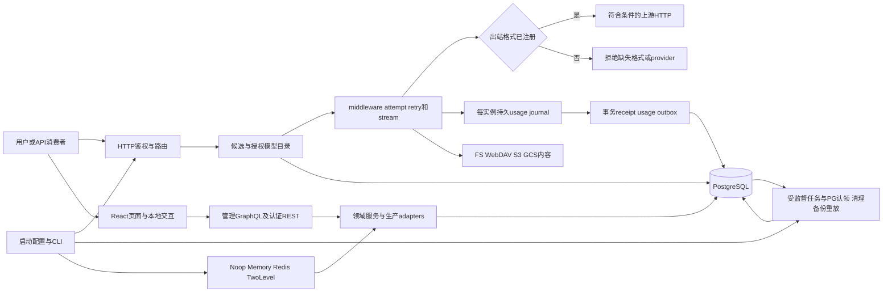

# 项目结构与全量模块导航

唯一工作树G:/fubox_API，17 Rust crate（16生产+testkit），React前端31 feature目录、33嵌入PostgreSQL migration（编号有空档）、测试/契约/脚本/CI/部署配置。完整1366个输入文件逐内容哈希见[输入清单](source-manifest.md)，已发布已发布已发布已发布已发布File图节点1344与输入计数不是相同口径；图freshness见入口；图freshness见入口；图freshness见入口；图freshness见入口；图freshness见入口。私有helper随模块归类，不伪造独立用户操作。

正常、错误、权限与重试分支按[HTTP](http-api.md)、[后端](backend.md)、[前端](frontend.md)逐操作图展开。生产装配在[conduit-bin wiring](../../crates/conduit-bin/src/wiring.rs)，配置保存与运行消费之间的具体连接见[设置](backend.md#flow-settings)。

## 全部Rust crate

| 模块 | 功能与主要上下游 | 操作/流程导航 | 当前范围/限制 |
| --- | --- | --- | --- |
| [conduit-admin-graphql](../../crates/conduit-admin-graphql/src/lib.rs) | 管理schema、Object/root/授权扩展/typed GUID/connections | [操作与流程](admin-graphql.md) | 49输入；105Q149M，JWT入口，运行未验收 |
| [conduit-auth](../../crates/conduit-auth/src/lib.rs) | 密码hash、JWT、APIkey principal、RBAC项目scope | [操作与流程](backend.md#flow-http-security) | 11输入；当前DB用户检查；鉴权入口不同 |
| [conduit-bin](../../crates/conduit-bin/src/main.rs) | 可执行CLI、生产PG/cache/schema/proxy adapters、maintenance | [操作与流程](infrastructure.md#flow-start) | 68输入；启动条件/配置真实有效才能运行 |
| [conduit-cache](../../crates/conduit-cache/src/lib.rs) | Noop/Memory/Redis/TwoLevel namespace/TTL/live辅助 | [操作与流程](backend.md#B-CACHE01) | 8输入；候选仍PG per-request；feature条件 |
| [conduit-config](../../crates/conduit-config/src/lib.rs) | defaults/YAML/env/override、导出校验schema | [操作与流程](infrastructure.md#flow-config) | 9输入；启动字段与动态DB设置分开 |
| [conduit-core](../../crates/conduit-core/src/lib.rs) | 领域对象、条件/价格/错误与upstream policy | [操作与流程](backend.md#flow-settings) | 19输入；类型及错误共享，不等新增API |
| [conduit-db](../../crates/conduit-db/src/lib.rs) | PG pools/transactions/repos/admission与migration | [操作与流程](backend.md#flow-db-schema) | 51输入；PG唯一产品DB；副本仅Dashboard/Operations |
| [conduit-http](../../crates/conduit-http/src/lib.rs) | 注册路由/handler/middleware/静态资源/独立metrics | [操作与流程](http-api.md) | 34输入；53注册55 method-path，另fallback/metrics |
| [conduit-llm](../../crates/conduit-llm/src/lib.rs) | 统一请求与payload/usage/stream/API format模型 | [操作与流程](http-api.md#flow-inference) | 9输入；多模态对象有类型实现但出站缺口 |
| [conduit-openapi-graphql](../../crates/conduit-openapi-graphql/src/lib.rs) | service-account项目隔离管理schema | [操作与流程](backend.md#flow-openapi) | 9输入；2Q3M，不匿名 |
| [conduit-orchestrator](../../crates/conduit-orchestrator/src/lib.rs) | 候选/健康credential/LB/affinity/admission/记录/upstream | [操作与流程](http-api.md#flow-inference) | 48输入；供应与价格权限在执行前确认 |
| [conduit-pipeline](../../crates/conduit-pipeline/src/lib.rs) | middleware、attempt/retry/failover/cancellation/error/stream | [操作与流程](backend.md#flow-stream-finalize) | 11输入；每attempt与流终态按源码分支 |
| [conduit-scheduler](../../crates/conduit-scheduler/src/lib.rs) | job/worker/cancel/frequency/alignment | [操作与流程](backend.md#flow-auto-schedule) | 7输入；八类worker，仅六类maintenance接线 |
| [conduit-services](../../crates/conduit-services/src/lib.rs) | auth/channel/model/project/billing/commercial/system/storage领域 | [操作与流程](backend.md#flow-settings) | 40输入；admin_settings_service未导出；其测试不代替生产 |
| [conduit-storage](../../crates/conduit-storage/src/lib.rs) | FS/WebDAV/S3 SigV4/GCS service-account真实适配 | [操作与流程](backend.md#flow-storage) | 11输入；需有效外部目标；本次未访问 |
| [conduit-testkit](../../crates/conduit-testkit/src/lib.rs) | isolated DB/fake provider/contracts/golden/New API测试辅助 | [操作与流程](infrastructure.md#flow-check) | 10输入；测试支持，非产品运行入口 |
| [conduit-transformers](../../crates/conduit-transformers/src/lib.rs) | 协议入站/出站、SSE/error/usage/provider helper | [操作与流程](http-api.md#flow-inference) | 69输入；生产仅五chat fallback格式；六provider阻断 |

## 前端全部feature目录

| feature | 用户功能与操作步骤 | 实现边界 |
| --- | --- | --- |
| `frontend/src/features/apikeys` | [UI-apikey-list](frontend.md#UI-apikey-list) | 静态源码实现/权限条件；未运行 |
| `frontend/src/features/auth` | [UI-signin](frontend.md#UI-signin) | 静态源码实现/权限条件；未运行 |
| `frontend/src/features/billing` | [UI-billing-select](frontend.md#UI-billing-select) | 静态源码实现/权限条件；未运行 |
| `frontend/src/features/change-sets` | [UI-changesets](frontend.md#UI-changesets) | 静态源码实现/权限条件；未运行 |
| `frontend/src/features/channels` | [UI-channel-list](frontend.md#UI-channel-list) | 静态源码实现/权限条件；未运行 |
| `frontend/src/features/chats` | [UI-chats](frontend.md#UI-chats) | 本地演示/占位，无对应业务写入 |
| `frontend/src/features/dashboard` | [UI-dashboard](frontend.md#UI-dashboard) | 静态源码实现/权限条件；未运行 |
| `frontend/src/features/data-storages` | [UI-storage-list](frontend.md#UI-storage-list) | 静态源码实现/权限条件；未运行 |
| `frontend/src/features/errors` | [UI-error](frontend.md#UI-error) | 静态源码实现/权限条件；未运行 |
| `frontend/src/features/model-market` | [UI-modelmarket](frontend.md#UI-modelmarket) | 静态源码实现/权限条件；未运行 |
| `frontend/src/features/models` | [UI-model-list](frontend.md#UI-model-list) | 静态源码实现/权限条件；未运行 |
| `frontend/src/features/onboarding` | [UI-onboarding](frontend.md#UI-onboarding) | 静态源码实现/权限条件；未运行 |
| `frontend/src/features/operations` | [UI-operations](frontend.md#UI-operations) | 静态源码实现/权限条件；未运行 |
| `frontend/src/features/permission-demo` | [UI-permissiondemo](frontend.md#UI-permissiondemo) | 本地演示/占位，无对应业务写入 |
| `frontend/src/features/playground` | [UI-playground](frontend.md#UI-playground) | 前端已实现；生产POST入口缺失 |
| `frontend/src/features/product-experience` | [UI-system-general](frontend.md#UI-system-general) | 静态源码实现/权限条件；未运行 |
| `frontend/src/features/proejct-users` | [UI-projectuser-list](frontend.md#UI-projectuser-list) | 静态源码实现/权限条件；未运行 |
| `frontend/src/features/project-dashboard` | [UI-projectdashboard](frontend.md#UI-projectdashboard) | 静态源码实现/权限条件；未运行 |
| `frontend/src/features/project-roles` | [UI-projectroles](frontend.md#UI-projectroles) | 静态源码实现/权限条件；未运行 |
| `frontend/src/features/projects` | [UI-project-list](frontend.md#UI-project-list) | 静态源码实现/权限条件；未运行 |
| `frontend/src/features/prompt-protection-rules` | [UI-protection-list](frontend.md#UI-protection-list) | 静态源码实现/权限条件；未运行 |
| `frontend/src/features/prompts` | [UI-prompt-list](frontend.md#UI-prompt-list) | 静态源码实现/权限条件；未运行 |
| `frontend/src/features/requests` | [UI-requests](frontend.md#UI-requests) | 静态源码实现/权限条件；未运行 |
| `frontend/src/features/roles` | [UI-role-list](frontend.md#UI-role-list) | 静态源码实现/权限条件；未运行 |
| `frontend/src/features/settings` | [UI-profile](frontend.md#UI-profile) | 静态源码实现/权限条件；未运行 |
| `frontend/src/features/system` | [UI-system](frontend.md#UI-system) | 静态源码实现/权限条件；未运行 |
| `frontend/src/features/threads` | [UI-threads](frontend.md#UI-threads) | 静态源码实现/权限条件；未运行 |
| `frontend/src/features/traces` | [UI-traces](frontend.md#UI-traces) | 静态源码实现/权限条件；未运行 |
| `frontend/src/features/user-groups` | [UI-groups](frontend.md#UI-groups) | 静态源码实现/权限条件；未运行 |
| `frontend/src/features/users` | [UI-user-list](frontend.md#UI-user-list) | 静态源码实现/权限条件；未运行 |
| `frontend/src/features/wallet` | [UI-wallet](frontend.md#UI-wallet) | 静态源码实现/权限条件；未运行 |

## 其他真实产品顶层与共享前端模块

| 目录/文件类别 | 功能、权威文件与用户入口 | 流程与边界 |
| --- | --- | --- |
| frontend/src/routes、routeTree.gen.ts、components、contexts、hooks、stores、lib、gql、config、locales | 50页面2布局、auth/project/route guard、侧栏命令/主题/语言、表单/query共享；不是只有feature目录 | [页面与共享操作](frontend.md)；[268模板](frontend-client-operations.md)；本地状态与服务写入分别标注 |
| frontend/tests与单元配置、package.json/pnpm-lock、vite/tsconfig | 浏览器/单元契约、构建和pnpm依赖 | [前端验证/E2E](infrastructure.md#flow-check)；本轮前端四门禁已执行，实际结果见修复检查 |
| migrations/postgres | 33嵌入SQL、schema版本、advisory迁移事务 | [迁移与数据库](backend.md#flow-db-schema)；解析部分不等DDL错误 |
| tests/contracts、tests其他测试 | 协议golden fixtures/HTTP/OpenAPI与各模块测试 | [契约门禁](infrastructure.md#flow-check)；fixture不证明生产registry完整 |
| scripts | knowledge CLI、release/contract/license/security/schema工具 | [工具与门禁](infrastructure.md)；真实脚本入口与参数来自现有源 |
| .github | CI release-gates/CodeQL/Dependabot workflow配置 | [CI与发布](infrastructure.md#flow-release)；本次未发布或触发远端 |
| .cargo、Cargo.toml、Cargo.lock、rust-toolchain、rustfmt/clippy/deny/config.schema等 | workspace/dependency/toolchain/schema/审计策略 | [开发门禁](infrastructure.md#flow-check)和[配置](infrastructure.md#flow-config) |
| Dockerfile、compose.yml、.dockerignore、config.example.yml、相关.env示例 | Rust/frontend镜像构建、PG/应用启动配置 | [部署](infrastructure.md#flow-deploy)；示例非当前运行凭据 |
| docs、README、LICENSE、LICENSES、NOTICE等 | 产品说明、部署/数据库/域模型历史资料、许可证 | 本知识包绑定当前源码；旧inventory需与本包核对，日期不保证当前准确 |
| .cbmignore、scripts/knowledge.py、.codebase-memory | 图谱身份/持久化/输入排除和查询 | [索引维护](indexing.md)；工具缓存不是产品数据库 |

排除研究副本、其他worktree、任务账本/产物、生成依赖、构建输出、运行数据、凭据与个人scratch；完整输入清单只保存路径/哈希，不保存配置secret。物理目录存在不自动归入产品功能。下面目录表覆盖当前1366输入所属目录，可以从功能域继续导航至源文件。

## 全量源目录到功能域

| 源目录 | 输入文件数（直接目录） | 所属功能/流程 |
| --- | --- | --- |
| `.` | 17 | [功能/操作/流程](infrastructure.md#flow-config) |
| `.cargo` | 2 | [功能/操作/流程](infrastructure.md) |
| `.github` | 1 | [功能/操作/流程](infrastructure.md) |
| `.github/workflows` | 4 | [功能/操作/流程](infrastructure.md) |
| `LICENSES` | 4 | [功能/操作/流程](infrastructure.md#flow-config) |
| `crates/conduit-admin-graphql` | 1 | [功能/操作/流程](admin-graphql.md) |
| `crates/conduit-admin-graphql/src` | 48 | [功能/操作/流程](admin-graphql.md) |
| `crates/conduit-auth` | 1 | [功能/操作/流程](backend.md#flow-http-security) |
| `crates/conduit-auth/src` | 10 | [功能/操作/流程](backend.md#flow-http-security) |
| `crates/conduit-bin` | 2 | [功能/操作/流程](infrastructure.md#flow-start) |
| `crates/conduit-bin/src` | 66 | [功能/操作/流程](infrastructure.md#flow-start) |
| `crates/conduit-cache` | 1 | [功能/操作/流程](backend.md#B-CACHE01) |
| `crates/conduit-cache/src` | 7 | [功能/操作/流程](backend.md#B-CACHE01) |
| `crates/conduit-config` | 1 | [功能/操作/流程](infrastructure.md#flow-config) |
| `crates/conduit-config/examples` | 2 | [功能/操作/流程](infrastructure.md#flow-config) |
| `crates/conduit-config/src` | 6 | [功能/操作/流程](infrastructure.md#flow-config) |
| `crates/conduit-core` | 1 | [功能/操作/流程](backend.md#flow-settings) |
| `crates/conduit-core/src` | 2 | [功能/操作/流程](backend.md#flow-settings) |
| `crates/conduit-core/src/objects` | 16 | [功能/操作/流程](backend.md#flow-settings) |
| `crates/conduit-db` | 1 | [功能/操作/流程](backend.md#flow-db-schema) |
| `crates/conduit-db/src` | 8 | [功能/操作/流程](backend.md#flow-db-schema) |
| `crates/conduit-db/src/repo` | 41 | [功能/操作/流程](backend.md#flow-db-schema) |
| `crates/conduit-db/src/row` | 1 | [功能/操作/流程](backend.md#flow-db-schema) |
| `crates/conduit-http` | 1 | [功能/操作/流程](http-api.md) |
| `crates/conduit-http/assets` | 1 | [功能/操作/流程](http-api.md) |
| `crates/conduit-http/src` | 26 | [功能/操作/流程](http-api.md) |
| `crates/conduit-http/src/middleware` | 6 | [功能/操作/流程](http-api.md) |
| `crates/conduit-llm` | 1 | [功能/操作/流程](http-api.md#flow-inference) |
| `crates/conduit-llm/src` | 4 | [功能/操作/流程](http-api.md#flow-inference) |
| `crates/conduit-llm/src/http` | 3 | [功能/操作/流程](http-api.md#flow-inference) |
| `crates/conduit-llm/tests` | 1 | [功能/操作/流程](http-api.md#flow-inference) |
| `crates/conduit-openapi-graphql` | 1 | [功能/操作/流程](backend.md#flow-openapi) |
| `crates/conduit-openapi-graphql/src` | 8 | [功能/操作/流程](backend.md#flow-openapi) |
| `crates/conduit-orchestrator` | 1 | [功能/操作/流程](http-api.md#flow-inference) |
| `crates/conduit-orchestrator/src` | 18 | [功能/操作/流程](http-api.md#flow-inference) |
| `crates/conduit-orchestrator/src/candidates` | 1 | [功能/操作/流程](http-api.md#flow-inference) |
| `crates/conduit-orchestrator/src/middlewares` | 25 | [功能/操作/流程](http-api.md#flow-inference) |
| `crates/conduit-orchestrator/tests` | 3 | [功能/操作/流程](http-api.md#flow-inference) |
| `crates/conduit-pipeline` | 1 | [功能/操作/流程](backend.md#flow-stream-finalize) |
| `crates/conduit-pipeline/src` | 9 | [功能/操作/流程](backend.md#flow-stream-finalize) |
| `crates/conduit-pipeline/tests` | 1 | [功能/操作/流程](backend.md#flow-stream-finalize) |
| `crates/conduit-scheduler` | 1 | [功能/操作/流程](backend.md#flow-auto-schedule) |
| `crates/conduit-scheduler/src` | 6 | [功能/操作/流程](backend.md#flow-auto-schedule) |
| `crates/conduit-services` | 1 | [功能/操作/流程](backend.md#flow-settings) |
| `crates/conduit-services/src` | 28 | [功能/操作/流程](backend.md#flow-settings) |
| `crates/conduit-services/src/channel_service` | 11 | [功能/操作/流程](backend.md#flow-settings) |
| `crates/conduit-storage` | 1 | [功能/操作/流程](backend.md#flow-storage) |
| `crates/conduit-storage/src` | 9 | [功能/操作/流程](backend.md#flow-storage) |
| `crates/conduit-storage/tests` | 1 | [功能/操作/流程](backend.md#flow-storage) |
| `crates/conduit-testkit` | 1 | [功能/操作/流程](infrastructure.md#flow-check) |
| `crates/conduit-testkit/examples` | 1 | [功能/操作/流程](infrastructure.md#flow-check) |
| `crates/conduit-testkit/src` | 7 | [功能/操作/流程](infrastructure.md#flow-check) |
| `crates/conduit-testkit/tests` | 1 | [功能/操作/流程](infrastructure.md#flow-check) |
| `crates/conduit-transformers` | 1 | [功能/操作/流程](http-api.md#flow-inference) |
| `crates/conduit-transformers/src` | 32 | [功能/操作/流程](http-api.md#flow-inference) |
| `crates/conduit-transformers/tests` | 1 | [功能/操作/流程](http-api.md#flow-inference) |
| `crates/conduit-transformers/tests/fixtures/anthropic` | 19 | [功能/操作/流程](http-api.md#flow-inference) |
| `crates/conduit-transformers/tests/fixtures/openai` | 16 | [功能/操作/流程](http-api.md#flow-inference) |
| `frontend` | 19 | [功能/操作/流程](frontend.md) |
| `frontend/public` | 2 | [功能/操作/流程](frontend.md) |
| `frontend/src` | 6 | [功能/操作/流程](frontend.md) |
| `frontend/src/assets` | 1 | [功能/操作/流程](frontend.md) |
| `frontend/src/components` | 34 | [功能/操作/流程](frontend.md) |
| `frontend/src/components/ai-elements` | 34 | [功能/操作/流程](frontend.md) |
| `frontend/src/components/date-range-picker` | 6 | [功能/操作/流程](frontend.md) |
| `frontend/src/components/layout` | 11 | [功能/操作/流程](frontend.md) |
| `frontend/src/components/ui` | 41 | [功能/操作/流程](frontend.md) |
| `frontend/src/config` | 2 | [功能/操作/流程](frontend.md) |
| `frontend/src/context` | 3 | [功能/操作/流程](frontend.md) |
| `frontend/src/features/apikeys` | 1 | [功能/操作/流程](frontend.md#UI-apikey-list) |
| `frontend/src/features/apikeys/components` | 24 | [功能/操作/流程](frontend.md#UI-apikey-list) |
| `frontend/src/features/apikeys/context` | 1 | [功能/操作/流程](frontend.md#UI-apikey-list) |
| `frontend/src/features/apikeys/data` | 4 | [功能/操作/流程](frontend.md#UI-apikey-list) |
| `frontend/src/features/auth` | 1 | [功能/操作/流程](frontend.md#UI-signin) |
| `frontend/src/features/auth/components` | 1 | [功能/操作/流程](frontend.md#UI-signin) |
| `frontend/src/features/auth/data` | 3 | [功能/操作/流程](frontend.md#UI-signin) |
| `frontend/src/features/auth/forgot-password` | 1 | [功能/操作/流程](frontend.md#UI-signin) |
| `frontend/src/features/auth/initialization` | 3 | [功能/操作/流程](frontend.md#UI-signin) |
| `frontend/src/features/auth/initialization/components` | 1 | [功能/操作/流程](frontend.md#UI-signin) |
| `frontend/src/features/auth/sign-in` | 2 | [功能/操作/流程](frontend.md#UI-signin) |
| `frontend/src/features/auth/sign-in/components` | 6 | [功能/操作/流程](frontend.md#UI-signin) |
| `frontend/src/features/auth/sign-up` | 1 | [功能/操作/流程](frontend.md#UI-signin) |
| `frontend/src/features/auth/sign-up/components` | 1 | [功能/操作/流程](frontend.md#UI-signin) |
| `frontend/src/features/billing` | 12 | [功能/操作/流程](frontend.md#UI-billing-select) |
| `frontend/src/features/billing/components` | 1 | [功能/操作/流程](frontend.md#UI-billing-select) |
| `frontend/src/features/change-sets` | 5 | [功能/操作/流程](frontend.md#UI-changesets) |
| `frontend/src/features/change-sets/components` | 6 | [功能/操作/流程](frontend.md#UI-changesets) |
| `frontend/src/features/change-sets/data` | 1 | [功能/操作/流程](frontend.md#UI-changesets) |
| `frontend/src/features/channels` | 1 | [功能/操作/流程](frontend.md#UI-channel-list) |
| `frontend/src/features/channels/components` | 48 | [功能/操作/流程](frontend.md#UI-channel-list) |
| `frontend/src/features/channels/context` | 1 | [功能/操作/流程](frontend.md#UI-channel-list) |
| `frontend/src/features/channels/data` | 12 | [功能/操作/流程](frontend.md#UI-channel-list) |
| `frontend/src/features/channels/hooks` | 2 | [功能/操作/流程](frontend.md#UI-channel-list) |
| `frontend/src/features/channels/utils` | 9 | [功能/操作/流程](frontend.md#UI-channel-list) |
| `frontend/src/features/chats` | 1 | [功能/操作/流程](frontend.md#UI-chats) |
| `frontend/src/features/chats/components` | 1 | [功能/操作/流程](frontend.md#UI-chats) |
| `frontend/src/features/chats/data` | 2 | [功能/操作/流程](frontend.md#UI-chats) |
| `frontend/src/features/dashboard` | 2 | [功能/操作/流程](frontend.md#UI-dashboard) |
| `frontend/src/features/dashboard/channel-success-rates` | 1 | [功能/操作/流程](frontend.md#UI-dashboard) |
| `frontend/src/features/dashboard/components` | 21 | [功能/操作/流程](frontend.md#UI-dashboard) |
| `frontend/src/features/dashboard/data` | 2 | [功能/操作/流程](frontend.md#UI-dashboard) |
| `frontend/src/features/dashboard/utils` | 1 | [功能/操作/流程](frontend.md#UI-dashboard) |
| `frontend/src/features/data-storages` | 1 | [功能/操作/流程](frontend.md#UI-storage-list) |
| `frontend/src/features/data-storages/components` | 9 | [功能/操作/流程](frontend.md#UI-storage-list) |
| `frontend/src/features/data-storages/context` | 1 | [功能/操作/流程](frontend.md#UI-storage-list) |
| `frontend/src/features/data-storages/data` | 2 | [功能/操作/流程](frontend.md#UI-storage-list) |
| `frontend/src/features/errors` | 5 | [功能/操作/流程](frontend.md#UI-error) |
| `frontend/src/features/model-market` | 2 | [功能/操作/流程](frontend.md#UI-modelmarket) |
| `frontend/src/features/models` | 3 | [功能/操作/流程](frontend.md#UI-model-list) |
| `frontend/src/features/models/components` | 24 | [功能/操作/流程](frontend.md#UI-model-list) |
| `frontend/src/features/models/context` | 1 | [功能/操作/流程](frontend.md#UI-model-list) |
| `frontend/src/features/models/data` | 8 | [功能/操作/流程](frontend.md#UI-model-list) |
| `frontend/src/features/onboarding` | 6 | [功能/操作/流程](frontend.md#UI-onboarding) |
| `frontend/src/features/operations` | 8 | [功能/操作/流程](frontend.md#UI-operations) |
| `frontend/src/features/permission-demo` | 1 | [功能/操作/流程](frontend.md#UI-permissiondemo) |
| `frontend/src/features/playground` | 1 | [功能/操作/流程](frontend.md#UI-playground) |
| `frontend/src/features/product-experience` | 6 | [功能/操作/流程](frontend.md#UI-system-general) |
| `frontend/src/features/proejct-users` | 1 | [功能/操作/流程](frontend.md#UI-projectuser-list) |
| `frontend/src/features/proejct-users/components` | 10 | [功能/操作/流程](frontend.md#UI-projectuser-list) |
| `frontend/src/features/proejct-users/context` | 1 | [功能/操作/流程](frontend.md#UI-projectuser-list) |
| `frontend/src/features/proejct-users/data` | 3 | [功能/操作/流程](frontend.md#UI-projectuser-list) |
| `frontend/src/features/project-dashboard` | 2 | [功能/操作/流程](frontend.md#UI-projectdashboard) |
| `frontend/src/features/project-roles` | 1 | [功能/操作/流程](frontend.md#UI-projectroles) |
| `frontend/src/features/project-roles/components` | 8 | [功能/操作/流程](frontend.md#UI-projectroles) |
| `frontend/src/features/project-roles/context` | 1 | [功能/操作/流程](frontend.md#UI-projectroles) |
| `frontend/src/features/project-roles/data` | 2 | [功能/操作/流程](frontend.md#UI-projectroles) |
| `frontend/src/features/projects` | 1 | [功能/操作/流程](frontend.md#UI-project-list) |
| `frontend/src/features/projects/components` | 7 | [功能/操作/流程](frontend.md#UI-project-list) |
| `frontend/src/features/projects/context` | 1 | [功能/操作/流程](frontend.md#UI-project-list) |
| `frontend/src/features/projects/data` | 2 | [功能/操作/流程](frontend.md#UI-project-list) |
| `frontend/src/features/prompt-protection-rules` | 1 | [功能/操作/流程](frontend.md#UI-protection-list) |
| `frontend/src/features/prompt-protection-rules/components` | 10 | [功能/操作/流程](frontend.md#UI-protection-list) |
| `frontend/src/features/prompt-protection-rules/context` | 1 | [功能/操作/流程](frontend.md#UI-protection-list) |
| `frontend/src/features/prompt-protection-rules/data` | 2 | [功能/操作/流程](frontend.md#UI-protection-list) |
| `frontend/src/features/prompts` | 1 | [功能/操作/流程](frontend.md#UI-prompt-list) |
| `frontend/src/features/prompts/components` | 10 | [功能/操作/流程](frontend.md#UI-prompt-list) |
| `frontend/src/features/prompts/context` | 1 | [功能/操作/流程](frontend.md#UI-prompt-list) |
| `frontend/src/features/prompts/data` | 2 | [功能/操作/流程](frontend.md#UI-prompt-list) |
| `frontend/src/features/requests` | 2 | [功能/操作/流程](frontend.md#UI-requests) |
| `frontend/src/features/requests/components` | 15 | [功能/操作/流程](frontend.md#UI-requests) |
| `frontend/src/features/requests/context` | 2 | [功能/操作/流程](frontend.md#UI-requests) |
| `frontend/src/features/requests/data` | 5 | [功能/操作/流程](frontend.md#UI-requests) |
| `frontend/src/features/requests/utils` | 3 | [功能/操作/流程](frontend.md#UI-requests) |
| `frontend/src/features/roles` | 1 | [功能/操作/流程](frontend.md#UI-role-list) |
| `frontend/src/features/roles/components` | 9 | [功能/操作/流程](frontend.md#UI-role-list) |
| `frontend/src/features/roles/context` | 1 | [功能/操作/流程](frontend.md#UI-role-list) |
| `frontend/src/features/roles/data` | 3 | [功能/操作/流程](frontend.md#UI-role-list) |
| `frontend/src/features/settings` | 1 | [功能/操作/流程](frontend.md#UI-profile) |
| `frontend/src/features/settings/appearance` | 2 | [功能/操作/流程](frontend.md#UI-profile) |
| `frontend/src/features/settings/components` | 2 | [功能/操作/流程](frontend.md#UI-profile) |
| `frontend/src/features/settings/display` | 2 | [功能/操作/流程](frontend.md#UI-profile) |
| `frontend/src/features/settings/notifications` | 2 | [功能/操作/流程](frontend.md#UI-profile) |
| `frontend/src/features/settings/profile` | 2 | [功能/操作/流程](frontend.md#UI-profile) |
| `frontend/src/features/settings/security` | 2 | [功能/操作/流程](frontend.md#UI-profile) |
| `frontend/src/features/system` | 3 | [功能/操作/流程](frontend.md#UI-system) |
| `frontend/src/features/system/components` | 16 | [功能/操作/流程](frontend.md#UI-system) |
| `frontend/src/features/system/context` | 1 | [功能/操作/流程](frontend.md#UI-system) |
| `frontend/src/features/system/data` | 5 | [功能/操作/流程](frontend.md#UI-system) |
| `frontend/src/features/threads` | 1 | [功能/操作/流程](frontend.md#UI-threads) |
| `frontend/src/features/threads/components` | 7 | [功能/操作/流程](frontend.md#UI-threads) |
| `frontend/src/features/threads/data` | 2 | [功能/操作/流程](frontend.md#UI-threads) |
| `frontend/src/features/traces` | 2 | [功能/操作/流程](frontend.md#UI-traces) |
| `frontend/src/features/traces/components` | 12 | [功能/操作/流程](frontend.md#UI-traces) |
| `frontend/src/features/traces/context` | 2 | [功能/操作/流程](frontend.md#UI-traces) |
| `frontend/src/features/traces/data` | 3 | [功能/操作/流程](frontend.md#UI-traces) |
| `frontend/src/features/traces/utils` | 1 | [功能/操作/流程](frontend.md#UI-traces) |
| `frontend/src/features/user-groups` | 2 | [功能/操作/流程](frontend.md#UI-groups) |
| `frontend/src/features/users` | 1 | [功能/操作/流程](frontend.md#UI-user-list) |
| `frontend/src/features/users/components` | 14 | [功能/操作/流程](frontend.md#UI-user-list) |
| `frontend/src/features/users/context` | 1 | [功能/操作/流程](frontend.md#UI-user-list) |
| `frontend/src/features/users/data` | 5 | [功能/操作/流程](frontend.md#UI-user-list) |
| `frontend/src/features/wallet` | 1 | [功能/操作/流程](frontend.md#UI-wallet) |
| `frontend/src/features/wallet/components` | 1 | [功能/操作/流程](frontend.md#UI-wallet) |
| `frontend/src/gql` | 8 | [功能/操作/流程](frontend.md) |
| `frontend/src/hooks` | 16 | [功能/操作/流程](frontend.md) |
| `frontend/src/icons` | 3 | [功能/操作/流程](frontend.md) |
| `frontend/src/lib` | 14 | [功能/操作/流程](frontend.md) |
| `frontend/src/locales` | 4 | [功能/操作/流程](frontend.md) |
| `frontend/src/locales/en` | 25 | [功能/操作/流程](frontend.md) |
| `frontend/src/locales/zh-CN` | 25 | [功能/操作/流程](frontend.md) |
| `frontend/src/routes` | 1 | [功能/操作/流程](frontend.md) |
| `frontend/src/routes/(auth)` | 4 | [功能/操作/流程](frontend.md) |
| `frontend/src/routes/(errors)` | 5 | [功能/操作/流程](frontend.md) |
| `frontend/src/routes/_authenticated` | 3 | [功能/操作/流程](frontend.md) |
| `frontend/src/routes/_authenticated/api-keys` | 1 | [功能/操作/流程](frontend.md) |
| `frontend/src/routes/_authenticated/billing` | 1 | [功能/操作/流程](frontend.md) |
| `frontend/src/routes/_authenticated/change-sets` | 1 | [功能/操作/流程](frontend.md) |
| `frontend/src/routes/_authenticated/changelog` | 1 | [功能/操作/流程](frontend.md) |
| `frontend/src/routes/_authenticated/channels` | 1 | [功能/操作/流程](frontend.md) |
| `frontend/src/routes/_authenticated/chats` | 1 | [功能/操作/流程](frontend.md) |
| `frontend/src/routes/_authenticated/dashboard` | 1 | [功能/操作/流程](frontend.md) |
| `frontend/src/routes/_authenticated/data-storages` | 1 | [功能/操作/流程](frontend.md) |
| `frontend/src/routes/_authenticated/groups` | 1 | [功能/操作/流程](frontend.md) |
| `frontend/src/routes/_authenticated/help-center` | 1 | [功能/操作/流程](frontend.md) |
| `frontend/src/routes/_authenticated/models` | 1 | [功能/操作/流程](frontend.md) |
| `frontend/src/routes/_authenticated/operations` | 1 | [功能/操作/流程](frontend.md) |
| `frontend/src/routes/_authenticated/permission-demo` | 1 | [功能/操作/流程](frontend.md) |
| `frontend/src/routes/_authenticated/project/api-keys` | 1 | [功能/操作/流程](frontend.md) |
| `frontend/src/routes/_authenticated/project/dashboard` | 1 | [功能/操作/流程](frontend.md) |
| `frontend/src/routes/_authenticated/project/models` | 1 | [功能/操作/流程](frontend.md) |
| `frontend/src/routes/_authenticated/project/playground` | 1 | [功能/操作/流程](frontend.md) |
| `frontend/src/routes/_authenticated/project/prompts` | 1 | [功能/操作/流程](frontend.md) |
| `frontend/src/routes/_authenticated/project/requests` | 2 | [功能/操作/流程](frontend.md) |
| `frontend/src/routes/_authenticated/project/roles` | 1 | [功能/操作/流程](frontend.md) |
| `frontend/src/routes/_authenticated/project/threads` | 2 | [功能/操作/流程](frontend.md) |
| `frontend/src/routes/_authenticated/project/traces` | 2 | [功能/操作/流程](frontend.md) |
| `frontend/src/routes/_authenticated/project/users` | 1 | [功能/操作/流程](frontend.md) |
| `frontend/src/routes/_authenticated/project/wallet` | 1 | [功能/操作/流程](frontend.md) |
| `frontend/src/routes/_authenticated/projects` | 1 | [功能/操作/流程](frontend.md) |
| `frontend/src/routes/_authenticated/prompt-protection-rules` | 1 | [功能/操作/流程](frontend.md) |
| `frontend/src/routes/_authenticated/requests` | 1 | [功能/操作/流程](frontend.md) |
| `frontend/src/routes/_authenticated/roles` | 1 | [功能/操作/流程](frontend.md) |
| `frontend/src/routes/_authenticated/settings` | 6 | [功能/操作/流程](frontend.md) |
| `frontend/src/routes/_authenticated/system` | 1 | [功能/操作/流程](frontend.md) |
| `frontend/src/routes/_authenticated/users` | 1 | [功能/操作/流程](frontend.md) |
| `frontend/src/routes/oauth/oidc` | 1 | [功能/操作/流程](frontend.md) |
| `frontend/src/stores` | 5 | [功能/操作/流程](frontend.md) |
| `frontend/src/utils` | 5 | [功能/操作/流程](frontend.md) |
| `frontend/tests` | 17 | [功能/操作/流程](frontend.md) |
| `migrations/postgres` | 33 | [功能/操作/流程](backend.md#flow-db-schema) |
| `scripts` | 2 | [功能/操作/流程](infrastructure.md) |
| `scripts/db` | 2 | [功能/操作/流程](infrastructure.md) |
| `scripts/e2e` | 1 | [功能/操作/流程](infrastructure.md) |
| `scripts/licenses` | 2 | [功能/操作/流程](infrastructure.md) |
| `scripts/provider-compatibility` | 2 | [功能/操作/流程](infrastructure.md) |
| `scripts/rust` | 2 | [功能/操作/流程](infrastructure.md) |
| `tests/contracts` | 3 | [功能/操作/流程](infrastructure.md) |
| `tests/contracts/llm_cases/aisdk` | 3 | [功能/操作/流程](infrastructure.md) |
| `tests/contracts/llm_cases/anthropic` | 5 | [功能/操作/流程](infrastructure.md) |
| `tests/contracts/llm_cases/doubao` | 3 | [功能/操作/流程](infrastructure.md) |
| `tests/contracts/llm_cases/gemini` | 5 | [功能/操作/流程](infrastructure.md) |
| `tests/contracts/llm_cases/jina` | 3 | [功能/操作/流程](infrastructure.md) |
| `tests/contracts/llm_cases/openai_audio` | 4 | [功能/操作/流程](infrastructure.md) |
| `tests/contracts/llm_cases/openai_chat` | 5 | [功能/操作/流程](infrastructure.md) |
| `tests/contracts/llm_cases/openai_image` | 3 | [功能/操作/流程](infrastructure.md) |
| `tests/contracts/llm_cases/openai_responses` | 4 | [功能/操作/流程](infrastructure.md) |
