# 后端执行、持久化与自动功能

绑定[当前源码](source-manifest.md)，原研究来源BACKEND_RESEARCH a2/r2 8批。本轮21项修复另有本地mock与隔离PG回归，真实外部服务未运行。旧行号是定位线索，当前符号实现与内容SHA为准。HTTP逐method/path见[HTTP操作](http-api.md)，管理254根及UI步骤见[GraphQL](admin-graphql.md)，CLI精确命令见[基础设施](infrastructure.md)。

生产明确阻断聊天outbound的六类型：anthropic_gcp、gemini_vertex、claudecode、antigravity、codex、github_copilot（wiring.rs254-272）。非聊天专属格式及multipart断链等限制见HTTP表；配置能保存不等端到端可用。

# 后端服务、运行与持久化

静态源码证据，运行未验收。生产装配是crates/conduit-bin/src/wiring.rs；service trait、未导出模块、normalization fixture不等于生产支持。

## OpenAPI全部5个根操作

入口POST BASE/openapi/v1/graphql（query/variables）。角色为service_account key，相应scope；caller.project_id限定所有目标，跨项目NotFound。ID为typed GraphQL GUID，不是数据库数字。HTTP200仍检查errors。

| ID | 字段及步骤 | 权限、结果及失败 | 源证据 |
| --- | --- | --- | --- |
| B-OPENAPI-01 | apiKey(id?,key?,name?)恰选一→query选id/name/scopes/profiles，按权限key | read_api_keys；同项目key；零/多标识、类型错拒绝，跨项目NotFound | conduit-openapi-graphql/src/resolver.rs:137；wiring_openapi.rs:638 |
| B-OPENAPI-02 | apiKeyQuotaUsages(apiKeyId?,key?,name?)恰选一→读profileName/quota/window/usage | read_api_keys；启用quota各profile用量，未配空列表，跨项目NotFound | resolver.rs:164；OpenApiQuotaAdapter:951 |
| B-OPENAPI-03 | createLLMAPIKey(name)→非空唯一name→mutation→安全接收key | write_api_keys；本项目LLM user key和默认scope/profile；重名/无权限拒绝 | resolver.rs:222；wiring_openapi.rs:510 |
| B-OPENAPI-04 | updateAPIKeyProfiles(id?,name?,input)恰选一→完整profiles和activeProfile→检查返回值 | 目标读权限+write_api_keys；替换profiles，规范化nil modelMappings；非法/跨项目拒绝 | resolver.rs:242；wiring_openapi.rs:680-705 |
| B-OPENAPI-05 | loadApiKeyProfileTemplate(input)→模板templateId/templateName恰选一、key apiKeyId/apiKeyName恰选一→mutation→读profiles | 模板读+read_api_keys+write_api_keys；追加到同项目key，保留active并去重名；空profile/异项目/多标识拒绝 | resolver.rs:274；wiring_openapi.rs:821 |

全部操作映射以下图，失败改正scope、唯一标识或项目后核对状态再重试。

### flow-openapi

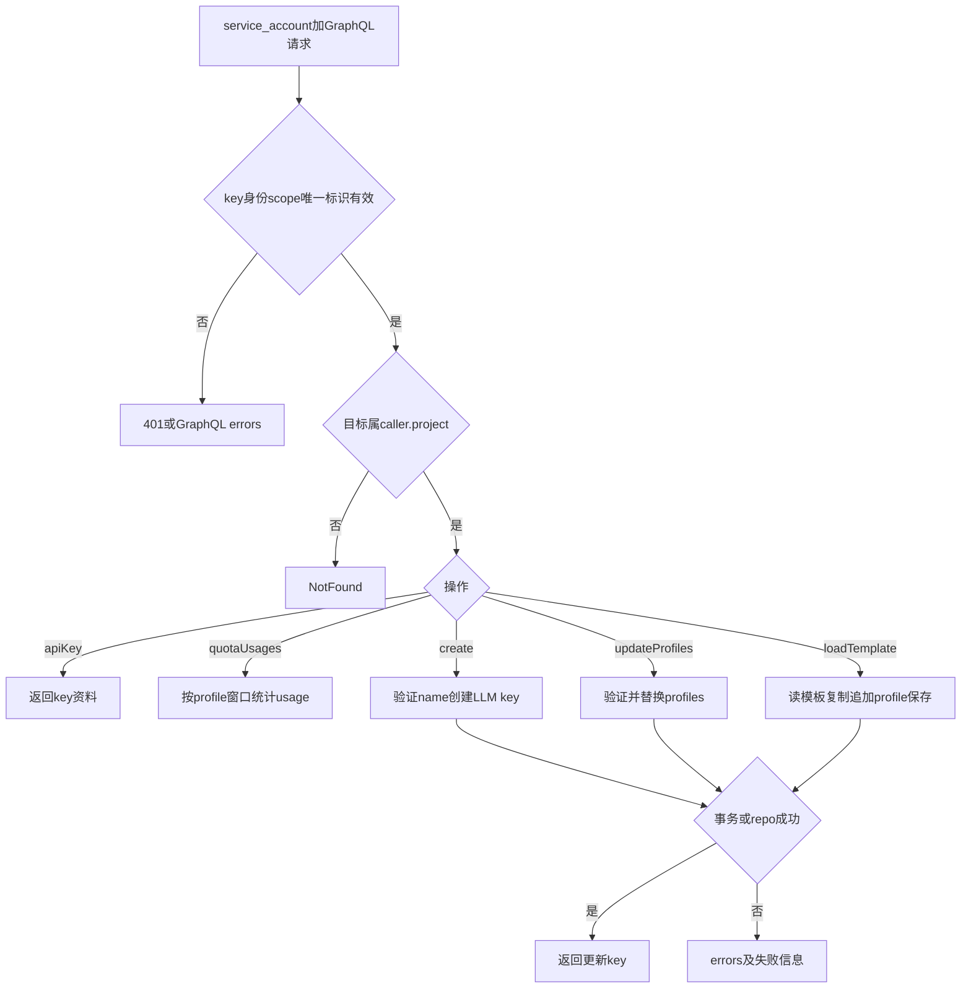
```mermaid
flowchart TD
 A[service_account加GraphQL请求] --> B{key身份scope唯一标识有效}
 B -->|否| X[401或GraphQL errors]
 B -->|是| C{目标属caller.project}
 C -->|否| Y[NotFound]
 C -->|是| D{操作}
 D -->|apiKey| E[返回key资料]
 D -->|quotaUsages| F[按profile窗口统计usage]
 D -->|create| G[验证name创建LLM key]
 D -->|updateProfiles| H[验证并替换profiles]
 D -->|loadTemplate| I[读模板复制追加profile保存]
 G --> J{事务或repo成功}
 H --> J
 I --> J
 J -->|是| K[返回更新key]
 J -->|否| L[errors及失败信息]
```

## 设置从管理接口到PostgreSQL到运行

admin完整字段另见操作清单。SystemSettingsAdapter/SystemSettingsExtAdapter等注入；conduit-services/src/admin_settings_service.rs未在lib.rs导出，是未接生产的替代实现，其单测不能证明生产接线。

| 设置族 / 证据 | 持久化与消费者 | 生效与限制 |
| --- | --- | --- |
| 品牌/title/onboarding；wiring.rs:2056-2198 | systems；system_handlers状态/favicon/frontend query | 持久UI品牌，引导记录不会替用户配置上游 |
| retryPolicy；2248/2267、5391 | systems retry_policy→每请求快照→ordering/Pipeline attempt | 新请求读取，次数/预算/delay/首event/非stream超时/空响应检测统一请求快照 |
| generalSettings；2316/2351、5325 | systems general/accounting→采购零售成本与STATION_CREDIT、rate version；upstreamErrorPolicy | 财务与价格共用advisory锁，已有价格不能换会计币种；时区保存不证明所有worker用该时区，auto backup为UTC02:00 |
| modelSettings；2471/2500、1349/1318 | systems→DbCandidateSource与AutoReasoning | 关联fallback与reasoning影响新请求 |
| channelSettings；1562/1587 | systems→model_sync/probe逐轮读frequency/probe.enabled | sync小时/probe分钟，sync再限定auto_sync渠道 |
| auto-disable；auto_disable_runtime.rs:23/111 | attempt observer读规则与连续错误→禁credential/channel→webhook | 仅启用规则且有provider_status的失败 |
| passThrough/userAgent；1599/1607、2284/2292、5532 | systems→每请求PassThrough/RequestBody/Response/Stream/DefaultUserAgent | 协议与策略决定，不绕鉴权；读取错fallback false |
| storage/default；2198/2223、2300/2308、5562 | systems→DbRequestArtifactStorage与request/execution persistence/preview/GC | 每请求读取；外部写失败不视为已保存；header敏感过滤 |
| security；2043/2101，runtime.rs:125 | systems→blocked_ips→HTTP防护 | 仅LLM/openapi，不作用internal/admin；加载异常放行 |
| proxyPresets；2023/2118/2133 | systems masked列表；channel proxy→build_channel_config→UpstreamExecutor::client_for_request:59 | preset资料本身不生效，要由具体channel选择 |
| quotaEnforcement；wiring_postgres_provider_quota.rs:1398/1406 | systems→PgQuotaAdmissionSource/DbCandidateSource | enabled才读snapshots；monitor与enforce不同 |
| autoBackup；wiring_system_settings_ext.rs:529/546 | systems→PgBackupExtAdapter每小时读取 | daily/weekly/monthly UTC02点，lastBackupAt防当天重复，需有效非database存储 |
| videoStorage；同文件422/444 | systems→PgVideoStorageAdapter:48 | 分钟poll/有效scan interval limit、外部存储，仅已有response URL，不轮询上游视频task |
| webhook；492/504 | systems→auto-disable事件WebhookNotifierRuntime HTTP通知 | 事件/target启用，默认3秒；队列繁忙可丢事件warn |
| key profiles/templates与project offers | api_keys/profiles/templates与access/entitlement/offer SQL→key metadata→候选/模型/map/quota/LB | project offer覆盖映射，先授权后计费，不是独立于项目授权的key profile |
| channel credentials/endpoints/offers/prices | channels/价格/公开目录→DbCandidateSource快照→PipelineCandidate | 新请求读DB；商业价格/映射须审批；保存格式不证明有出站；websocket校验可接受但runtime拒绝 |

### flow-settings

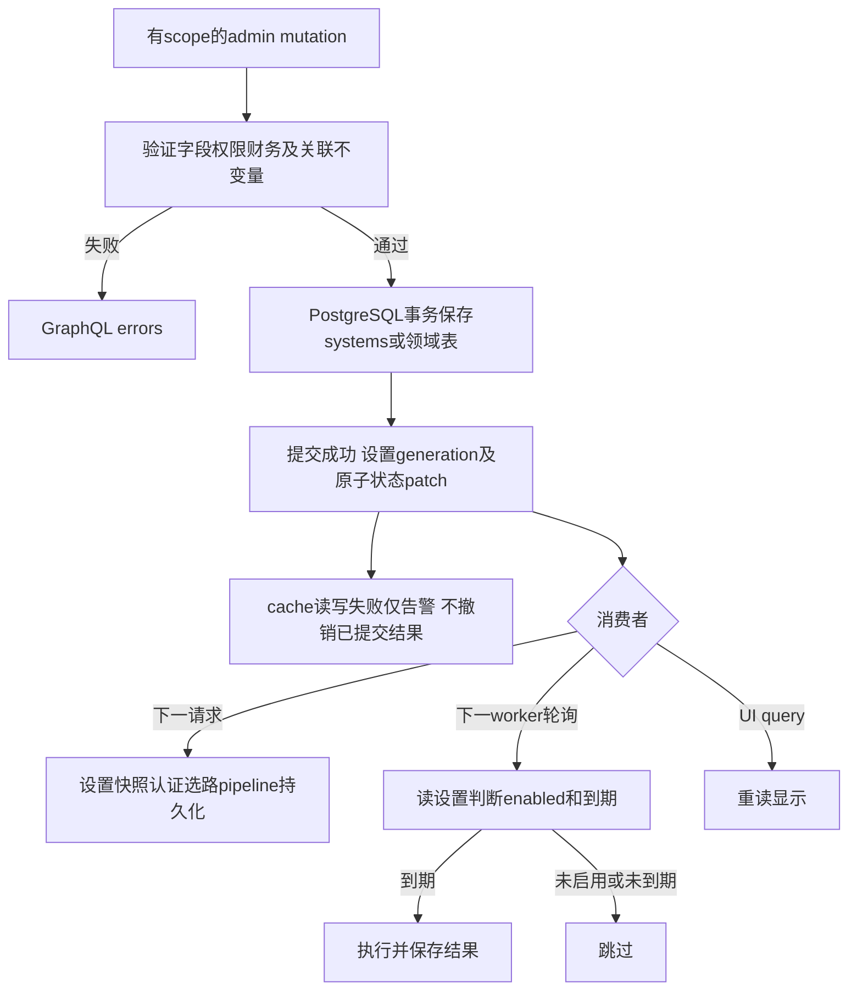
```mermaid
flowchart TD
 A[有scope的admin mutation] --> B[验证字段权限财务及关联不变量]
 B -->|失败| X[GraphQL errors]
 B -->|通过| C[PostgreSQL事务保存systems或领域表]
 C --> D[提交成功 设置generation及原子状态patch]
 D --> K[cache读写失败仅告警 不撤销已提交结果]
 D --> E{消费者}
 E -->|下一请求| F[设置快照认证选路pipeline持久化]
 E -->|下一worker轮询| G[读设置判断enabled和到期]
 E -->|UI query| H[重读显示]
 G -->|到期| I[执行并保存结果]
 G -->|未启用或未到期| J[跳过]
```

配置文件defaults/YAML/env/loader overrides提供启动配置：地址/base/CORS/trusted proxy/deadline/DSN/pools/read-replica/cache mode/worker总开关等通常需重启，不把DB动态消费扩展到所有YAML。allow_no_auth有服务实现，但api_key_auth:353始终拒绝缺key，没有生产无key fallback，不能推荐通过配置开启匿名调用。

## 内部运行功能

### flow-http-security

B-RUNTIME-01：每入站自动触发。用户核对JWT/API key入口、key状态/有效期、当前user active/project role、body/base与trace/request header。密码bcrypt外包hex（auth/password.rs:21）；JWT HS256验签/时效（jwt.rs:45/54）；admin JWT还读DB用户（jwt_auth.rs:176）。API key校验后把模型/映射/项目渠道offers/strategy/quota/并发写metadata。源IP信trusted_proxies；CORS/IP/timeout/panic层；gzip/deflate/zstd单encoding解压有膨胀限制，移除旧encoding/length。key401/quota429/validator500，编码400/413、deadline504、scope403/跨项目404。pipeline key RPM拒绝是403 quota_exceeded（quota.rs:120），不是所有限流都429。IP规则加载异常放行，只作用LLM/openapi。api_key_auth.rs:348；runtime.rs:23-154；openai_handlers.rs:1279；router.rs:751。

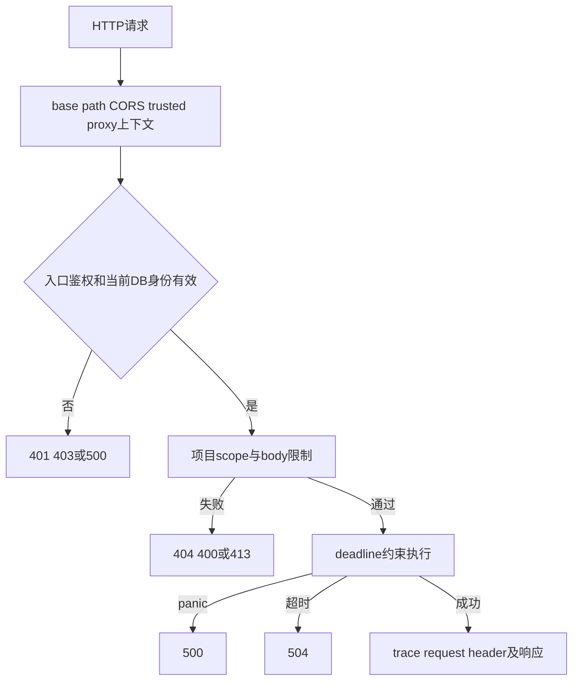
```mermaid
flowchart TD
 A[HTTP请求] --> B[base path CORS trusted proxy上下文]
 B --> C{入口鉴权和当前DB身份有效}
 C -->|否| X[401 403或500]
 C -->|是| D[项目scope与body限制]
 D -->|失败| Y[404 400或413]
 D -->|通过| E[deadline约束执行]
 E -->|panic| F[500]
 E -->|超时| G[504]
 E -->|成功| H[trace request header及响应]
```

B-RUNTIME-02至06共用[HTTP请求执行图](http-api.md#flow-inference)，由管理对应字段配置；每项都有管理步骤与真实运行证据。

| ID / 功能 | 用户配置与排查步骤 | 执行、限制与证据 |
| --- | --- | --- |
| B-RUNTIME-02 候选选择/授权 | 维护公开model、关联priority、project offers、key profile tags/channelIDs→调用模型→看explanation eligible/excluded/selected | DbCandidateSource并发读channel/model/settings与offer mapping；关联regex/tag/when/token、profile/native-tools/stream/provider quota过滤；无候选404区分额度耗尽。candidates.rs:301/720/1837；db_candidate_source.rs:170-319 |
| B-RUNTIME-03 LB/健康/多key/亲和 | 选profile strategy/system default/weight→稳定trace/thread或previous_response_id/prompt_cache_key→看健康与亲和解释 | priority严格组边界，组内score/cost/rotated tie、健康credential；安全指纹，过期禁用格式错不会复活route；previous_response优先prompt-cache，成功反馈cache/PG。orchestrator.rs:1430-1758；route_affinity.rs；usage_log_recorder.rs:525/565 |
| B-RUNTIME-04 策略/提示/覆盖 | 保存model mapping、reasoning、prompts顺序prepend/append、protection、channel header/body/proxy/透传→脱敏测试看attempt | StripBillingHeader/EnsureUsage/Quota/AutoReasoning/ModelAccess/Mapping/InjectPrompt/Protection入站一次；出站每attempt覆盖/auth/UA；Protection仅chat文本/parts mask/reject，加载错放行、坏regex跳过，不保护二进制。wiring.rs:1047-1107；prompt_injection.rs:34；prompt_protection.rs:62-162 |
| B-RUNTIME-05 并发/速率/provider额度 | key quota/window/并发、channel RPM/队列/冷却、provider enforcement→看错误details区分key/channel | key请求quota PG advisory lock+admission，key并发PG lease跨进程；pipeline key RPM与channel RPM/TPM/队列/cooldown/circuit跟踪在进程内。每attemptchannel准入，429 Retry-After冷却。quota_admission.rs:35；usage_log_recorder.rs:362/733；quota.rs:45；rate_limit_admission.rs:79；channel_limiter.rs:124 |
| B-RUNTIME-06 retry/failover/error | 保存retry/status/error pattern/rewrite→发请求→按attempt看最后错误 | 入站一次，每attempt复位stream/channel metadata/model；先同channel（timeout跳过）再next，预算/取消止；空响应与首event/非stream timeout；最后channel rewrite后system policy，客户端原生错误。pipeline.rs:1063-1308/1727；wiring.rs:5325/5391/5640 |

### flow-stream-finalize

B-RUNTIME-07：消费者stream=true保持连接读terminal；取消时关闭body。管理员只有storage.live_preview开启才有preview buffer。UpstreamExecutor增量SSE/队列backpressure，first-event约束；非stream但上游stream可聚合JSON。receiver drop取消token、释放upstream并禁止重试。terminal或完整aggregate→completed/usage；提前断开→canceled；缺terminal且不完整或硬错→failed；受监督finalizer按body/chunks各自策略写request/execution/chunks并释放lease/预留；确认客户端断开的计划通过record_cancellation写父请求canceled，执行行使用同一计划；其他upstream失败均failed，错误文本包含cancel也不改变分类。terminal先保留，只有聚合成功且计量被durable journal接收后才转发成功终结；聚合/持久接收失败返回错误并停止成功终结。完整生命周期受llm_request_timeout绝对deadline约束，累计事件50,000与64MiB预算超限终止。upstream_executor.rs:163；orchestrator.rs:1788；outbound_stream.rs::PersistentStreamFinalizer::close:530；openai_handlers.rs:1500/1542。

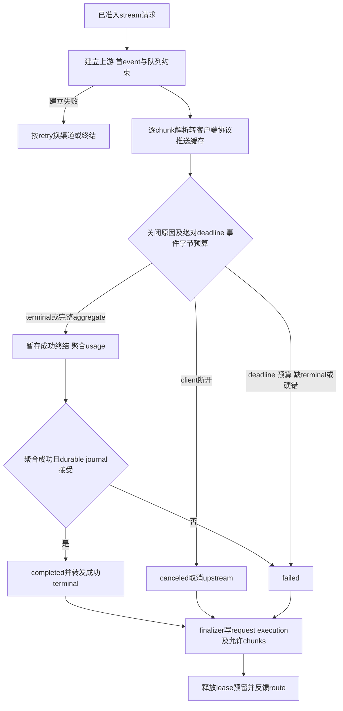
```mermaid
flowchart TD
 A[已准入stream请求] --> B[建立上游 首event与队列约束]
 B -->|建立失败| X[按retry换渠道或终结]
 B --> C[逐chunk解析转客户端协议推送缓存]
 C --> D{关闭原因及绝对deadline 事件字节预算}
 D -->|terminal或完整aggregate| P[暂存成功终结 聚合usage]
 P --> Q{聚合成功且durable journal接受}
 Q -->|是| E[completed并转发成功terminal]
 Q -->|否| G[failed]
 D -->|client断开| F[canceled取消upstream]
 D -->|deadline 预算 缺terminal或硬错| G
 E --> H[finalizer写request execution及允许chunks]
 F --> H
 G --> H
 H --> I[释放lease预留并反馈route]
```

### flow-storage

B-RUNTIME-08：管理员配置storagePolicy与active默认DataStorage→允许header/body/response/chunks→请求→请求页看metadata/route/attempt→授权下载/preview。requests/request_executions分request/attempt，trace/thread关联，usage独立；敏感header过滤、credential仅指纹。primary JSON在PG；外部storage项目/request scoped key。Local需目录，WebDAV HTTP/auth，S3真实AwsSigV4Signer，GCS真实ServiceAccountGcsSigner；无效配置失败，旧placeholder/deferred注释失真。Memory适配器只为内存场景，PG主内容由repo处理，不是产品DB替代。hydrate外部JSON错可能为空；下载需content_saved/key/前缀和可取存储。wiring.rs:983-1007/1065/1083/5562；wiring_request_content.rs:180/225/251/292；storage/backend.rs:159；s3.rs:208；gcs.rs:276。

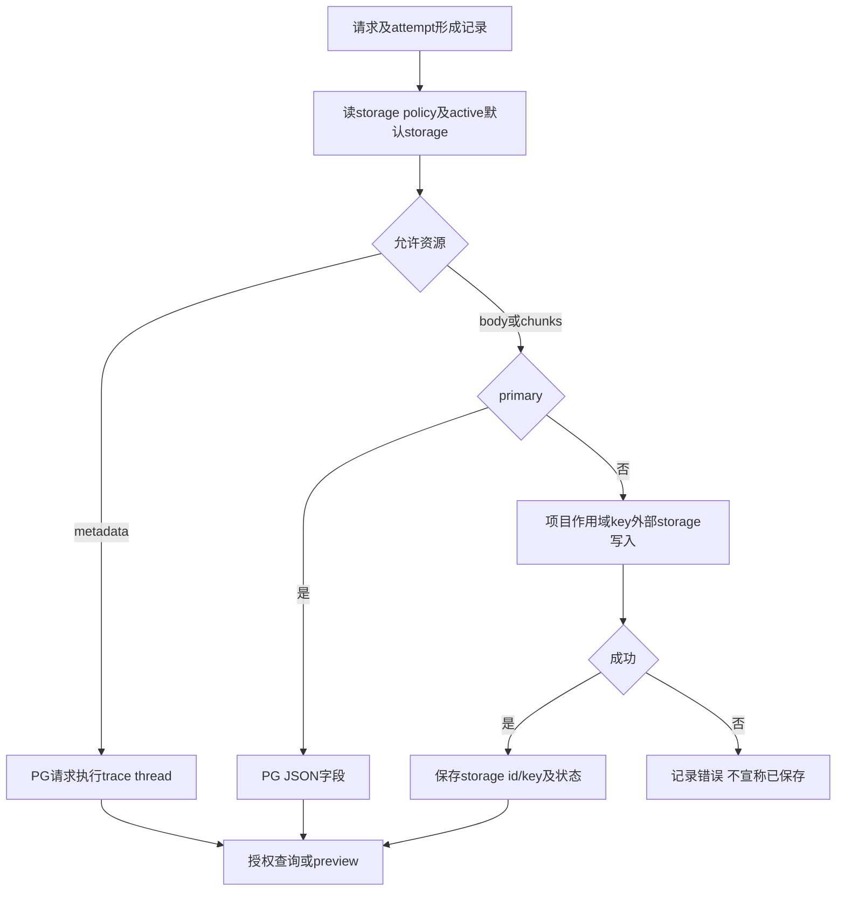
```mermaid
flowchart TD
 A[请求及attempt形成记录] --> B[读storage policy及active默认storage]
 B --> C{允许资源}
 C -->|metadata| D[PG请求执行trace thread]
 C -->|body或chunks| E{primary}
 E -->|是| F[PG JSON字段]
 E -->|否| G[项目作用域key外部storage写入]
 G --> H{成功}
 H -->|是| I[保存storage id/key及状态]
 H -->|否| J[记录错误 不宣称已保存]
 F --> K[授权查询或preview]
 I --> K
 D --> K
```

### flow-accounting

B-RUNTIME-09：先财务setup、零售价/采购价、project商业资料和credit/订阅→发授权请求→看usage版本/采购成本/charge→钱包/allowance/ledger/审计。未知price不默认为零。授权候选后、第一次upstream前，估算input/maxOutput（缺省4096）预留STATION_CREDIT与API key lease；request key advisory事务锁幂等并校验归属。成功usage→charge outbox→订阅/credit结算，绑定price/version/rate snapshots；失败取消释放。reconciler每60秒、100批处理过期reservation/缺结算。Decimal/micros换算采购币种→会计币种→Credit；已有价格锁财务币种。商业价格/变更/兑换审计append-only，不与请求GC混淆。orchestrator.rs:1188-1221；usage_log_recorder.rs:733/908；usage_charge_settler_postgres.rs:508/600-665/485；money.rs::AccountingSettings；migrations000026/27/28/30/31/33；wiring_postgres_billing.rs。

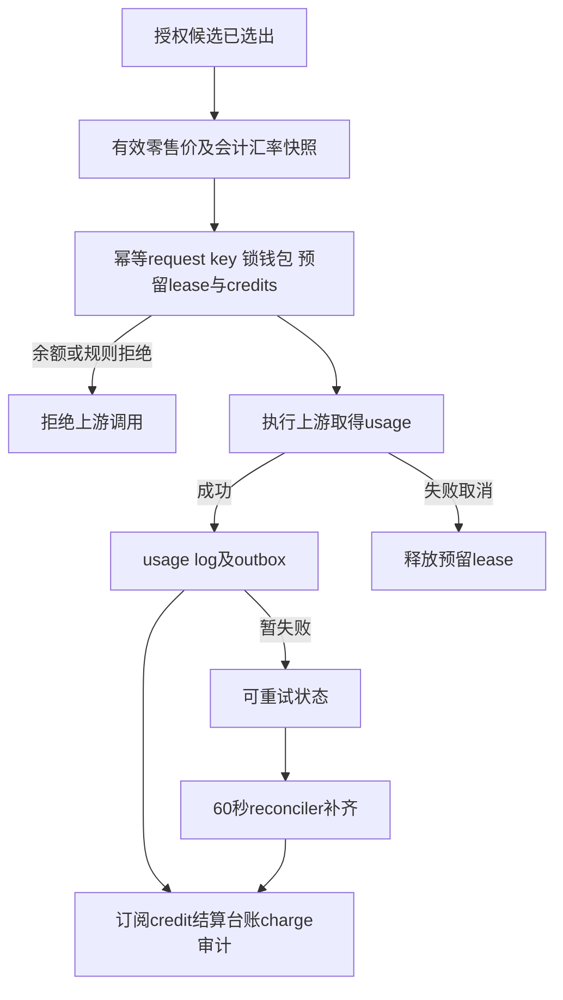
```mermaid
flowchart TD
 A[授权候选已选出] --> B[有效零售价及会计汇率快照]
 B --> C[幂等request key 锁钱包 预留lease与credits]
 C -->|余额或规则拒绝| X[拒绝上游调用]
 C --> D[执行上游取得usage]
 D -->|成功| E[usage log及outbox]
 E --> F[订阅credit结算台账charge审计]
 D -->|失败取消| G[释放预留lease]
 E -->|暂失败| H[可重试状态]
 H --> I[60秒reconciler补齐]
 I --> F
```

### flow-commercial-review

B-RUNTIME-10：创建provider价格/model mapping/retail draft→保存items→submit pending_review→有权review者approve/reject→看events/audit→新请求读applied。approve锁change_set，savepoint按kind应用全部，失败回滚局部并记录失败；状态非法拒绝，过期snapshot可superseded；未批准不影响路由计费。billing/commercialization/redemption/group/pricing/project access适配器真实注入。wiring_postgres_change_sets.rs:204/398/505/595/683/804；wiring.rs:824/858-865；migrations000031/32/33。

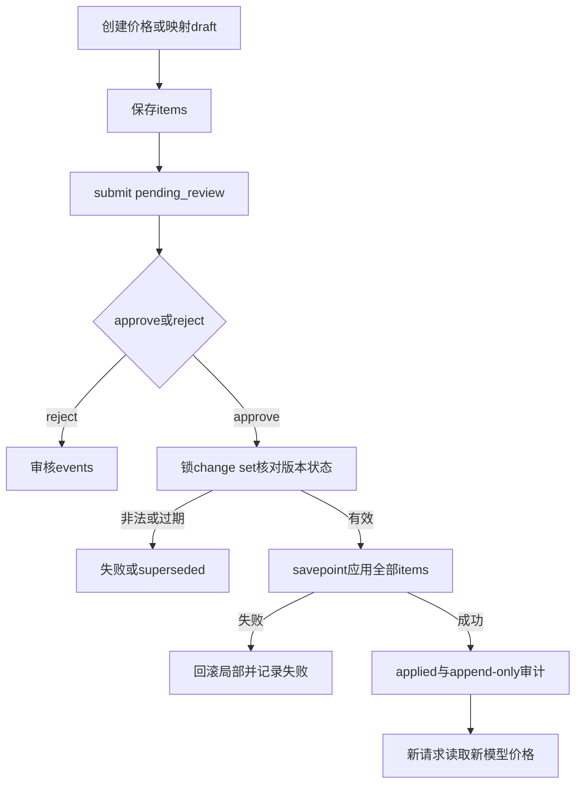
```mermaid
flowchart TD
 A[创建价格或映射draft] --> B[保存items]
 B --> C[submit pending_review]
 C --> D{approve或reject}
 D -->|reject| E[审核events]
 D -->|approve| F[锁change set核对版本状态]
 F -->|非法或过期| G[失败或superseded]
 F -->|有效| H[savepoint应用全部items]
 H -->|失败| I[回滚局部并记录失败]
 H -->|成功| J[applied与append-only审计]
 J --> K[新请求读取新模型价格]
```

## 后台任务与自动业务

cli.rs::start_http_server_async:713→maintenance.rs::start_postgres:44。用户不调用内部函数，下面步骤用于配置、触发确认和排查；轮询成功但没有工作不证明实际业务完成。本研究未运行任务。

| ID / 自动功能 | 条件与触发 | 操作员步骤和结果 | 失败、限制与证据 |
| --- | --- | --- | --- |
| B-AUTO01 订阅周期更新 | 无条件billing.subscription_lifecycle，每60s；到期active/paused/cancel_pending | 管理端计划/分配/续订/autoRenew→到期后查状态周期额度；启用计划且autoRenew active/paused刷新，其余expired并撤权益 | FOR UPDATE OF s SKIP LOCKED LIMIT1逐笔事务；错日志；不是支付扣款。maintenance.rs:58；wiring_postgres_billing.rs::process_due_subscriptions:678/683/697/712 |
| B-AUTO02 卡住请求清理 | gc.enabled且stale_processing_enabled；interval也作陈旧阈值 | 启动配置重启→查processing updated_at超阈值→请求/执行failed→日志/财务对账 | 不证明取消upstream；DB错日志。maintenance.rs:77/82；mark_stale_processing_postgres:317/325/333/341 |
| B-AUTO03 存储策略清理 | gc.enabled；每24h interval，非固定日钟点；DB策略、启动VACUUM配置 | 设置request/response/usage/probe retention→GC preview→到期删除/外部清理→查deleted_rows/failed_resources | 单步错报告，run complete不等全成功；财务审计受保留约束。maintenance.rs:97/107/114/132；run_postgres_storage_policy_gc；gc_service.rs::plan_storage_policy_gc |
| B-AUTO04 渠道模型同步 | 每小时poll；DB auto_sync频率1h/6h/1d桶；enabled未删且auto_sync_supported_models | 配key/autoSync/regex/mapping规则→查supportedModels/deployments/pending mapping drafts；保留manual，消失上游部署/route禁用 | 逐credential试，全失败错；坏regex/规则错；发现不等公开发布。maintenance.rs:145/149；channel_model_sync.rs::run:56、should_run:93、sync_one:104，keys111/regex133/UPDATE162/禁169,179/草稿189/mapping207，apply286/stage404 |
| B-AUTO05 渠道探测统计 | 每分钟poll；动态probe enabled/frequency | 开启频率→有真实请求后查probe成功率吞吐延迟 | 仅统计已存request_executions/usage，不主动HTTP ping或推理；无流量不证明健康。maintenance.rs:161/165；channel_probe.rs::current_probe_plan:122/compute_and_store:48/INSERT103 |
| B-AUTO06 活动流注册表清扫 | always-on默认每5分钟 | 无需配置；preview重连问题查active/订阅/过期条目 | 仅进程内registry，不恢复upstream或持久游标。maintenance.rs:174/177；worker_logic.rs::LiveStreamSweepInterval::DEFAULT:235 |
| B-AUTO07 视频内容归档 | 每分钟读DB设置；enabled及scanIntervalMinutes；active非database目标 | 配FS/S3/GCS/WebDAV/scanLimit→本地response有URL后等待→查contentSaved/key | processing/completed且openai/video或seedance/video且未保存；下载5分钟/512MiB；单错warn；无URL跳过，不poll上游task。maintenance.rs:185；video_storage.rs::run:48/59/68/77/80/87、process_one:110/121/124/127/135/149/157/161 |
| B-AUTO08 自动备份 | 每小时poll；enabled且UTC02时；daily/周日/月1日；lastBackupAt同日跳过 | 配外部目标与章节，敏感章节需CONDUIT_BACKUP_ENCRYPTION_KEY→查lastBackupAt/Error及backups/auto；可手动trigger | active非DB目标，密钥缺/错失败closed；写入新备份后按retentionDays删除本应用backups/auto/conduit时间戳键；0保留全部。删除失败报告lastBackupError，下次重试；其他对象不删除。maintenance.rs:202/209；backup.rs::run_auto_backup:322/336/349/355/369/384/395/403、scheduled412/due434；worker_logic.rs409；backup_service.rs503/526/641 |
| B-AUTO09 上游额度/价格观测 | 启动provider_quota.enabled，interval分钟至少1；due，手动force忽略next_check_at | 配支持key；new_api先probe/confirm→周期→查quota/价格observation/待审draft；enforcement monitor/deprioritize/exclude | 自动扫描仅claudecode/codex/github_copilot/nanogpt/nanogpt_responses/已验证new_api；helper存在不等扫描。claudecode最少token POST可能收费；失败error/ready=false并推进时间，不保证所有channel failclosed。maintenance.rs214/224/227；provider_quota.rs::check153/159/160/163/183/207、check_one214/245/250/252/256/272、settings1084 |

### flow-auto-schedule

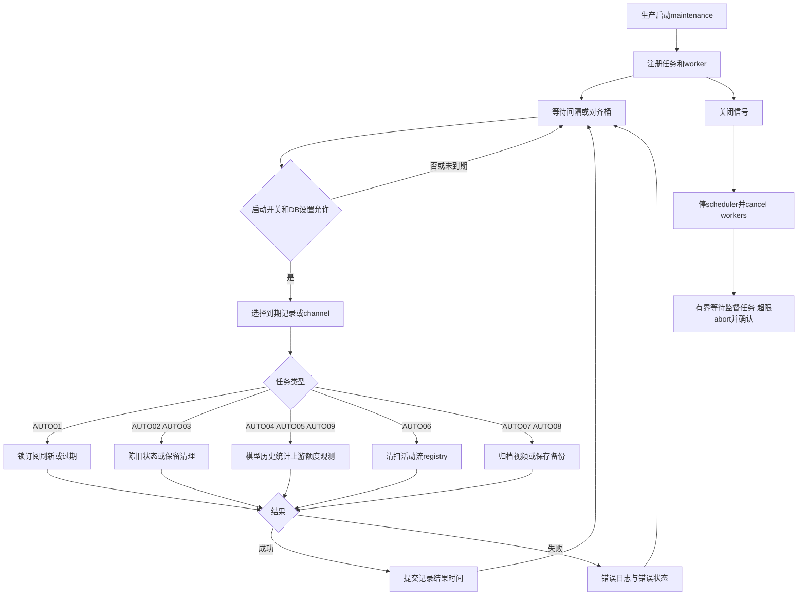
```mermaid
flowchart TD
 A[生产启动maintenance] --> B[注册任务和worker]
 B --> C[等待间隔或对齐桶]
 C --> D{启动开关和DB设置允许}
 D -->|否或未到期| C
 D -->|是| E[选择到期记录或channel]
 E --> F{任务类型}
 F -->|AUTO01| G[锁订阅刷新或过期]
 F -->|AUTO02 AUTO03| H[陈旧状态或保留清理]
 F -->|AUTO04 AUTO05 AUTO09| I[模型历史统计上游额度观测]
 F -->|AUTO06| J[清扫活动流registry]
 F -->|AUTO07 AUTO08| K[归档视频或保存备份]
 G --> L{结果}
 H --> L
 I --> L
 J --> L
 K --> L
 L -->|成功| M[提交记录结果时间]
 L -->|失败| N[错误日志与错误状态]
 M --> C
 N --> C
 B --> O[关闭信号]
 O --> P[停scheduler并cancel workers]
 P --> Q[有界等待监督任务 超限abort并确认]
```

AUTO01至09逐项映射此图；视频/备份还映射flow-auto-storage。

| ID / 事件或补偿功能 | 触发与操作步骤 | 结果/失败与证据 |
| --- | --- | --- |
| B-AUTO10 亲和过期清理 | wiring无条件，每60s最多5000；配置TTL→正常请求创建/命中→到期再选route | purge失败warn，显式值SHA256。wiring.rs976；route_affinity.rs::start_route_affinity_cleanup168/170/171、hash184 |
| B-AUTO11 异步用量结算 | usage/outbox后排队；CONDUIT_BILLING_SETTLEMENT_WORKERS默认8、1–64→完成后查wallet/usage/charge/outbox | permit约束；错outbox_failed/warn；响应返回不等财务完成。settler_postgres.rs217/224/225/232/237 |
| B-AUTO12 财务补偿/过期预留 | wiring982无条件；启动即cleanup，再100批missing charge直至不足100，每60s | 查wallet/reservation/outbox/幂等键；错warn退出当轮，之后继续。settler_postgres.rs::start_reconciler485/488/492/501 |
| B-AUTO13 连续失败禁用/Webhook | 启用autoDisable/status阈值；含provider_status失败入4096队列→读持久连续错误/fingerprint→禁key/channel→启用webhook通知 | 无status不参与，成功记录打断连续失败；队满丢warn；DB/通知错日志，不是可靠事件总线。wiring1036；auto_disable_runtime.rs23/38/39/45/65/66/68/75/91/94/104/111/118；webhook_runtime.rs |

### flow-auto-event

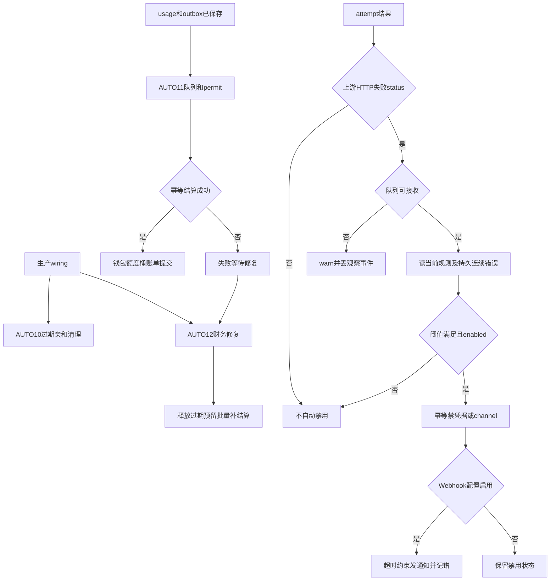
```mermaid
flowchart TD
 A[生产wiring] --> B[AUTO10过期亲和清理]
 A --> C[AUTO12财务修复]
 D[usage和outbox已保存] --> E[AUTO11队列和permit]
 E --> F{幂等结算成功}
 F -->|是| G[钱包额度桶账单提交]
 F -->|否| H[失败等待修复]
 H --> C
 C --> I[释放过期预留批量补结算]
 J[attempt结果] --> K{上游HTTP失败status}
 K -->|否| L[不自动禁用]
 K -->|是| M{队列可接收}
 M -->|否| N[warn并丢观察事件]
 M -->|是| O[读当前规则及持久连续错误]
 O --> P{阈值满足且enabled}
 P -->|否| L
 P -->|是| Q[幂等禁凭据或channel]
 Q --> R{Webhook配置启用}
 R -->|是| S[超时约束发通知并记错]
 R -->|否| T[保留禁用状态]
```

AUTO10至13逐项映射此图。

### flow-auto-storage

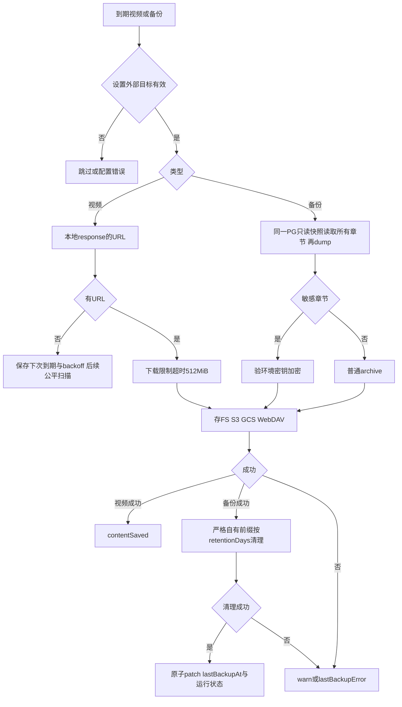
```mermaid
flowchart TD
 A[到期视频或备份] --> B{设置外部目标有效}
 B -->|否| C[跳过或配置错误]
 B -->|是| D{类型}
 D -->|视频| E[本地response的URL]
 E --> F{有URL}
 F -->|否| G[保存下次到期与backoff 后续公平扫描]
 F -->|是| H[下载限制超时512MiB]
 D -->|备份| I[同一PG只读快照读取所有章节 再dump]
 I --> J{敏感章节}
 J -->|是| K[验环境密钥加密]
 J -->|否| L[普通archive]
 H --> M[存FS S3 GCS WebDAV]
 K --> M
 L --> M
 M --> N{成功}
 N -->|视频成功| O[contentSaved]
 N -->|备份成功| Q[严格自有前缀按retentionDays清理]
 Q --> R{清理成功}
 R -->|是| S[原子patch lastBackupAt与运行状态]
 R -->|否| P[warn或lastBackupError 保留重试]
 N -->|否| P[warn或lastBackupError]
```

### 未接线worker与关闭

scheduler/worker.rs有8种worker：ChannelProbe/ChannelModelSync/DataStorageSync/ProviderQuotaCheck/LiveStreamSweeper/PromptCache/VideoStorage/AutoBackup。maintenance只接6种；DataStorageSyncWorker、PromptCacheWorker、runtime::spawn_all_workers不在CLI启动路径，不宣称对应定时reload。

MaintenanceRuntime先停止scheduler调度并取消TaskSupervisor，再停止worker，监督的异步job、亲和、结算/修复、观察器、手动备份/GC、流式生产者/finalizer与HTTP桥有界等待或abort；TaskRuntime在启动部分失败及Drop时也取消。CLI独立metrics abort并await。具体关闭分支见[资源生命周期](#flow-supervision)。

## CLI、DB与运维补证

binary为conduit-api；clap内部command name不代表另一个binary。9项原生命令（含无子命令启动）及managed DB/迁移的步骤、分支图见基础设施I-02至I-11。

- CLI启动顺序：加载校验→logging/runtime→主socket bind→DB/migrate/cache/auth/admin+proxy wiring→maintenance→可选metrics→serve。bind不是ready；停止metrics abort/await与maintenance。cli666/691/700/703/711/713/724/737/746/750，main68。
- preview mask只认key名含secret/key/password/token，db.dsn不匹配，可能直接输出连接凭据。preview和get均须受控终端，不能无审查保存完整输出。cli631/814/839/862，get641/827，支持6项，未知exit4；load2/validate3。
- reset-password省略email只在恰好1 owner时自动选择；缺/多owner或指定非owner失败；密码环境至少8字符bcrypt。reset_owner_password_postgres561/572/594/604。
- bootstrap不是migration/重置；精确confirm、同host/port维护DB、advisory session lock，存在DB不改；role创建而DB失败会保留role并报告partial，查询实际结果后决定重试。run_database226/239/245/251/256；bootstrap353/366/374/433/450/459。
- version/build-info/help无DB操作，build-info有version/commit/branch/build_time/rustc_version/target；未注入unknown，不是当前工作树指纹。cli153/754/758/781/162/655。
- managed PostgreSQL仅Windows+embedded-postgres，状态/配置/DSN/TTY决定模式；独占用户目录锁、state、固定PG setup/start仅loopback、bootstrap后改本次应用DSN；外部配置优先，embedded与环境DSN冲突拒绝。embedded_postgres21/45/117/122/143/204/208/209/213/238/241/249/250。

B-BOOT01：Windows embedded-postgres条件、交互选择、目录锁/state、loopback安装启动与应用role/DB准备见[独立托管数据库步骤](infrastructure.md#I-03)，本次未安装或启动。

### flow-db-schema

B-DB01：PostgreSQL嵌入33SQL，最新000036_recovery_lifecycle，编号间隙不推断35次；每migration在事务pg_advisory_xact_lock后DDL+version commit，失败rollback；disableAuto需schema当前。read replica连接或schema失败按fallback禁用或阻启动。仅Dashboard/Operations生产适配器注入read pool，其余CRUD/路由/鉴权/财务用master。migrate.rs::EMBEDDED_MIGRATIONS194、LATEST151、lock157、执行414/454；connection62/126；wiring479/485/506/510/515/517、Dashboard750/752、Operations772/773。

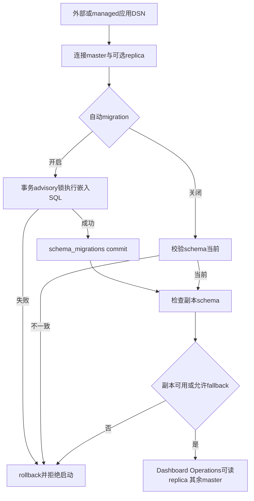
```mermaid
flowchart TD
 A[外部或managed应用DSN] --> B[连接master与可选replica]
 B --> C{自动migration}
 C -->|开启| D[事务advisory锁执行嵌入SQL]
 D -->|失败| X[rollback并拒绝启动]
 D -->|成功| E[schema_migrations commit]
 C -->|关闭| F[校验schema当前]
 E --> G[检查副本schema]
 F -->|不一致| X
 F -->|当前| G
 G --> H{副本可用或允许fallback}
 H -->|否| X
 H -->|是| I[Dashboard Operations可读replica 其余master]
```

持久族覆盖：用户/project/role/member/key/profiles/templates；model/channel/endpoint/price；prompt/protection；request/attempt/usage/trace/thread/probe；systems JSON；data_storage；public model/deployments/routes/access plans/retail；wallet/ledger/subscription/entitlement/buckets；provider quota/price observation；quota admission/跨进程lease；route explanation/affinity；pricing audit/change set/redemption。JSONB配置/内容、Decimal/micros金额、软删SQL；静态模型覆盖不证明运行DB已迁移。

## 管理运维生产行为

JWT及字段owner/scope，不能用LLM key替代。每操作映射flow-operations，详细UI另列。

| ID / 对应GQL | 步骤与结果 | 失败和边界 / source |
| --- | --- | --- |
| B-OPS01 backup | 选六include旗标→dump（总含projects）→敏感加密→base64 data下载 | 非完整PG/PITR财务镜像，敏感含channels/APIKeys/logs需合法32byte base64环境密钥；backup.rs239/249/260/270，crypto61 |
| B-OPS02 restore | archive/章节、channel/model/modelPrice/APIkey策略skip/overwrite/error→解密parse版本→事务parents到consumers、sequence→check success/message | currency共用锁+校验，任何错误rollback；不恢复完整wallet/外部对象；backup273/471/481/483/486/490/505/566/570/576/584 |
| B-OPS03 triggerAutoBackup | 保存目标章节→手动trigger→之后查lastBackupAt/Error和对象 | spawn接受非完成；手动不要求enabled/UTC02，但仍需外部目标/密钥；backup285/291/294、AUTO08 |
| B-OPS04 getCacheDiagnostics | owner选支持target→fileName/content JSON→读backend/prefix/DB摘要 | valuesIncluded=false，candidateSource=postgresql_per_request、candidateEntriesCached=false，不是Redis dump；system_operations75/113/120/123/124 |
| B-OPS05 clearCache | owner选target→clear→check success/targets | 仅channel:/model: prefix invalidation，非flush all，不清亲和/live/财务；backend错error；system_operations138、prefix30 |
| B-OPS06 previewGcCleanup | 输入requestsCleanupDays/usageLogsCleanupDays→读cutoff/estimatedCount | days<=0跳过，只估计不删除；system_operations156/162/166/172 |
| B-OPS07 triggerGcCleanup | 先preview→按StoragePolicy手动plan→trigger→查实际日志/资源 | true仅spawn，单步错不止全部后续；system_operations180/193/196/199/247、AUTO03 |
| B-OPS08 checkForUpdate | API-only版本检查访问release比较semver | 网络/解析错回退当前版本，显示无更新不证明联网；无自动更新binary；wiring2006-2011/1845 |

### flow-operations

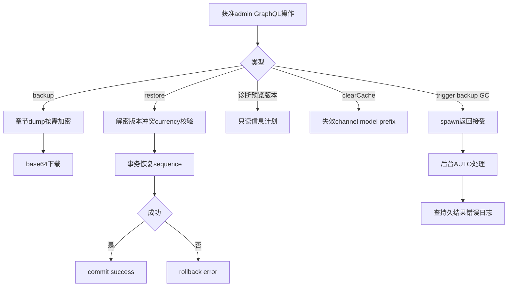
```mermaid
flowchart TD
 A[获准admin GraphQL操作] --> B{类型}
 B -->|backup| C[章节dump按需加密]
 C --> D[base64下载]
 B -->|restore| E[解密版本冲突currency校验]
 E --> F[事务恢复sequence]
 F --> G{成功}
 G -->|是| H[commit success]
 G -->|否| I[rollback error]
 B -->|诊断预览版本| J[只读信息计划]
 B -->|clearCache| K[失效channel model prefix]
 B -->|trigger backup GC| L[spawn返回接受]
 L --> M[后台AUTO处理]
 M --> N[查持久结果错误日志]
```

B-CACHE01：cache.mode为noop/memory/redis/two_level。Redis/two_level须feature/外部Redis，build_cache184分别Noop/Moka/Redis/TwoLevel和namespace。wiring533/537分布式模式builder错阻启动，其余543 warn回退Noop。SystemService每次先读权威PG值，用内容SHA生成缓存键并以60秒TTL回填；旧读回填不同generation键不能覆盖新值。缓存读写/失效失败记录告警，已经提交的DB设置仍返回成功。候选仍每请求PG；内存限流不因Redis启用而跨节点。选择mode/namespace/TTL→重启→diagnostics实际backend→GraphQL设置写在跨实例PG advisory事务锁下执行read/merge/write，后台状态使用JSONB原子局部patch；不以缓存失效模拟配置事务。

B-OBS01 metrics：独立listener/path（缺leading/自动补），不套主router同鉴权；进程内requests/inflight/duration，重启清零。B-OBS02 logging：filter/stdout/file/JSON，file DAILY+max_backups，init没实现max_size/max_age/compress策略；日志init错阻启动。OTEL feature为空/planned，无exporter生产接线。runtime_logging8/15/29/31/35/60/90；cli692/724/729；router765与metrics middleware。操作步骤见基础设施I-14，flow-observe。

timezone：Dashboard在启动with_offset(resolve_timezone_offset())，IANA解析当时FixedOffset，unknown回UTC；DB timezone修改或DST不再次刷新Dashboard；backup/modelsync/quota UTC。wiring756/5356-5374。

生产admin schema wiring797-882 ScopeAuthExtension与所有业务slots注入，具体PG/service创建600-795。包括System/Model/Channel/APIkey/Profile/Prompt/Me/User/Billing/Project/Role/Market/Commercialization/Group/Dashboard/Operations/Probe/Quota/Requests/Usage/DataStorage/Backup/Execution/Route/Thread/Trace/Node。裸AppServices::default测试503不证明CLI生产全部stub。

## 后端模块覆盖与真实依赖

17 crate为16生产crate加testkit；基础1357输入与graph File1344由INDEX_DOCS负责。以下私有helper按功能族导航，不制造独立用户入口。

| crate | 生产连接/功能归组 | 直接证据与边界 |
| --- | --- | --- |
| conduit-bin | main/CLI/config→PG/cache→admin/openapi/proxy/maintenance；身份商业用量存储adapters | main68/cli700/wiring449/797/894/933；CLI/BOOT/DB/AUTO/OPS；feature条件非已启动 |
| conduit-http | router/state、公用status/init/auth/OIDC、admin OAuth/content/preview/GraphQL、协议/static/middleware/metrics/serve | router433/441-763/765；53route/55 method-path，另metrics和fallback；helper非上游运行证明 |
| conduit-orchestrator | DB候选、endpoint/LB/健康多key/affinity、admission/记录、bridge/live/upstream/middleware | lib3/wiring933/955/1112/orchestrator execute_llm/openai_bridge202；RUNTIME02-09 |
| conduit-pipeline | cancellation、request/response/raw/stream middleware、attempt/retry/failover、empty/firstevent/error rewrite/pass-through | lib3/pipeline1063/1727/stream_live；RUNTIME06-08 |
| conduit-services | APIkey/auth/backup/billing/channel/model/pricing/quota/provider/project/commercialization/role/user/member/prompt/protection/request/usage/thread/trace/system/file/video/health | lib3-29/wiring600-795/UsageLogRecorder/maintenance；254管理字段另前端；admin_settings_service.rs未lib导出，其测试非production证明 |
| conduit-db | PG pools/migration/policy repo/row/tx/quota admission/soft delete/project isolation | lib3/connection62/migrate194/pg_quota_admission35；DB01/RUNTIME05/09；主路径PG，InMemory辅助 |
| conduit-core | domain objects、pricing/conditions/ConduitError/error policy | lib3/error166/ErrorKind25/UpstreamErrorPolicy135；所有生产层共享，类型存在非端点支持 |
| conduit-auth | bcrypt/JWT/APIkey/principal/context/RBAC/scope/project policy | lib3-11/password21/jwt45/54/http api_key_auth348/jwt_auth83；RUNTIME01/HTTP鉴权/OpenAPI |
| conduit-llm | unified Chat/Embedding/Image/Video/Audio/Rerank、HTTP/format/stream/usage/token | lib3-6/model LlmRequest15/Payload46；多模态helper有生产限制 |
| conduit-transformers | OpenAI/Anthropic/Gemini/Jina/Doubao/provider辅助/registry/SSE/usage/error | lib3-33/traits outbound261/wiring registry148-276；仅5fallback chat格式，6provider failclosed；非chat专属无出站 |
| conduit-cache | Cache/live/Noop/Moka/Redis/TwoLevel/namespace/TTL | lib build_cache184/wiring533-547；CACHE01/OPS04-05；Redis条件feature，候选PG per-request |
| conduit-config | AppConfig/YAML/default/env/CLI/schema/validate/export | lib5-9/loader119-134/validate；CLI02-04/SETTINGS；动态DB设置另通路 |
| conduit-scheduler | Scheduler/jobs/worker loop/cancel、8worker与alignment/frequency/switch | lib3-6/worker/worker_logic/maintenance44；AUTO01-09；6business worker接线，PromptCache/DataStorageSync未启动 |
| conduit-storage | backend factory/local/WebDAV/S3/GCS、HTTP/signers/config | lib3-9/backend159/S3 signer208/GCS signer276/wiring_request_content180；RUNTIME08/AUTO07-08/OPS01-03；真实签名实现，旧placeholder注释失真，远端未运行 |
| conduit-openapi-graphql | service-account/project隔离2query3mutation | lib/resolver137/164/222/242/274/wiring894/wiring_openapi510/638/680/821/951；全部5操作，非匿名 |
| conduit-admin-graphql | admin schema/authz/traits/scalars/connections | wiring797-882所有production槽；前端105Q149M；Public字段仍HTTPJWT |
| conduit-testkit | DB isolation/fake provider/contracts/golden/stream/New API fake gateway | lib9-14；非生产依赖/测试支持，无运行，不算产品操作 |

## 口径与已确认限制

HTTP53注册/55 GET POST DELETE method-path，不含自动OPTIONS、static fallback或独立metrics GET。OpenAPI2Q3M；Admin105Q149M共254不重复计数；CLI9含默认启动；RUNTIME10族；AUTO13族；OPS8族。完整method-path需要逐项机器清单，不能23group替代。

- outbound仅OpenAiChatCompletions/AnthropicMessages/GeminiContents/OpenAiResponses/OpenAiResponsesCompact；非chat及legacy专属endpoint无transformer即invalid_request；默认first endpoint fallback可能错chat格式/path，不能宣称支持所有协议。
- imageEdits/audioTranscriptions/audioTranslations multipart走ChatJSON bridge，真实multipart无生产解析。video GET/DELETE本地snapshot/canceled，无provider GET/DELETE/退款；视频归档仅本地URL下载。OAuth凭据不解除6provider outbound阻断。
- HTTP缺key仍401，allow_no_auth未接anonymousfallback；IP名单加载失败放行；protection只chat text/parts regex；RPM等部分process-local，request预算/跨进程lease/wallet用PG；metrics独立无相同auth。
- backup retentionDays已消费，见AUTO08及下方删除边界；Dashboard timezone启动FixedOffset；file logging只有DAILY/max_files；PromptCache/DataStorageSync未接；otel无exporter；readReplica仅Dashboard/Operations。
- Playground补核：只有GET /admin/playground（GraphQL调试），没有POST /admin/playground/chat；UI transport实现但production入口缺失/fallback失败，不能写成已可推理。
- 外部provider/FS/S3/GCS/WebDAV/Redis、PG迁移恢复、并发取消终态、公网OIDC/OAuth第三方条件未运行，不由静态文档宣称成功。

## 检查范围

仅源/配置/test/contract静态读取、路由注册枚举、维护者已保存graph JSON。未运行cargo/test/provider/server/migration/browser/数据库，未写文件/启动后台。fixtures与fake transformer不等production registry；wiring DB boot测试缺CONDUIT_TEST_POSTGRES_DSN可return Ok，不能把旧未配置运行当PG通过。graph best_effort/SQL parse部分、trait/macros/动态选择须具体源补证，空结果非不存在。cli-trace有lsp/heuristic置信差异。

source未变允许复用代码结论，丢失旧文件不算持久化。INDEX_DOCS路由提取第一次54行漏多行mount_path trailing comma的Gemini POST；修正提取为55行/53paths并保留源行，未据旧缺项判不存在。

## A6研究者反思

原生read-only与首次文件产物约定冲突，改sole writer批次交接，合同今后先明确角色可写范围。中断后成功消息不证明文件仍在，恢复核exists/hash/source再保存，源码未变不重复全量调查。auto-refresh graph集中维护，其他叶子用snapshot；SQL/trait/macros边界明示。前端负责admin/UI，后端负责HTTP/OpenAPI/生产消费者，接口有唯一枚举责任。旧placeholder/onlyOpenAI/未接线注释与实现冲突时查真实wiring。Windows rg通配错误/截断改有界路径读取，不将检索失败当不存在，不调用外部补证明。

background：本研究无文件写入、临时文件、服务/子进程、exec session、未决工具；所有命令已返回。维护者snapshot由INDEX_DOCS持有，已有graph/runtime进程非本叶创建，不停止。

## 逐业务族到步骤和流程

| 功能ID | 具体触发/角色/步骤/结果与限制 | 流程 |
| --- | --- | --- |
| [B-OPENAPI-01](#B-OPENAPI-01) | 读取本功能对应段/表中的启用条件、输入、输出、错误；自动功能无需调用私有函数 | [执行图](backend.md#flow-openapi) |
| [B-OPENAPI-02](#B-OPENAPI-02) | 读取本功能对应段/表中的启用条件、输入、输出、错误；自动功能无需调用私有函数 | [执行图](backend.md#flow-openapi) |
| [B-OPENAPI-03](#B-OPENAPI-03) | 读取本功能对应段/表中的启用条件、输入、输出、错误；自动功能无需调用私有函数 | [执行图](backend.md#flow-openapi) |
| [B-OPENAPI-04](#B-OPENAPI-04) | 读取本功能对应段/表中的启用条件、输入、输出、错误；自动功能无需调用私有函数 | [执行图](backend.md#flow-openapi) |
| [B-OPENAPI-05](#B-OPENAPI-05) | 读取本功能对应段/表中的启用条件、输入、输出、错误；自动功能无需调用私有函数 | [执行图](backend.md#flow-openapi) |
| [B-RUNTIME-02](#B-RUNTIME-02) | 读取本功能对应段/表中的启用条件、输入、输出、错误；自动功能无需调用私有函数 | [执行图](http-api.md#flow-inference) |
| [B-RUNTIME-03](#B-RUNTIME-03) | 读取本功能对应段/表中的启用条件、输入、输出、错误；自动功能无需调用私有函数 | [执行图](http-api.md#flow-inference) |
| [B-RUNTIME-04](#B-RUNTIME-04) | 读取本功能对应段/表中的启用条件、输入、输出、错误；自动功能无需调用私有函数 | [执行图](http-api.md#flow-inference) |
| [B-RUNTIME-05](#B-RUNTIME-05) | 读取本功能对应段/表中的启用条件、输入、输出、错误；自动功能无需调用私有函数 | [执行图](http-api.md#flow-inference) |
| [B-RUNTIME-06](#B-RUNTIME-06) | 读取本功能对应段/表中的启用条件、输入、输出、错误；自动功能无需调用私有函数 | [执行图](http-api.md#flow-inference) |
| [B-AUTO01](#B-AUTO01) | 读取本功能对应段/表中的启用条件、输入、输出、错误；自动功能无需调用私有函数 | [执行图](backend.md#flow-auto-schedule) |
| [B-AUTO02](#B-AUTO02) | 读取本功能对应段/表中的启用条件、输入、输出、错误；自动功能无需调用私有函数 | [执行图](backend.md#flow-auto-schedule) |
| [B-AUTO03](#B-AUTO03) | 读取本功能对应段/表中的启用条件、输入、输出、错误；自动功能无需调用私有函数 | [执行图](backend.md#flow-auto-schedule) |
| [B-AUTO04](#B-AUTO04) | 读取本功能对应段/表中的启用条件、输入、输出、错误；自动功能无需调用私有函数 | [执行图](backend.md#flow-auto-schedule) |
| [B-AUTO05](#B-AUTO05) | 读取本功能对应段/表中的启用条件、输入、输出、错误；自动功能无需调用私有函数 | [执行图](backend.md#flow-auto-schedule) |
| [B-AUTO06](#B-AUTO06) | 读取本功能对应段/表中的启用条件、输入、输出、错误；自动功能无需调用私有函数 | [执行图](backend.md#flow-auto-schedule) |
| [B-AUTO07](#B-AUTO07) | 读取本功能对应段/表中的启用条件、输入、输出、错误；自动功能无需调用私有函数 | [执行图](backend.md#flow-auto-schedule) |
| [B-AUTO08](#B-AUTO08) | 读取本功能对应段/表中的启用条件、输入、输出、错误；自动功能无需调用私有函数 | [执行图](backend.md#flow-auto-schedule) |
| [B-AUTO09](#B-AUTO09) | 读取本功能对应段/表中的启用条件、输入、输出、错误；自动功能无需调用私有函数 | [执行图](backend.md#flow-auto-schedule) |
| [B-AUTO10](#B-AUTO10) | 读取本功能对应段/表中的启用条件、输入、输出、错误；自动功能无需调用私有函数 | [执行图](backend.md#flow-auto-event) |
| [B-AUTO11](#B-AUTO11) | 读取本功能对应段/表中的启用条件、输入、输出、错误；自动功能无需调用私有函数 | [执行图](backend.md#flow-auto-event) |
| [B-AUTO12](#B-AUTO12) | 读取本功能对应段/表中的启用条件、输入、输出、错误；自动功能无需调用私有函数 | [执行图](backend.md#flow-auto-event) |
| [B-AUTO13](#B-AUTO13) | 读取本功能对应段/表中的启用条件、输入、输出、错误；自动功能无需调用私有函数 | [执行图](backend.md#flow-auto-event) |
| [B-OPS01](#B-OPS01) | 读取本功能对应段/表中的启用条件、输入、输出、错误；自动功能无需调用私有函数 | [执行图](backend.md#flow-operations) |
| [B-OPS02](#B-OPS02) | 读取本功能对应段/表中的启用条件、输入、输出、错误；自动功能无需调用私有函数 | [执行图](backend.md#flow-operations) |
| [B-OPS03](#B-OPS03) | 读取本功能对应段/表中的启用条件、输入、输出、错误；自动功能无需调用私有函数 | [执行图](backend.md#flow-operations) |
| [B-OPS04](#B-OPS04) | 读取本功能对应段/表中的启用条件、输入、输出、错误；自动功能无需调用私有函数 | [执行图](backend.md#flow-operations) |
| [B-OPS05](#B-OPS05) | 读取本功能对应段/表中的启用条件、输入、输出、错误；自动功能无需调用私有函数 | [执行图](backend.md#flow-operations) |
| [B-OPS06](#B-OPS06) | 读取本功能对应段/表中的启用条件、输入、输出、错误；自动功能无需调用私有函数 | [执行图](backend.md#flow-operations) |
| [B-OPS07](#B-OPS07) | 读取本功能对应段/表中的启用条件、输入、输出、错误；自动功能无需调用私有函数 | [执行图](backend.md#flow-operations) |
| [B-OPS08](#B-OPS08) | 读取本功能对应段/表中的启用条件、输入、输出、错误；自动功能无需调用私有函数 | [执行图](backend.md#flow-operations) |
| [B-RUNTIME-01](#B-RUNTIME-01) | 读取本功能对应段/表中的启用条件、输入、输出、错误；自动功能无需调用私有函数 | [执行图](backend.md#flow-http-security) |
| [B-RUNTIME-07](#B-RUNTIME-07) | 读取本功能对应段/表中的启用条件、输入、输出、错误；自动功能无需调用私有函数 | [执行图](backend.md#flow-stream-finalize) |
| [B-RUNTIME-08](#B-RUNTIME-08) | 读取本功能对应段/表中的启用条件、输入、输出、错误；自动功能无需调用私有函数 | [执行图](backend.md#flow-storage) |
| [B-RUNTIME-09](#B-RUNTIME-09) | 读取本功能对应段/表中的启用条件、输入、输出、错误；自动功能无需调用私有函数 | [执行图](backend.md#flow-accounting) |
| [B-RUNTIME-10](#B-RUNTIME-10) | 读取本功能对应段/表中的启用条件、输入、输出、错误；自动功能无需调用私有函数 | [执行图](backend.md#flow-commercial-review) |
| [B-BOOT01](#B-BOOT01) | managed PostgreSQL准备条件，具体设置、结果及失败处理见段落 | [流程](infrastructure.md#flow-database) |
| [B-DB01](#B-DB01) | 迁移及master/read pools，具体设置、结果及失败处理见段落 | [流程](backend.md#flow-db-schema) |
| [B-CACHE01](#B-CACHE01) | cache后端与动态设置失效，具体设置、结果及失败处理见段落 | [流程](backend.md#flow-settings) |
| [B-OBS01](#B-OBS01) | 独立metrics，具体设置、结果及失败处理见段落 | [流程](infrastructure.md#flow-observe) |
| [B-OBS02](#B-OBS02) | logging，具体设置、结果及失败处理见段落 | [流程](infrastructure.md#flow-observe) |

## 计量恢复、删除与后台生命周期

本节反映quality-repair-20261006的实现。旧研究段落的数字行号是定位线索，当前函数实现与[内容清单](source-manifest.md)为准；实际检查与未运行范围见[修复检查记录](execution-retrospective.md#repair-checks)。没有新增推理协议或公开路由，原有不支持的协议/Playground入口仍受前文限制。

### 持久计量输入与事务交接

每个实例必须有自己的持久usage_recovery目录，不能共享同一目录；进程持排他文件锁。首次上游准入前预留journal容量，并在requests标记metering_pending。成功usage先以白名单结构（身份ID、时间、token/成本审计、价格引用、reservation key）写入有校验和且fsync的journal.wal；没有prompt、原始headers或credentials。成功stream terminal暂存到此接受点。

PG handoff在一个事务内校验event_key/payload_hash永久receipt、创建usage与usage_charge_outbox、清metering_pending，再commit。commit后才ack WAL；结果不明、PG失败或重启会重放同event_key，不重复计量/收费。receipt在已结算usage合法GC后仍阻止重插。ready文件是重放索引，WAL才是权威；它不会用一个空内存队列替代输入持久化。

PG故障而journal写入成功时可返回成功，随后监督的replay循环交接；journal容量不足会在新上游前拒绝准入，写入/损坏/冲突失败会阻止后续准入并返回持久化错误。不得删除未ack的WAL、ready或quarantine以强行恢复。重放可恢复计量输入，不保证操作系统/卷损毁后的数据恢复；需要持久卷备份和实例目录的正确恢复。崩溃留下metering_pending却无确认事件时保守保留请求，需运维核对而非猜测usage收费。

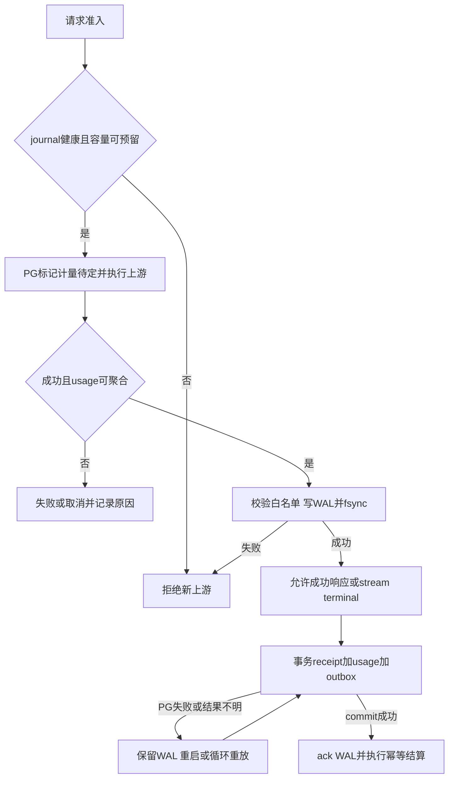
```mermaid
flowchart TD
 A[请求准入] --> B{journal健康且容量可预留}
 B -->|否| X[拒绝新上游]
 B -->|是| C[PG标记计量待定并执行上游]
 C --> D{成功且usage可聚合}
 D -->|否| E[失败或取消并记录原因]
 D -->|是| F[校验白名单 写WAL并fsync]
 F -->|失败| X
 F -->|成功| G[允许成功响应或stream terminal]
 G --> H[事务receipt加usage加outbox]
 H -->|PG失败或结果不明| I[保留WAL 重启或循环重放]
 I --> H
 H -->|commit成功| J[ack WAL并执行幂等结算]
```

### 内容删除、视频公平扫描与活动租约

GC先在同一PG事务写删除队列、expired_artifacts tombstone并清对应JSON或父记录；hydrate和晚到的body/chunks/media写入都尊重tombstone。外部PUT前保存写入intent，避免进程在存储写入后、保存引用前退出而失去清理依据。监督任务每30秒处理持久删除队列；失败记录重试/backoff，父记录已删除仍保留对象key供恢复。所有对象受每对象PG claim保护，不能从目录名猜测任意用户文件可删除。

视频按持久next_attempt_at与ID选择到期项。缺URL/下载失败推进退避，失败前缀不会反复占满scanLimit；重启保留重试进度。下载仍仅从本地保存response URL取得，不新增提供商任务GET/DELETE。稳定项目/request存储key与写intent防止重试产生失联对象。

请求及execution在建立时保存activity_until，覆盖llm_request_timeout活动期；stale GC不因60秒没有终结写入就误判长流。metering_pending或未结算outbox关联行受GC保护。活动到期与请求失败是不同状态，处理时同时核对实际lease和期限。

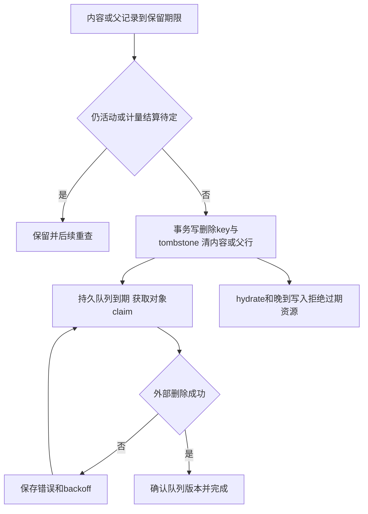
```mermaid
flowchart TD
 A[内容或父记录到保留期限] --> B{仍活动或计量结算待定}
 B -->|是| C[保留并后续重查]
 B -->|否| D[事务写删除key与tombstone 清内容或父行]
 D --> E[持久队列到期 获取对象claim]
 E --> F{外部删除成功}
 F -->|否| G[保存错误和backoff]
 G --> E
 F -->|是| H[确认队列版本并完成]
 D --> I[hydrate和晚到写入拒绝过期资源]
```

### 多实例认领与关闭

PG maintenance_claims用owner UUID、120秒lease与30秒续租排他认领模型同步、探测、quota、自动/手动备份、GC、视频及对象删除。到期owner可被新实例接管；固定日期/对齐桶的完成记录防止重复执行。定时备份认领后再次读取配置，区分Executed与Skipped；跳过释放日期claim，同日重新启用可重试，只有成功执行才完成日期fence。日期备份使用稳定对象名，恢复重复PUT同一对象。外部提供商请求在进程崩溃后的结果不明仍依赖提供商自身幂等能力，不能宣称网络副作用全局exactly-once。

关闭停止新调度、取消受监督任务并有界等待；超限abort再等待退出。部分初始化失败也由TaskRuntime清理。请求stream deadline、上游reqwest timeout和API并发/钱包预留期限对齐；预算或取消通过同一finalizer闭环。metrics用Drop guard在取消时减in_flight，外层统计最终504一次。保存配置的cache警告不冒充DB未提交。

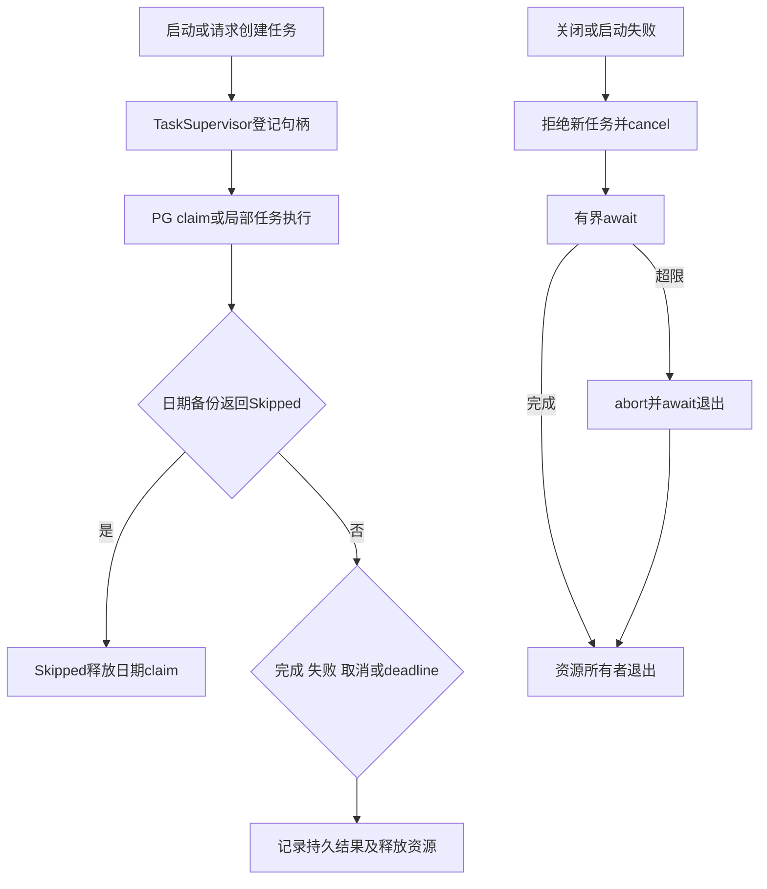
```mermaid
flowchart TD
 A[启动或请求创建任务] --> B[TaskSupervisor登记句柄]
 B --> C[PG claim或局部任务执行]
 C --> K{日期备份返回Skipped}
 K -->|是| L[Skipped释放日期claim]
 K -->|否| D{完成 失败 取消或deadline}
 D --> E[记录持久结果及释放资源]
 F[关闭或启动失败] --> G[拒绝新任务并cancel]
 G --> H[有界await]
 H -->|超限| I[abort并await退出]
 H -->|完成| J[资源所有者退出]
 I --> J
```

### 备份一致性与保留

手动和自动dump所有选定section经一次load_sections调用，在同一REPEATABLE READ READ ONLY PG事务连接读取projects、APIkey join和价格子表；commit后才序列化/加密/写存储。恢复仍用原事务，不将应用JSON archive称为完整钱包数据库备份。

retentionDays正值清理新备份存储中严格匹配backups/auto/conduit-UTC时间戳.json的过期对象；0永久。其他前缀、手工备份和未知命名保留。写入成功但清理失败不能伪称整次完成，lastBackupError保留且可重试。生产run_scheduled入口在配置/存储/retention失败时原子patch lastBackupError；下次实际成功清除错误并更新lastBackupAt，不用旧配置整JSON覆盖管理员并发修改；Owner保存配置不能覆盖这些只读运行字段。定时调度领取日期claim后重新读配置，禁用或不再到期返回Skipped并释放claim；同日重新启用可重试，Executed才完成日期fence。
