# 前端页面、用户操作与流程

绑定[源码输入清单](source-manifest.md)，原静态研究来源FRONTEND_RESEARCH a2/r2；本轮修复另有前端单元/构建及隔离PG回归，未运行浏览器或真实上游。50页面+2布局、31 feature目录。每个UI操作有入口/权限/步骤/失败说明；组合ID是同段不同操作的别名。根字段的独立操作与精确参数见[管理GraphQL](admin-graphql.md)，客户端所有模板见[268文档](frontend-client-operations.md)。

Playground前端交互已实现，但生产缺POST /admin/playground/chat；GET /admin/playground是另一个GraphQL调试入口。占位表单、Fake chats、静态Help/Permission、缺/requests与/project/usage-logs页面均按当前实现标明。

优先事实：APIKey Load Template已改变服务器key；Models仅单项Archive/Delete和bulk Enable/Disable，bulkArchiveModels/bulkDeleteModels为API-only；profile头像无显式大小/MIME校验，profile保存不直接切换i18n；财务引导先保存General再标完成。下文已按这些纠正组织。

# 前端与管理 GraphQL 探索

候选：source:3f1dbb00cd6c4d6e2d3d7478591d8e24b0ec1e12+a97ecf0159b39f693618492bbcf1e4a39b3009c71351f026c8da4ade087cd9b1。只读静态源码，未启动应用、浏览器或请求真实提供商，运行行为验收未运行。职责：frontend/ 和 crates/conduit-admin-graphql/，相关契约与必要跨层入口。

GraphQL API 根字段为 lib.rs 的 QueryRoot 与 mutation.rs 的 MutationRoot，不应把 schema.rs 的 synthetic SDL smoke 或旧路径注释当成当前完整 API。AdminSchema=Schema<QueryRoot,MutationRoot,EmptySubscription>（lib.rs:59），无 subscription。

覆盖：52 createFileRoute 声明（含 authenticated/settings 2 个 layout，alias 单独列），31 feature 目录，254 管理根字段=105 query+149 mutation；268 前端 GraphQL 模板文档=119 query+149 mutation（含重复名称和残留定义，不等于独立用户动作）。GraphQL 常量 user 与 signIn 不对应当前根字段，标记残留/无 schema 实现；实际登录走 REST /admin/auth/signin。

证据：frontend-functions.json 为 5058 符号完整页；files.json 含 frontend778/admin49 File 节点。研究者未调用会自动刷新的图谱工具；动态派发、Rust 宏、JS 模板拼接由有界当前源码核实。研究 scope 824 个可读文本源码/配置/测试/locale 文件的 path+content-SHA256 有序 JSON 总 SHA256=2dd6de1638c74723d2e69cc002bfcbb6209391f9ea60c08c0f74660ff3e3e8cc，此指纹不能替代 1357 项目输入总指纹。

## 公共操作约束

UI 权限隐藏不替代后端权限。根字段表由 authz_extension.rs:72 field_authz 控制，未知字段默认拒绝；Owner 绕过 scope，OwnerOnly 必须 Owner，Authenticated 要求已登录；支持 project role 的 scope 携带 X-Project-ID 时走 authorize_project_resolver，否则系统权限。node/nodes 还须遵守实体与项目访问约束。

frontend/src/gql/graphql.ts:59 graphqlRequest 带 Bearer 与浏览器当前 Project 的 X-Project-ID，可由调用方覆盖。所有 API 操作入口为部署 base path 下 POST /admin/graphql；选择正确 Project，用当前 schema 声明的 operation、variables 和 selection 执行。参数名大小写须精确，例如 channelID、APIKey、OIDC、defaultDataStorageID。

GraphQLRequestError：401 或 UNAUTHENTICATED 清 token 并整页回登录（graphql.ts:40 expireSessionAndRedirect）；403/permission denied 保留会话；网络、非 JSON、解析与 GraphQL 错误显示失败。改正输入/Project/权限后重试，写操作先核对当前列表。

## 通用流程

每个后续 operation 均须映射流程和领域步骤。

### flow-read

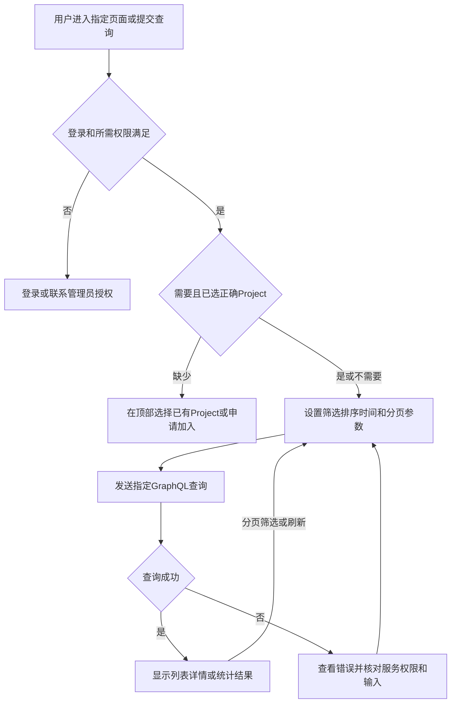

### flow-write

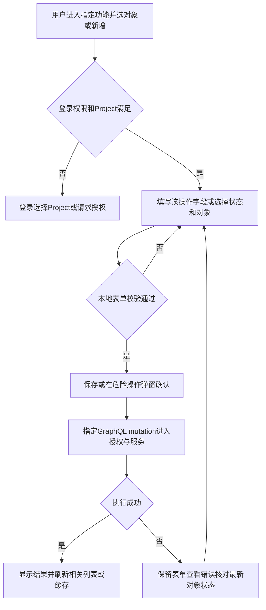

### flow-local

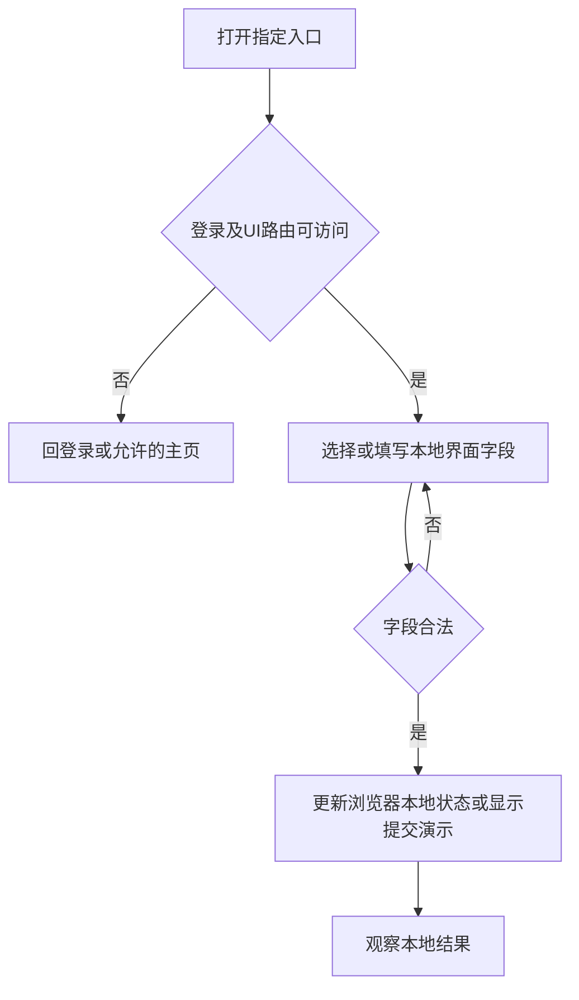

### flow-api-only

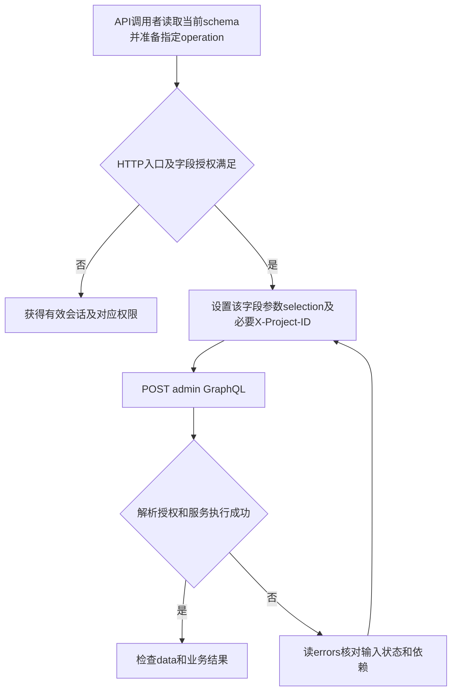

占位页面不得描述为已保存系统设置：appearance/display/notifications 与 users-invite-dialog 用 showSubmittedData；chats 有 Fake Data；help-center 为 ComingSoon；/permission 只有文本。forgot-password现在显示真实恢复指引，不提交虚假请求。生产装配/持久化状态须与后端探索交叉衔接；schema 字段存在不等于 PostgreSQL/runtime 验收通过。

## 页面完整清单

52个createFileRoute声明=50页面+2layout。URL不含括号分组和_authenticated。scope为页面RouteGuard显式权限，默认任一满足；后端字段权限另列。ENTERPRISE模式限制由config/route-permission.ts和RouteGuard读取：projects/roles/prompt-protection-rules/data-storages/permission-demo，以及project prompts/traces/threads/users/roles/playground；SIMPLE不允许这些路由。/models在SIMPLE仍可直达，虽侧栏不显示。

| URL | route source:line（统一frontend/src/routes/） | 页面权限/前置 | 步骤recipe/flow | 状态 |
| --- | --- | --- | --- | --- |
| /forgot-password | (auth)/forgot-password.tsx:4 | 匿名 | [UI-forgot](#UI-forgot)/[flow-local](#flow-local) | 密码恢复指引 |
| /initialization | (auth)/initialization.tsx:4 | 系统尚未初始化 | [UI-initialize](#UI-initialize)/[flow-auth](#flow-auth) | 真实REST |
| /sign-in | (auth)/sign-in.tsx:5 | 匿名、有token跳/ | [UI-signin](#UI-signin)/[flow-auth](#flow-auth) | 真实REST |
| /sign-up | (auth)/sign-up.tsx:4 | 服务允许注册 | [UI-signup](#UI-signup)/[flow-auth](#flow-auth) | REST条件开放 |
| /401 | (errors)/401.tsx:4 | 无 | [UI-error](#UI-error)/[flow-local](#flow-local) | 导航 |
| /403 | (errors)/403.tsx:4 | 无 | [UI-error](#UI-error)/[flow-local](#flow-local) | 导航 |
| /404 | (errors)/404.tsx:4 | 无 | [UI-error404](#UI-error404)/[flow-local](#flow-local) | 导航/搜索建议 |
| /500 | (errors)/500.tsx:4 | 无 | [UI-error](#UI-error)/[flow-local](#flow-local) | 导航 |
| /503 | (errors)/503.tsx:4 | 无 | [UI-error503](#UI-error503)/[flow-local](#flow-local) | 静态维护页 |
| /oauth/oidc/idp-callback | oauth/oidc/idp-callback.tsx:7 | 有效一次性code | [UI-oidc](#UI-oidc)/[flow-auth](#flow-auth) | 自动回调 |
| /api-keys | _authenticated/api-keys/index.tsx:13 | read_api_keys | [UI-apikeys](#UI-apikeys)/[flow-read](#flow-read) + [flow-write](#flow-write) | 非主导航入口 |
| /billing | _authenticated/billing/index.tsx:13 | read_billing或read_subscriptions | [UI-billing](#UI-billing)/[flow-read](#flow-read) + [flow-write](#flow-write) | 真实 |
| /change-sets | _authenticated/change-sets/index.tsx:16 | read_commercialization | [UI-changesets](#UI-changesets)/[flow-changeset](#flow-changeset) | 真实 |
| /changelog | _authenticated/changelog/index.tsx:16 | read_commercialization | [UI-changelog](#UI-changelog)/[flow-read](#flow-read) | 真实 |
| /channels | _authenticated/channels/index.tsx:13 | read_channels | [UI-channels](#UI-channels)/[flow-read](#flow-read) + [flow-write](#flow-write) | 真实 |
| /chats | _authenticated/chats/index.tsx:4 | 登录 | [UI-chats](#UI-chats)/[flow-local](#flow-local) | Fake Data演示 |
| /dashboard/channel-success-rates | _authenticated/dashboard/channel-success-rates.tsx:13 | read_dashboard | [UI-dashboard](#UI-dashboard)/[flow-read](#flow-read) | 隐藏详情入口 |
| /data-storages | _authenticated/data-storages/index.tsx:13 | write_data_storages（侧栏是read_data_storages） | [UI-storage](#UI-storage)/[flow-read](#flow-read) + [flow-write](#flow-write) | 真实 |
| /groups | _authenticated/groups/index.tsx:13 | read_groups | [UI-groups](#UI-groups)/[flow-read](#flow-read) + [flow-write](#flow-write) | 真实 |
| /help-center | _authenticated/help-center/index.tsx:4 | 登录 | [UI-help](#UI-help)/[flow-local](#flow-local) | ComingSoon |
| / | _authenticated/index.tsx:13 | read_dashboard | [UI-dashboard](#UI-dashboard)/[flow-read](#flow-read) | 真实 |
| /models | _authenticated/models/index.tsx:14 | read_channels | [UI-models](#UI-models)/[flow-read](#flow-read) + [flow-write](#flow-write) | 真实 |
| /operations | _authenticated/operations/index.tsx:13 | read_dashboard | [UI-operations](#UI-operations)/[flow-read](#flow-read) | 真实 |
| /permission-demo | _authenticated/permission-demo/index.tsx:4 | 登录ENTERPRISE | [UI-permissiondemo](#UI-permissiondemo)/[flow-local](#flow-local) | 演示 |
| /permission | _authenticated/permission.tsx:3 | 登录 | [UI-permission](#UI-permission)/[flow-local](#flow-local) | 静态文本 |
| /project/api-keys | _authenticated/project/api-keys/index.tsx:16 | read_api_keys+选Project | [UI-apikeys](#UI-apikeys)/[flow-read](#flow-read) + [flow-write](#flow-write) | 真实 |
| /project/dashboard | _authenticated/project/dashboard/index.tsx:16 | read_requests+选Project | [UI-projectdashboard](#UI-projectdashboard)/[flow-read](#flow-read) | 真实 |
| /project/models | _authenticated/project/models/index.tsx:4 | 登录，页面处理Project | [UI-modelmarket](#UI-modelmarket)/[flow-read](#flow-read) | 真实 |
| /project/playground | _authenticated/project/playground/index.tsx:16 | write_requests或read_channels+Project+ENTERPRISE，HTTP另鉴权 | [UI-playground](#UI-playground)/[flow-playground](#flow-playground) | 前端已实现，生产POST入口缺失 |
| /project/prompts | _authenticated/project/prompts/index.tsx:16 | read_prompts+Project+ENTERPRISE | [UI-prompts](#UI-prompts)/[flow-read](#flow-read) + [flow-write](#flow-write) | 真实 |
| /project/requests/$requestId | _authenticated/project/requests/$requestId.tsx:16 | read_requests+Project | [UI-requestdetail](#UI-requestdetail)/[flow-read](#flow-read) + [flow-local](#flow-local) | 真实 |
| /project/requests | _authenticated/project/requests/index.tsx:16 | read_requests+Project | [UI-requests](#UI-requests)/[flow-read](#flow-read) | 真实 |
| /project/roles | _authenticated/project/roles/index.tsx:16 | read_roles+Project+ENTERPRISE | [UI-projectroles](#UI-projectroles)/[flow-read](#flow-read) + [flow-write](#flow-write) | 真实 |
| /project/threads/$threadId | _authenticated/project/threads/$threadId.tsx:16 | read_requests+Project+ENTERPRISE | [UI-threaddetail](#UI-threaddetail)/[flow-read](#flow-read) | 真实 |
| /project/threads | _authenticated/project/threads/index.tsx:16 | read_requests+Project+ENTERPRISE | [UI-threads](#UI-threads)/[flow-read](#flow-read) | 真实 |
| /project/traces/$traceId | _authenticated/project/traces/$traceId.tsx:16 | read_requests+Project+ENTERPRISE | [UI-tracedetail](#UI-tracedetail)/[flow-read](#flow-read) | 真实 |
| /project/traces | _authenticated/project/traces/index.tsx:16 | read_requests+Project+ENTERPRISE | [UI-traces](#UI-traces)/[flow-read](#flow-read) | 真实 |
| /project/users | _authenticated/project/users/index.tsx:16 | read_users+Project+ENTERPRISE | [UI-projectusers](#UI-projectusers)/[flow-read](#flow-read) + [flow-write](#flow-write) | 真实 |
| /project/wallet | _authenticated/project/wallet/index.tsx:4 | 登录，页面处理Project | [UI-wallet](#UI-wallet)/[flow-read](#flow-read) + [flow-write](#flow-write) | 真实 |
| /projects | _authenticated/projects/index.tsx:13 | read_projects+ENTERPRISE | [UI-projects](#UI-projects)/[flow-read](#flow-read) + [flow-write](#flow-write) | 真实 |
| /prompt-protection-rules | _authenticated/prompt-protection-rules/index.tsx:13 | read_channels+ENTERPRISE | [UI-protection](#UI-protection)/[flow-read](#flow-read) + [flow-write](#flow-write) | 真实 |
| /requests/$requestId | _authenticated/requests/$requestId.tsx:4 | 登录，实体查询决定权限 | [UI-requestdetail](#UI-requestdetail)/[flow-read](#flow-read) + [flow-local](#flow-local) | 全局隐藏详情 |
| /roles | _authenticated/roles/index.tsx:13 | read_roles+ENTERPRISE | [UI-roles](#UI-roles)/[flow-read](#flow-read) + [flow-write](#flow-write) | 真实 |
| /settings/appearance | _authenticated/settings/appearance.tsx:4 | 登录 | [UI-appearance](#UI-appearance)/[flow-local](#flow-local) | 提交演示 |
| /settings/display | _authenticated/settings/display.tsx:4 | 登录 | [UI-display](#UI-display)/[flow-local](#flow-local) | 提交演示 |
| /settings | _authenticated/settings/index.tsx:4 | 登录 | [UI-profile](#UI-profile)/[flow-read](#flow-read) + [flow-write](#flow-write) | profile别名useSearch需运行核验 |
| /settings/notifications | _authenticated/settings/notifications.tsx:4 | 登录 | [UI-notifications](#UI-notifications)/[flow-local](#flow-local) | 提交演示 |
| /settings/profile | _authenticated/settings/profile.tsx:4 | 登录 | [UI-profile](#UI-profile)/[flow-read](#flow-read) + [flow-write](#flow-write) | 真实 |
| /system | _authenticated/system/index.tsx:17 | read_settings | [UI-system](#UI-system)/[flow-read](#flow-read) + [flow-write](#flow-write) | 真实 |
| /users | _authenticated/users/index.tsx:13 | read_users | [UI-users](#UI-users)/[flow-read](#flow-read) + [flow-write](#flow-write) | 真实 |
| layout authenticated | _authenticated/route.tsx:5 | AuthGuard | UI-shell | 非独立页面 |
| layout settings | _authenticated/settings/route.tsx:4 | 继承登录 | UI-profile | 非独立页面 |

权限config另有/project/usage-logs但没有页面文件；数据hook不构成page。没有/otp路由，AuthGuard字符串排除不证明OTP实现。

## 认证与共享界面操作

- UI-initialize：首次部署者进/initialization，确认未初始化；填Owner名字、姓氏、邮箱、至少8字符密码与确认、品牌名，校验后Continue。POST /admin/system/initialize默认deferFinancialSetup=true；成功到登录；失败按错误修正，不重复创建Owner。证据initialization-form.tsx:24/75、auth/data/initialization.ts:41、lib/api-client.ts:119。
- UI-signin：/sign-in填邮箱密码登录或选配置的OIDC按钮；REST返回user/token；未勾选Remember me存sessionStorage，勾选存localStorage，另一存储的旧会话清除；随后拉me；Owner落/，普通用户落/project/dashboard；失败toast，按允许的服务设置登录。auth/data/auth.ts:56，user-auth-form.tsx。
- UI-signup：服务允许注册；/sign-up填邮箱、passwordSchema要求密码与一致确认，提交REST；成功保存会话进项目Dashboard；禁用或重复邮箱按错误处理。sign-up-form.tsx:18/51。
- UI-oidc：/sign-in选provider→authorize→身份提供商认证→/oauth/oidc/idp-callback读code→exchange→保存会话到首页；错误或缺code返回登录，重新发起而非复用旧code。auth/data/auth.ts:139/151/168，回调:24。
- UI-forgot：/forgot-password显示当前不提供邮件重置；密码帐号联系实例管理员重置，SSO帐号使用身份提供商的恢复方式；Return to sign in返回登录。没有提交邮箱、假加载或发送邮件承诺。features/auth/forgot-password/index.tsx。

- UI-signout：已登录用户菜单Log out；清sessionStorage/localStorage中的token和user及auth store，导航/sign-in；仅客户端退出，不宣称服务端撤销token。auth/data/auth.ts:120。

- UI-projectswitch：ENTERPRISE且有可访问Project时顶部下拉选择；浏览器持久selectedProjectId，后续GraphQL带X-Project-ID；SIMPLE隐藏切换，采用RESOLVED的个人主Project，没有主Project时不选。project-switcher.tsx:22/38、product-experience/mode.ts:19。

- UI-command：Search或快捷键打开命令菜单，输入页面名，选权限过滤后的导航项；可选主题，找不到项用有权限的实际入口。command-menu.tsx:27/80、search-context.tsx。

- UI-theme：顶部按钮或命令菜单选light/dark/system；本地context/localStorage即时生效，无GraphQL。theme-context.tsx、theme-switch.tsx。

- UI-language：顶部选择English或中文；i18n先更新，登录时updateMe(preferLanguage)持久；失败toast并回滚已知偏好，匿名只改本地。hooks/useLanguage.ts:15/49。

- UI-sidebar：顶部折叠/展开侧栏，sidebar_state cookie保存布局；菜单按模式/权限过滤。authenticated-layout.tsx:24、sidebar.ts:22。

- UI-price-display：统计/渠道价格支持的页面切原始金额或Credit显示，pricingDisplayStore保留浏览器选择；不更改真实会计金额。pricingDisplayStore.ts、pricing-display-toggle.tsx。
- UI-error：401/403/500点Go Back回历史或Back to Home到/，依首页权限分流。features/errors对应文件:17-25。
- UI-error404：输入搜索词筛建议并选页面，或Back/Home/Help Center；Help Center仍占位。not-found-error.tsx:100/134/187。
- UI-error503：阅读维护提示；Learn more没有handler。maintenance-error.tsx:14。
- UI-chats：搜索本地convo.json联系人、选择静态会话；New Chat选联系人只showSubmittedData；发送/电话/视频/附件图标没有真实消息传输。chats/index.tsx:27/37、new-chat.tsx:85。
- UI-help/UI-permission/UI-permissiondemo：分别阅读ComingSoon、静态Permission Management和当前scope/权限组件演示；没有角色权限写入。
- UI-shell：进入认证布局；AuthGuard校验会话，加载侧栏及Project、语言、主题共享控件；无会话回登录，页面权限不足用允许主页。证据_authenticated/route.tsx:5。

### flow-auth

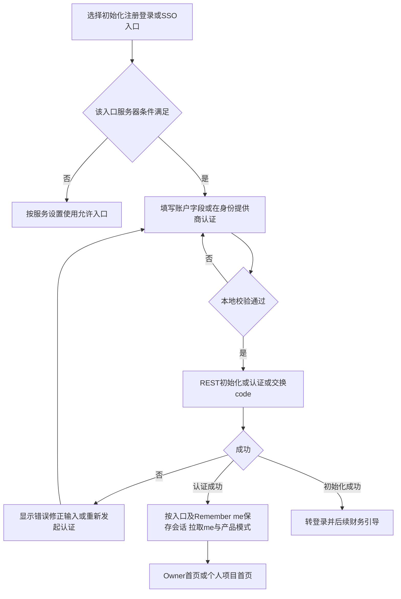

flow-read-write由flow-read与flow-write两图组成，不存在单独图锚。

## 渠道操作（/channels）

读取需要read_channels；写入需要write_channels，另列scope优先。CRUD/bulk不同字段仍分别保留在根字段表。读取用flow-read，保存用flow-write。

| UI操作ID | 用户步骤、结果及失败处理 | GraphQL/REST与证据 | 流程 |
| --- | --- | --- | --- |
| [UI-channels](#UI-channels)；[UI-channel-list](#UI-channel-list) | 进入页→provider/type tab、名称/model/tag/adapter、状态/错误筛选、排序分页→名单/error count/health points；失败toast清条件或查权限 | queryChannels/countChannelsByType/allChannelTags/allChannelSummarys/channels/channelProbeData；channels/index.tsx:21、data/channels.ts:901/2091 | [flow-read](#flow-read) |
| [UI-channel-create](#UI-channel-create)；[UI-channel-edit](#UI-channel-edit)；[UI-channel-duplicate](#UI-channel-duplicate) | New或Edit/Duplicate→provider/API格式/name/baseURL/websiteURL/key或OAuth/models/test model/tags/ordering/remark，可quota/currency→校验保存→刷新；错留表单修重复名/类型/模型/凭据 | createChannel/updateChannel(id,input)/duplicateChannel(sourceID,input)；channels-action-dialog.tsx:87；channel.rs:1493/1524 | [flow-write](#flow-write) |
| UI-channel-status；UI-channel-archive；UI-channel-recover；UI-channel-delete | 行状态或Archive/Recover/Delete→确认→保存并刷新；归档保留记录，删除引用约束由服务执行；失败刷新再选 | updateChannelStatus/deleteChannel；status-dialog:18、archive-dialog:15、delete-dialog:19 | [flow-write](#flow-write) |
| UI-channel-bulk-enable；UI-channel-bulk-disable；UI-channel-bulk-archive；UI-channel-bulk-recover；UI-channel-bulk-delete | 勾选→工具栏对应操作→核对名单数量→确认→检查逐条结果并刷新；失败不假定全处理 | bulkEnableChannels/bulkDisableChannels/bulkArchiveChannels/bulkRecoverChannels/bulkDeleteChannels；bulk dialogs:9 | [flow-write](#flow-write) |
| [UI-channel-import](#UI-channel-import) | Bulk Import→粘贴/上传导出JSON→解析核对列表名字→导入→看结果；格式错修改JSON，服务错核对已导入项 | bulkImportChannels(input.channels)；bulk-import-dialog.tsx:28、channel_ext2.rs:144；bulkCreateChannels无当前tsx caller，API-only | [flow-write](#flow-write) |
| UI-channel-order | 选对象/排序入口→调weight或拖动→预览→保存→新排序；无更改可取消 | bulkUpdateChannelOrdering(input.channels[ID,weight])；bulk-ordering-dialog:209、channel_ext2.rs:184 | [flow-write](#flow-write) |
| UI-channel-model-sync | Edit获取/同步models→选pattern、manual models/autoSync→看返回再保存；失败查baseURL/key/proxy | fetchModels(input)、syncChannelModels(channelID,pattern)；fetch为query但需write_channels、访问上游；channels-action-dialog:87、channels.ts:875/1939 | [flow-provider](#flow-provider) |
| UI-channel-endpoints | 菜单Endpoints→增改apiFormat/path/baseURL/transport→保存；非法格式按schema修正 | saveChannelEndpoints(input.channelID,endpoints)；endpoints-dialog:28、channel_ext.rs:174 | [flow-write](#flow-write) |
| UI-channel-proxy | Proxy→环境/禁用/URL，按需认证或preset→保存当前channel；preset保存需write_settings | updateChannel(settings.proxy)、saveProxyPreset；proxy-dialog:59、proxy-preset-edit-dialog:22 | [flow-write](#flow-write) |
| UI-channel-transform | Transform Options→reasoning/tool/thinking-budget等→merge当前settings保存；拒绝留表单 | updateChannel(settings.transformOptions)；transform-options-dialog:30 | [flow-write](#flow-write) |
| UI-channel-rate-limit | Rate Limit→RPM/TPM/maxConcurrent/queueSize/queueTimeoutMs→保存；非法/负数更正 | updateChannel(settings.rateLimit)；rate-limit-dialog:63、channel.rs:1279 | [flow-write](#flow-write) |
| UI-channel-overrides | Overrides→header/body操作JSON(op/path/value/condition/match)→校验保存；可Load/Save as Template，批量Apply选择MERGE/REPLACE，Clear或Delete模板确认；错误保留输入 | updateChannel(settings.headerOverrideOperations/bodyOverrideOperations)、create/apply/clear/delete模板字段；updateChannelOverrideTemplate无UI caller；overrides-dialog:26、bulk-apply-template:19、bulk-clear-template:8 | [flow-write](#flow-write) |
| UI-channel-mapping-edit | Model Mapping→prefix/trim/lowercase/hide、from/to增改删或提取prefix→保存；from唯一to有效；本地清空/撤回未保存不写DB | updateChannel(settings)；model-mapping-dialog:99/342 | [flow-write](#flow-write) |
| UI-channel-mapping-preview；UI-channel-mapping-apply | 先保存规则→Preview读新增/冲突/current version→选择replaceConflicts→Apply expectedVersion；版本变重新Preview，不复用旧值 | previewChannelModelMappings/applyChannelModelMappings；mapping-dialog:249/258/275 | [flow-mapping](#flow-mapping) |
| UI-channel-mapping-automation | read_channels读取全局enabled；write_channels切换enabled并保存→显示返回值；失败重新读取/恢复显示。开关保存不执行Preview或Apply，也不需要expectedVersion | channelModelMappingAutomationSettings；setChannelModelMappingAutomation(input.enabled)；channels/data/channels.ts:469/475；wiring_postgres_commercialization.rs:481-497仅写systems布尔值 | [flow-read](#flow-read)；[flow-write](#flow-write) |
| UI-channel-automation | Automation→Models/Error Rules→模板或JSON→Zod校验→保存；错留输入 | updateChannel(settings.autoModelMappingRules/errorResponseRewriteRules)；automation-dialog:28/74/94 | [flow-write](#flow-write) |
| UI-channel-test；UI-channel-bulk-test | Test选model/proxy→Test；批量先勾选，逐channel测成功/错误/latency，可停止后按结果重测；仅read_channels | testChannel；test-dialog:32、bulk-test-dialog:28 | [flow-provider](#flow-provider) |
| UI-channel-test-keys | 多key菜单Test API Keys→model/keys→逐key测试→看结果；失败单独重测 | testChannelAPIKey(channelID,key,modelID)；test-api-keys-dialog:22；testChannelAPIKeys整批hook无tsx caller | [flow-provider](#flow-provider) |
| UI-channel-disabled-keys | 查看禁用原因→单key启用/禁用，全部/所选启用或删除禁用keys→确认刷新 | enableChannelAPIKey/disableChannelAPIKey/enableAllChannelAPIKeys/enableSelectedChannelAPIKeys/deleteDisabledChannelAPIKeys；disabled-api-keys-dialog:25 | [flow-write](#flow-write) |
| UI-channel-resolve-error | error行Mark Error Resolved→确认→清错误标记；不验证健康，另Test | updateChannel(clearErrorMessage)；error-resolved-dialog:12 | [flow-write](#flow-write) |
| UI-channel-history；UI-channel-workspace | Test History/Operations→overview/health/newApi/troubleshooting及probe点→复用Test/Query Quota/Price/Edit/Resolve；无新写API | test-history-drawer:29、channel-operations-workspace:93 | [flow-read](#flow-read) |
| UI-channel-quota-probe；UI-channel-quota-confirm | Query Upstream Quota→probe→余额来源/requiresPat→如需临时PAT+正整数userID再probe→满足来源条件后Confirm→verifiedAt；错不把旧结果作新成功，关闭清PAT | probeChannelQuota/confirmChannelQuotaProbe；quota-probe-dialog:99/128/138/167 | [flow-provider](#flow-provider) |
| UI-channel-prices；UI-channel-price-probe | Model Price→model/currency/token/cache/image价目/账单币种/recharge multiplier；可探new_api价格并核对→Save创建draft→批准后生效 | probeNewApiPricing、createProviderPriceChangeSet；price-dialog:231/790、channels.ts:763；saveChannelModelPrices为API-only直接字段，不能映射到此按钮 | [flow-changeset](#flow-changeset) |
| UI-channel-system-settings | toolbar系统设置→probe/frequency、autoSync/public health→保存；write_settings另需 | updateSystemChannelSettings/updatePublicChannelHealthSettings；channels-system-settings-dialog:34 | [flow-write](#flow-write) |
| UI-channel-oauth-codex；UI-channel-oauth-claudecode；UI-channel-oauth-antigravity | Create/Edit选provider→REST Start→授权URL→完整callback_url→Exchange(session_id,callback_url,proxy可选)→credentials填表→另保存channel；Codex可auth JSON decode；过期重开 | use-oauth-flow.ts:93/112；data/codex.ts:5/21/35、claudecode.ts:5/21、antigravity.ts:8/26 | [flow-oauth-provider](#flow-oauth-provider) |
| [UI-channel-oauth-copilot](#UI-channel-oauth-copilot) | Start→复制user code/Open GitHub授权→按interval poll→credentials填表→保存；Retry/Reset/Reauthenticate；卸载/重置停本地timer | copilot-device-flow.tsx:21、hooks/use-device-flow.ts | [flow-oauth-provider](#flow-oauth-provider) |

provider选项排除_fake类型，格式可配置不证明runtime支持。生产codex/claudecode/antigravity/github_copilot聊天outbound阻断；OAuth成功仅取得凭据。

## API key操作（/api-keys或/project/api-keys）

project入口先选Project。read_api_keys读取，write_api_keys写入，具体系统scope另有Owner约束。

| UI操作ID | 用户步骤、结果及失败处理 | 字段与证据 | 流程 |
| --- | --- | --- | --- |
| [UI-apikeys](#UI-apikeys)；[UI-apikey-list](#UI-apikey-list) | name/user/type/status筛选排序分页→列表；详情node/APIKey，失败按公共错误处理 | apiKeys；apikeys/index.tsx:20 | [flow-read](#flow-read) |
| UI-apikey-create | New→name/user或service_account及scopes、models/channels全部或限定、quota requests/tokens/cost及all-time/rolling/calendar、validFrom/validUntil→校验保存→View复制key；限选非空quota至少一项，expiry将来且晚于start | createAPIKey；create-dialog:26/108 | [flow-write](#flow-write) |
| UI-apikey-view-copy | View→mask/reveal/copy→看剪贴板反馈；本地动作不记录token | view-dialog:13 | [flow-read](#flow-read) |
| UI-apikey-edit | Edit→name/scopes→保存；失败留输入 | updateAPIKey(id,input)；edit-dialog:15 | [flow-write](#flow-write) |
| UI-apikey-status；UI-apikey-archive；UI-apikey-bulk-enable；UI-apikey-bulk-disable；UI-apikey-bulk-archive | 单/多行状态或归档→确认→保存刷新；归档不是删除，schema无deleteAPIKey | updateAPIKeyStatus与bulk*；dialogs:9 | [flow-write](#flow-write) |
| UI-apikey-rotate | Rotate确认→返回新token→更新使用端；错核对当前key状态 | rotateAPIKey(id)；rotate-dialog:11 | [flow-write](#flow-write) |
| UI-apikey-profiles | Profiles→多个命名profiles/active、mappings/models/channels/tags/matchMode、LB、validity/quota/maxConcurrent等→Save；失败留表单 | updateAPIKeyProfiles；profiles-dialog:98 | [flow-write](#flow-write) |
| UI-apikey-quota；UI-apikey-usage | Quota各profile每10s更新，Usage Chart选time window→读图；失败查权限/范围 | apiKeyQuotaUsages/apiKeyTokenUsageStats；token-chart-dialog:22 | [flow-read](#flow-read) |
| UI-apikey-template-list | /api-keys或/project/api-keys，read_api_keys；打开Profiles的模板选择或Template Manager→读取目录→选择已有模板；加载失败核对权限/Project并刷新 | apiKeyProfileTemplates；apikeys-load-template-popover.tsx:83；不修改APIKey | [flow-read](#flow-read) |
| UI-apikey-template-create；UI-apikey-template-save；UI-apikey-template-edit；UI-apikey-template-load；UI-apikey-template-delete | Save as Template或Template Manager填name/description/profile创建；Edit保存；Load调用loadApiKeyProfileTemplate({templateID,apiKeyID})已保存服务器key并同步表单；另Save仅保存后续改动；Delete确认；失败不假定key已更新 | create/update/load/deleteApiKeyProfileTemplate，apiKeyProfileTemplates；create/save/edit-template:28/30/27、profile-templates:30、load-template-popover.tsx | [flow-write](#flow-write) |

### flow-provider

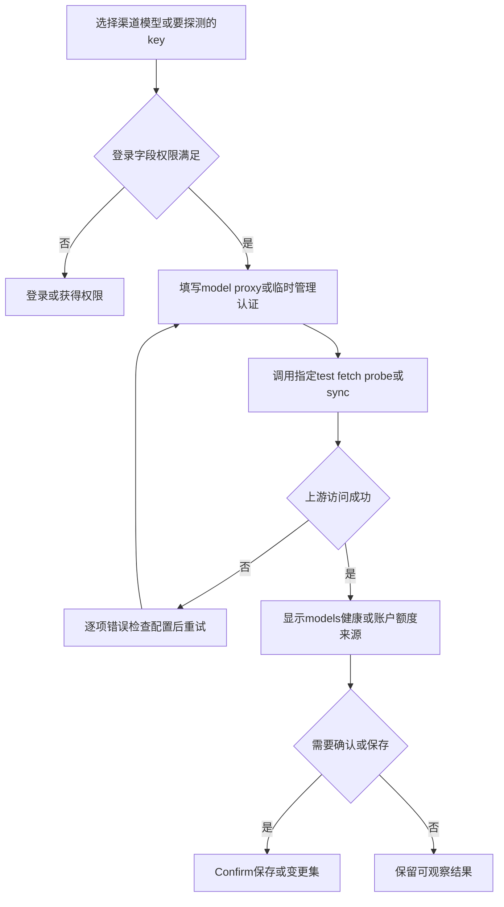

### flow-mapping

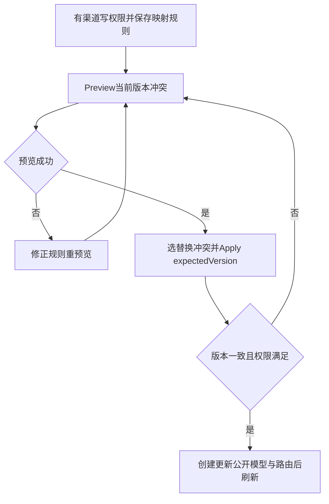

### flow-oauth-provider

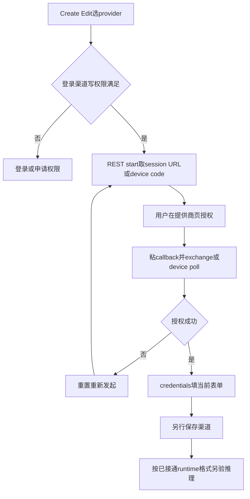

## 模型、商业化、分组与审批

### /models

read_channels读列表/关联；write_channels模型CRUD/路由；read/write_commercialization价格；write_settings系统策略。需真实channel/deployment供给；Owner绕过scope。读取flow-read，通常写flow-write，价格flow-price。

| UI操作ID | 用户步骤、结果及失败 | 字段与证据 |
| --- | --- | --- |
| UI-models；UI-model-list | 名称/modelID/developer/type/status筛选排序分页，点击列/关联；空列表正常，错误重试 | models/queryModels/queryModelChannelConnections/queryUnassociatedChannels；models/index.tsx、models-list.tsx、data/models.ts |
| [UI-model-create](#UI-model-create) | Create→public modelID/name/developer/type(enabled)、deploymentIDs，按需confirmCompatibility、高级modelCard/价格/limit/icon/group/remark/association→保存；冲突/无供给/不兼容留表单 | createPublicModelWithRoutes(input:{model,deploymentIDs,enabled?,confirmCompatibility?})；models-create-dialog.tsx:24、commercialization.rs:110、mutation.rs:730。models-action-dialog.tsx:257直接返新dialog，旧createModel分支不可达，createModel为API-only |
| [UI-model-edit](#UI-model-edit) | Edit→developer/modelID/type/name/icon/group/modelCard/settings/remark→保存刷新；错保留输入 | updateModel(id,input)；models-action-dialog.tsx:37/223；mutation1310 |
| [UI-model-batch-create](#UI-model-batch-create) | Batch Create→最多10行developer/modelID、自动填元数据，可增删；补齐name/icon及group→提交；全group为空会不提交，红标不能证明有效 | bulkCreateModels(inputs)；models-batch-create-dialog.tsx:41；mutation1027 |
| UI-model-status；UI-model-archive；UI-model-delete；UI-model-bulk-enable；UI-model-bulk-disable | 单行状态/归档/删除，或勾选多行Enable/Disable→确认→保存刷新；失败重读状态；Archive和Delete不同，不承诺删除可恢复 | updateModelStatus/deleteModel/bulkEnableModels/bulkDisableModels；bulkArchiveModels/bulkDeleteModels为API-only；status/delete/archive-dialog:21/15/9；mutation1040-1091/1326 |
| UI-model-associations | Association/developer规则→最多10条channel_model/channel_regex/model/regex/channel_tags_model/channel_tags_regex，priority0–10/disabled与tag/pattern/exclusions；when tokens/stream/content/request_format/daily_time（HH:mm-HH:mm不相同有限嵌套）→先预览匹配→修正→保存模型或developer | queryModelChannelConnections预览；updateModel(settings.associations,disableDeveloperSettingsInheritance)或updateSystemModelSettings(developerSettings)保存；models-association-dialog128；model.rs ModelAssociationInput。预览不保存，regex/无匹配不等上游失败 |
| UI-model-unassociated | Unassociated→按channel读无关联模型，本地search300ms debounce→关闭不写 | queryUnassociatedChannels；models-unassociated-dialog:13 |
| UI-model-settings | Settings→fallbackToChannelsOnModelNotFound/queryAllChannelModels/defaultModelApiIncludeAll/autoReasoningEffort/modelBlacklistRegex，保留developerSettings→保存；策略不能弥补协议接线缺口 | systemModelSettings/updateSystemModelSettings；models-settings-dialog:14；system.rs653 |
| UI-model-route | 商业面板读deployments/routes/books→publicModelID+deploymentID/status，需兼容确认→保存；同入口更新/停用 | upsertModelRoute(input:{id?,publicModelID,deploymentID,status?,confirmCompatibility?})；commercialization-panel、commercialization.rs97、mutation718 |
| UI-model-retail-price | write_commercialization；编辑零售价→无默认priceBook先创建(name,currency,isDefault)→refetch目录选book→创建draft→非负最多12小数token/cache或request flat_fee价格→saveRetailPriceChangeSetItem保存item→Submit送审→到change-sets核对/批准或拒绝 | [flow-price](#flow-price)；createPriceBook/createRetailPriceChangeSet/saveRetailPriceChangeSetItem/submitChangeSet/approveChangeSet；draft或pending不发布，approve成功才生效，准备/保存/提交失败保留输入并核最新版本。commercialization-panel.tsx153/158/211/223；change_set.rs、mutation764-855 |

### /project/models

UI-modelmarket：已登录，authenticated myModelCatalog按身份/selectedproject取有效模型/价/倍率/healthVisible→本地搜索name/id/developer，type筛选、name/price排序→卡片/Enter详情→复制modelID或转API key页→Back。没有mutation；unpriced不算零价，health可隐藏，错Retry、空目录正常。frontend/src/features/model-market/index.tsx:165、data.ts；lib.rs208。flow-read+flow-local。

### /groups

UI-groups/UI-group-list：read_groups simpleGroups；write_groups编辑，选择模型/用户另需read_channels/read_users。UI-group-create：New→name/description/isDefault、至少1模型、Enterprise可routeIDs、可用户、非负最多6小数倍率转换multiplierPpm→createSimpleGroup。UI-group-edit：Edit→name/description/status/isDefault/multiplier及已成功加载refs→updateSimpleGroup；缺模型/用户读取权限或读取失败时更新不发送对应refs，保留server原值；新建没成功模型目录不能提交。Default必须Enabled，现有Default不能直接取消，Archived不可编辑。UI-group-archive：确认→deleteSimpleGroup(id)，实际归档。结果刷新，错修name/refs/default冲突。simple_group.rs72/94；features/user-groups/index.tsx SimpleGroupsPage；mutation873-947。三独立assignSimpleGroupUsers/updateSimpleGroupModels/updateSimpleGroupPrice为API-only，分别groupID+userIDs、groupID+modelIDs、groupID+multiplierPpm；Save并不调用三者。simple_group.rs118/126/134。

### /change-sets与/changelog

UI-changesets/UI-changelog：read_commercialization→kind/status/scopeType/scopeID/limit过滤→详情看version/diff/validationErrors/audit；Changelog主要已处理历史。change-set/workbench/changelog-page与detail-dialog18；lib109。flow-read。

UI-changeset-submit/UI-changeset-review：write_commercialization；DRAFT显示Submit，PENDING_REVIEW Approve/Reject，INVALID仅Reject，终态无操作→确认，reviewNote最多2000字→submitChangeSet/approveChangeSet/rejectChangeSet→toast+refresh；前端不承诺独立审查人隔离，后端约束；失败留窗口，pending非已发布、过期重建draft。change-set-actions15/review-dialog20；mutation824-855。flow-price。

### flow-price

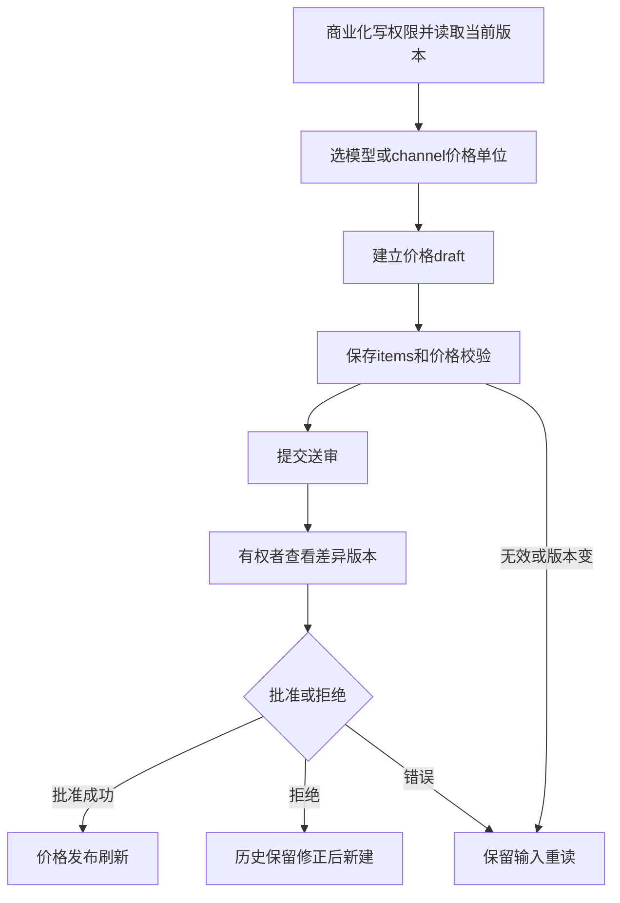

### flow-changeset

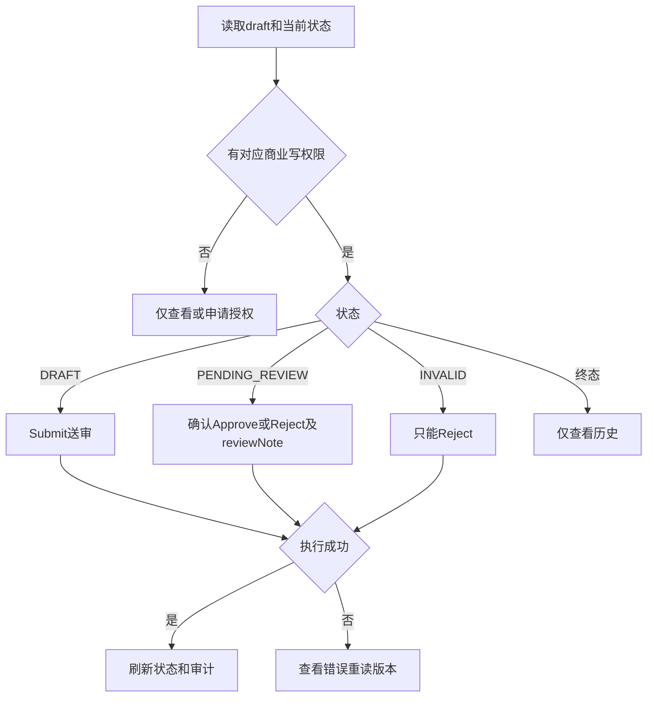

## 项目、角色、用户与个人身份

通常读取flow-read，保存/状态/删除flow-write，OIDC flow-auth；系统实体与项目实体不同，不混用移除成员/删用户、归档/删除。

| UI操作ID / 入口 | 角色前置与步骤 | 结果、失败及证据 |
| --- | --- | --- |
| UI-projects；UI-project-list /projects Enterprise | read_projects；name/status筛选、游标分页与列显示→projects | 错重试；projects/components/projects-action-dialog.tsx |
| UI-project-create；UI-project-edit | write_projects；New填name/description→createProject；Edit同字段→updateProject | 列表/selector刷新；错留窗口；dialog30/122/224 |
| UI-project-archive；UI-project-activate；UI-project-delete | write_projects；状态ARCHIVED/ACTIVE确认→updateProjectStatus；Delete需输入当前项目名→deleteProject | 永久Delete非Archive；依赖约束由服务，错重读；dialog256/287/350；project.rs |
| UI-project-profiles | write_projects；添加命名profile/channelIDs/channelTags/matchMode/active→updateProjectProfiles(id,{activeProfile,profiles}) | 校验后刷新；project-profiles-dialog:25 |
| UI-roles；UI-projectroles；UI-role-list /roles或/project/roles | read_roles；system where.level，project需选择并where.projectID；allScopes(level)为authenticated定义查询不授予权限 | 错查scope/project；roles与project-roles数据 |
| UI-role-create；UI-role-edit；UI-role-delete；UI-role-bulk-delete | write_roles；name/scopes，系统可模板、ScopesSelect筛可授予；project带projectID→createRole/updateRole；Delete确认，系统多选bulkDeleteRoles | 模板/checkbox不是授权；项目页无独立bulkDelete按钮；错修scope/被引用role；roles/project-roles action-dialog:20、role.rs/authz_extension.rs |
| UI-users；UI-user-list /users | read_users；email/name/status等分页→users；嵌套roles/project可能另需权限 | 未授权嵌套不是空关系；users组件 |
| UI-user-create；UI-user-edit | write_users；New first/last/email/password/confirm、isOwner/scopes/roleIDs（目录过滤可授予）→createUser不发confirm；Edit基本字段与addRoleIDs/removeRoleIDs→updateUser | UI可password空且发送空字符串，服务裁决，不能保证新账号有密码；失败保留；users-action-dialog70/154 |
| UI-user-status；UI-user-delete；UI-user-password | write_users；Enable/Disable→updateUserStatus；Delete→deleteUser；Change Password new+confirm校验→updateUser(id,{password}) | 管理重置区别个人updateMyPassword；错重载；status16/delete20/password21 |
| UI-user-add-project | 目标项目write_users及目录读；选未加入project、role/isOwner/scopes→addUserToProject({projectId,userId,...})并显式目标X-Project-ID | 失败不跨项目重试；users-add-to-project-dialog68/164 |
| UI-user-invite | users页Invite填email/role→Submit | 仅showSubmittedData，无邮件/token/用户写入；占位flow-local；users-invite-dialog26 |
| UI-projectusers；UI-projectuser-list /project/users Enterprise | read_users+selectedProject；查询当前成员 | 先选项目，错查目录权限；真实目录拼写features/proejct-users |
| UI-projectuser-add；UI-projectuser-edit；UI-projectuser-remove | write_users；选系统user(first100/email搜索)、role/isOwner/scopes→add；Edit→updateProjectUser({projectId,userId,isOwner,scopes,add/removeRoleIDs})；Remove确认→removeUserFromProject | 移除不是删除system account；后端为授权权威，目录加载失败不保存未知空关系；action-dialog47/140、users-delete20、user_ext.rs |
| UI-profile /settings/profile及/settings别名 | authenticated；me→first/last/preferLanguage/avatar→updateMe；avatar input accept=image/*、FileReader DataURL；email只读 | 保存后更新authStore/invalidate me/toast；无显式大小/实际MIME校验，不承诺此表单立即切语言；profile-form27/73/86/109、me_ext.rs；别名useSearch指定profile route，运行未验 |
| UI-security-password | authenticated；有密码填oldPassword，无密码发null；new/confirm校验→updateMyPassword({oldPassword?,newPassword}) | 成功toast/reset，错显示；不以管理员流程替代；security-form34、me_ext.rs |
| UI-oidc-link；UI-oidc-unlink | authenticated；REST providers→Link取authorize URL→浏览器提供方→callback绑定；Unlink现有identity确认→unlinkOIDCIdentity(identityId) | 成功invalidate providers/me；错保留；最后登录方式可解绑由服务裁决；oidc-management16/22/34 |
| UI-appearance；UI-display；UI-notifications | /settings对应表单填写选项Submit | 仅showSubmittedData，无服务保存；[flow-local](#flow-local)，区别真正ThemeSwitch/语言偏好 |

## 提示词、保护规则与存储

| UI操作ID / 入口 | 角色、前置与步骤 | 字段、结果、失败及证据 |
| --- | --- | --- |
| UI-prompts；UI-prompt-list /project/prompts Enterprise | read_prompts+selectedProject；project/name/status游标筛选排序分页 | prompts；条件/读取错误查权限 |
| UI-prompt-create；UI-prompt-edit | write_prompts；name/description/role/content/prepend或append/整数order、model_id/model_pattern/api_key condition groups（组内OR，组间AND，目录需read_channels/read_api_keys）→保存 | createPrompt带projectIDs=[selectedProject]、settings.action/conditions；updatePrompt保留当前project；失败留条件；prompts-action-dialog216/321、prompt.rs333/348。保存不证明请求实际应用 |
| UI-prompt-enable；UI-prompt-disable；UI-prompt-delete；UI-prompt-bulk-enable；UI-prompt-bulk-disable；UI-prompt-bulk-delete | write_prompts；单行或多选对应状态/删除→确认刷新 | updatePromptStatus/deletePrompt/bulkEnablePrompts/bulkDisablePrompts/bulkDeletePrompts；status-dialog22 |
| UI-protection；UI-protection-list /prompt-protection-rules Enterprise | read_channels，不是read_prompts→列表 | promptProtectionRules |
| UI-protection-create；UI-protection-edit | write_channels；name/description/regex、mask或reject、mask replacement必填、role scopes→保存 | create/updatePromptProtectionRule；rules-action-dialog50/95/124，prompt.rs382/391 |
| UI-protection-preview | authenticated；testText/pattern非空，250ms自动preview | previewPromptProtectionRule({pattern,testText,settings:{action,replacement?,scopes}})返回匹配/变换/拒绝；不持久，不等真实通路测试；无效regex显示错修正；[flow-preview](#flow-preview)；prompt.rs401 |
| UI-protection-status；UI-protection-delete；UI-protection-bulk-enable；UI-protection-bulk-disable；UI-protection-bulk-delete | write_channels；对应单/多对象操作确认 | updatePromptProtectionRuleStatus/delete/bulkEnable/bulkDisable/bulkDeletePromptProtectionRules |
| UI-datastorages；UI-storage-list；UI-storage /data-storages Enterprise | 页面write_data_storages，列表root另read_data_storages；name/type/status分页 | 侧栏read显示与页面write拒绝不一致；dataStorages |
| UI-storage-create | write_data_storages；name/description/type fs/s3/gcs/webdav；fs directory；s3 bucketName/endpoint/region/access/secret/pathStyle；gcs bucketName/credential；webdav url/user/password/path/insecure_skip_tls按实际映射 | createDataStorage；create-dialog16/117，data_storage.rs334/SettingsInput；配置保存不做连通性测试 |
| UI-storage-edit | write_data_storages；改现type对应name/description/settings→保存，不改type | updateDataStorage；非空secret/string才发，空不一定清旧credential；edit-dialog15/104，data_storage.rs349 |
| UI-storage-archive | write_data_storages；Archive确认 | updateDataStorage(id,{status:ARCHIVED})，没有deleteDataStorage；archive-dialog9、data文件；成功刷新，失败保留 |
| UI-storage-default | System Storage选enabled对象，write_settings→保存 | updateDefaultDataStorage({dataStorageID})；video目标独立；错保持选择并查有效状态；storage-policy-settings、system.rs513 |

### flow-preview

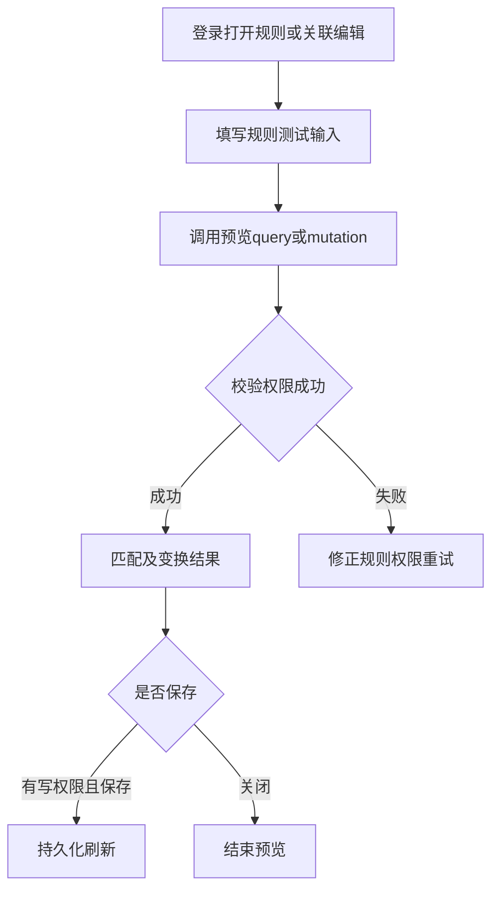

正常列表flow-read，CRUD状态flow-write；预览flow-preview，映射Apply版本冲突另用flow-mapping。

## 计费、订阅与钱包

金额是十进制字符串；有idempotencyKey的写入在结果不确定时复用同key，成功后才换key。读flow-read，信用/订阅写flow-credit。

| UI操作ID / 入口 | 权限、前置与步骤 | 结果、失败与证据 |
| --- | --- | --- |
| UI-billing；UI-billing-select /billing | read_users用户搜索；read_subscriptions plans/projects/subscriptions；read_billing projectBalance/comparison→选user/project（单项目自动选）→余额/ledger/周期/buckets及dedicated模型 | 缺scope部分禁用/提示，读取不等grant权限；错Retry/切对象重取；billing/index106-156/408/634/792/857 |
| UI-billing-grant-project | grant_credit；user/project、正amount（非零最多12小数）、description→grantProjectCredit({projectID,amount,description?,idempotencyKey}) | 成功刷新wallet/ledger清输入换key，失败留key；1052-1086/1150-1230，billing.rs314。当前UI不是grantUserCredit，后者API-only |
| UI-billing-plan-create；UI-billing-plan-edit | write_subscriptions；name/intervalUnit DAY MONTH YEAR/count/accessPlanIDs，至少1quotaRule；GENERAL/DEDICATED、allowance、rollover NONE/CAPPED；DEDICATED有效accessPlan，CAPPED正cap与carryoverDays整数1–3650→create或update plan（编辑id/status保留rule id） | 逐项错留窗口；分组目录read_groups；PlanDialog1540/1658-1727，billing.rs323/333/346 |
| UI-billing-subscribe | write_subscriptions；ENABLED plan、user/project、autoRenew、interval→assignUserSubscription({userID,planID,projectID,idempotencyKey,...}) | 刷新subscriptions/wallet；成功换key，不确定不重复新key；1210、billing.rs358 |
| UI-billing-allowance-refresh | write_subscriptions；当前subscription→Refresh→refreshSubscriptionAllowance(subscriptionID) | 刷新bucket/balance，错服务信息；1240/mutation签名 |
| UI-billing-pause；UI-billing-resume；UI-billing-cancel；UI-billing-renew；UI-billing-auto-renew | write_subscriptions；按状态可见按钮→pause/resume/cancel/renewUserSubscription(subscriptionID)，switch→setSubscriptionAutoRenew | 成功invalidate/toast，失败保持可读状态；没有全部动作二次确认保证，Cancel不编造确认窗；CurrentSubscription487-626、billing.rs372 |
| UI-redemption-list；UI-redemption-create；UI-redemption-revoke | 列表read_billing limit/offset、状态/expiry；创建撤销grant_credit；Create amount/正quantity/maxRedemptions/可ISO expiry/description→mutation→新code仅结果Copy；Revoke可用对象id | 列表不提供原文secret，撤销/耗尽禁用；错toast保留；redemption-code-section39/200-260、billing.rs160 |
| UI-wallet /project/wallet | authenticated+业务selectedProject；myProjectBalance/mySubscriptions→余额ledger周期bucket与模型→Retry | 普通用户不改订阅/发credit；wallet/index105-160/448。myBalance/myProjectWalletComparison hooks当前未挂载，API-only |
| UI-wallet-redeem | authenticated；Redeem去空格code→redeemCreditCode(code) | receipt后刷新；空/过期/失效/已兑/超次error保留；redeem-code-dialog13/33-58；没有caller idempotencyKey，服务自有语义 |

### flow-credit

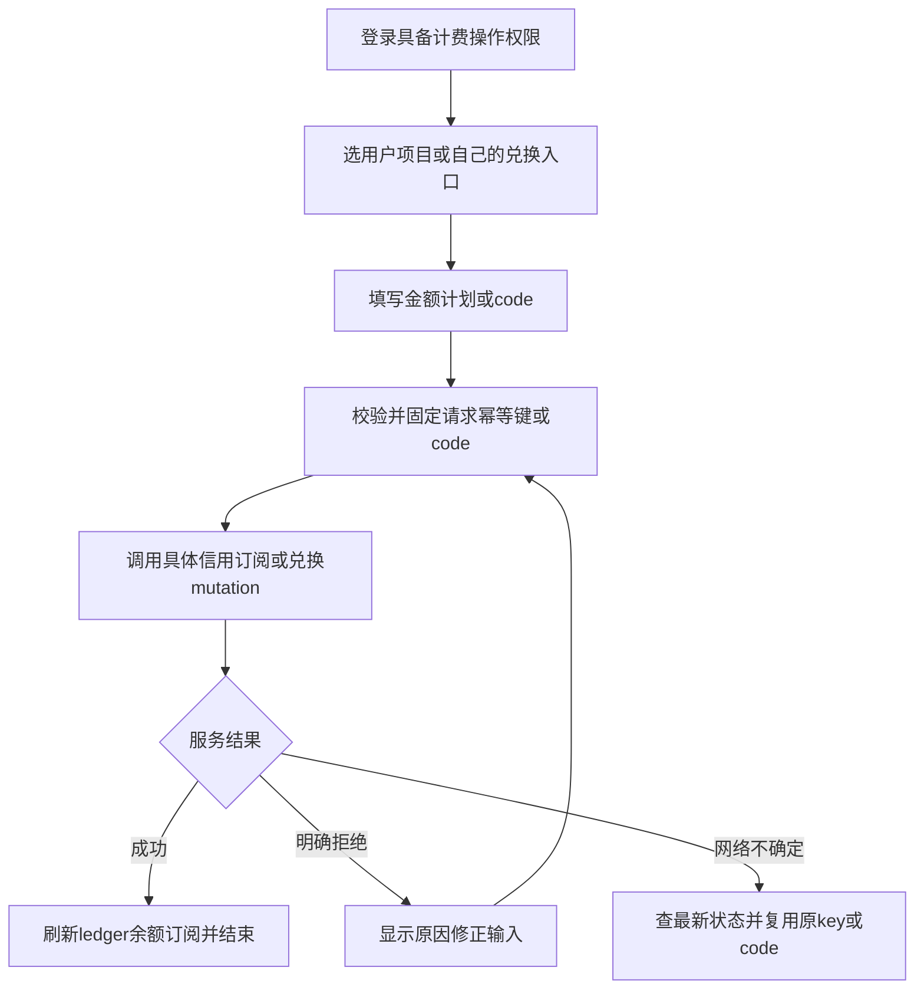

没有运行真实信用、订阅或兑换操作。

## 系统设置、首次引导与运维

/system十一tab：general/security/brand/storage/retry/webhook/proxy/quota/backup/diagnostics/about；backup/diagnostics仅Owner显示。查询即使authenticated也需HTTP JWT。未执行任何运维/备份/恢复。

| UI ID | 权限、入口和具体步骤 | 结果、失败、源证据 |
| --- | --- | --- |
| UI-system；UI-system-general | /system，read_settings页面；读systemGeneralSettings，accountingCurrencyCode/timezone/creditDisplayName/creditsPerAccountingUnit/exchangeRates非空正值无重复币种→updateSystemGeneralSettings。UA/PassThrough开关各updateUserAgentPassThroughSettings/updatePassThroughSettings；Owner可updateProductExperienceSettings SIMPLE/ENTERPRISE | 成功刷新；错误留输入或开关回滚。general-settings38/101/154/165/176；system.rs571/system_ext176。timezone仅启动Dashboard FixedOffset，未知UTC；备份/quotaUTC |
| UI-system-security | securitySettings→blockedIPs/showRequestLogIPBanIcon→updateSecuritySettings（write_settings） | 非法IP留输入；security-settings13/system167；不是注销用户 |
| UI-system-brand | brandSettings→brandName/brandLogo/title→updateBrandSettings（write_settings） | 刷新品牌/标题，错留输入；brand-settings14/system244 |
| UI-system-storage-policy；UI-storage-default | storagePolicy→chunks/livePreview/request headers/body/response body与cleanup enabled/days→updateStoragePolicy；defaultDataStorageID选择有效storage→updateDefaultDataStorage（write_settings） | 影响未来内容与保留，不补历史；storage-policy-settings44/147，system298/513 |
| UI-system-gc-preview；UI-system-gc-run | Storage Run cleanup填requestsCleanupDays/usageLogsCleanupDays→previewGcCleanup（read_settings）读取retention截止和当前estimatedCount；预览不删除，确认后才triggerGcCleanup（write_settings） | 预览[flow-read](#flow-read)，触发[flow-maintenance](#flow-maintenance)；toast仅接受异步任务，不确定查最新记录，错误重做预览；storage-policy85/114/140，wiring_postgres_system_operations.rs156-177 |
| UI-system-video-storage | videoStorageSettings→enabled/dataStorageID/scanIntervalMinutes/scanLimit→updateVideoStorageSettings；目录read_data_storages | 保存不证明视频provider轮询；video-storage-settings17/system_settings_ext102 |
| UI-system-retry | retryPolicy→enabled/channel retries/delay/first-event/nonstream timeout/LB strategy/cost weight/autoDisable/empty detection/upstreamErrorPolicy→updateRetryPolicy | 数字/JSON/规则失败留表单；retry-settings16/system430；不扩大协议支持 |
| UI-system-webhook | webhookNotifierConfig→targets唯一name/enabled/url/proxy/timeout/headers/body与subscriptions关系→updateWebhookNotifierConfig | 改名/删除同步订阅；校验失败修正；WebhookSettings60/284-324/system_settings_ext208。没有Test webhook按钮，保存不证明送达 |
| UI-system-proxy | proxyPresets→Add/Edit name?/url/username?/password?→saveProxyPreset；Delete确认deleteProxyPreset(url) | URL为唯一键；proxy-presets11/proxy-preset-edit22；应用到channel另updateChannel |
| UI-system-quota | quotaEnforcementSettings→enabled/mode EXHAUSTED_ONLY或DE_PRIORITIZE→updateQuotaEnforcementSettings | 成功invalidate，错保留；quota-settings19/51 |
| UI-quota-refresh | 页头QuotaBadges Refresh→checkProviderQuotas()（authenticated） | 展示provider/channel余额与reset窗，错toast保留旧结果。AppHeader17/25，quota-badges1106；直接函数不是hook扫描可否定的caller |
| UI-quota-reset | Codex quota卡Reset→resetChannelQuotaNow(channelID)（write_channels）→checkProviderQuotas刷新 | 错显示不伪造恢复；quota-badges198/219-227/655 |
| UI-system-backup | Owner；六include Channels/ModelPrices/Models/APIKeys/UsageStats/RequestLogs→backup→检查success/data→base64解码下载conduit-backup-timestamp.json | 失败message/toast，不产生成功文件；backup-settings26/109/backup_ext24 |
| UI-system-restore | Owner；选JSON archive与六include/conflict策略→multipart /admin/graphql：operations变量file:null，map 0到variables.file，part0=File，Bearer，不手设边界→restore | 检查success后invalidate cache；错保留file选项；backup-settings120/useRestore/backup_ext58。未运行，不承诺全数据库或上游帐号恢复 |
| UI-system-auto-backup | Owner；enabled/frequency daily weekly monthly/storage/六include/retentionDays→updateAutoBackupSettings；先保存且storage选定后Trigger Now→triggerAutoBackup | 接受后检查lastBackupAt/Error；UTC02周日/月1 hourly poll；retentionDays>0在新备份写入后清理本应用backups/auto时间戳键；0永久保留；删除失败写lastBackupError并可重试，不删除其他前缀或手工对象。backup-settings125/140/572，system_settings_ext299 |
| UI-system-diagnostics | Owner；Export getCacheDiagnostics({targets:[CHANNEL_CACHE]})下载fileName/content；Clear确认clearCache，同targets | 检查payload.success/message；仅channel/model相关cache，非全DB；diagnostics20/system_operations_ext16/22 |
| UI-system-about | systemVersion→About只读构建版本 | AboutSettings11；无Check for Update按钮，checkForUpdate API-only；生产网络失败回退当前版本，不自动升级 |
| UI-onboarding | onboardingInfo识别待完成项；导览的完成/skip→completeOnboarding（write_settings） | 后续batch13纠正：不是创建channel向导；onboarding-provider22/onboarding-flow17 |
| UI-onboarding-financial | Owner填accountingCurrencyCode/creditDisplayName/creditsPerAccountingUnit，校验→updateSystemGeneralSettings保留timezone/exchangeRates→completeFinancialSetupOnboarding | 后续纠正已并入；部分失败可能设置已保存done未标，重读继续；financial-setup-onboarding17/43 |
| UI-onboarding-models；UI-onboarding-auto-disable | 对应driver导览/配置页面操作→completeSystemModelSettingOnboarding或completeAutoDisableChannelOnboarding | done不证明真实设置逐项完成；models-onboarding-flow13/auto-disable-channel-onboarding-flow17 |

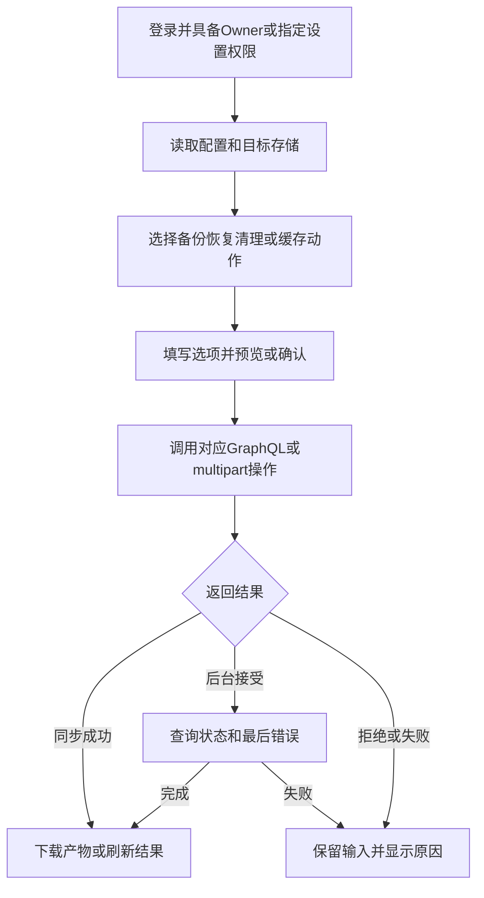
通常设置flow-write；GC估数预览flow-read，GC触发与备份恢复缓存flow-maintenance；quota flow-provider。

## 仪表盘、观测与请求

通常读flow-read，复制筛选等本地flow-local；本报告未启动应用/浏览器/上游。

| UI ID / 入口 | 权限、操作步骤 | 结果、失败、直接源证据 |
| --- | --- | --- |
| UI-dashboard / | read_dashboard；overview/total/today/token/dailyStats、channel/model/APIKey请求成本token/success/performance/fastest卡；TimePeriodSelector更新timeWindow；折叠section浏览器localStorage | 对应dashboardOverview/tokenStats/dailyRequestStats/requestStatsByChannel/Model/APIKey/tokenStatsByChannel/Model/APIKey/costStatsByChannel/Model/APIKey/channelSuccessRates/fastestChannels/Models/modelPerformanceStats/channelPerformanceStats/topRequestsProjects；空/0/不可用不能证明无请求。dashboard/index84 |
| UI-channel-success-rates /dashboard/channel-success-rates | read_dashboard；点Dashboard详情，timeWindow/limit/模型等过滤刷新→channelSuccessRates | 历史聚合非实时保证；错误重查 |
| UI-projectdashboard /project/dashboard | selected project/read_requests；me/myProjects、requests first1总数失败数recent、apiKeys计数仅read_api_keys时、公用healthAuthenticated；Retry或recent/APIKeys/models/wallet链接 | 缺项目先选；缺scope unavailable不假零；project-dashboard/index203-225/305/453 |
| UI-operations /operations | read_dashboard；periodDays 1/7/30→operationsLedger/operationsFlow、Models页operationsModelSeries；overview/channel/flow/models，showall/reset/toggle本地，Refresh重取 | revenue/upstream cost/gross profit/coverage/quota freshness/risk；null unavailable，图基线0非真实0；错误恢复权限服务后查。operations/index512/data.ts |
| UI-requests /project/requests | read_requests+project；model/status/source/APIKey/channel/time/date过滤、清除、sort/pageSize/前后页/autoRefresh→requests；View→detail | URL保存过滤，列本地；错误重试；requests/index368、RequestsPageContent/table |
| UI-request-detail；UI-globalrequest /project/requests/$requestId或/requests/$requestId | authenticated且node实体进一步read_requests/tenant；node+execution/usageLogs/requestRouteExplanation；查看请求响应attempt价格；复制下载JSON/headers/body；cURL Preview/Copy/CopyNonStream仅生成复制 | 未发送重放；cURL复制已存headers没有生成器自有mask，原始日志保护靠后端；binary body生成-F文件占位。request-detail-content34/111/289/510/curl-preview16/curl-generator90-130；全局Back先从request.projectID恢复项目选择，再跳已注册/project/requests并保留筛选上下文 |
| UI-request-live-preview | 打开项目请求详情；owner/read_requests且选对Project、JWT与有效numeric ID；请求processing且stream，storagePolicy.livePreview已读为true（UI查询需read_settings）；GET /admin/requests/{numericid}/preview带Bearer/X-Project-ID和Abort signal | [flow-live-preview](#flow-live-preview)；后端[鉴权及内容分支](http-api.md#flow-request-content)。SSE重连跳过已收replay，追加replay/chunk，completed后refetch；非SSE static-fetch用responseChunks并开启普通轮询。未完成的HTTP/读流失败按500ms乘重连次数、最多5秒重连并保留已收块；离开/依赖改变清timer并Abort。request-detail-page.tsx121-344 |
| UI-request-response-chunks | 打开chunks dialog本地分页/view/copy | 无数据可能未配置记录/GC，不证明无请求 |
| UI-request-audio-video | contentSaved/storageKey才GET /admin/requests/{id}/content Bearer+Project；Blob播放/音视频下载 | 授权错误显示，objectURL清理；不直接未经授权上游URL、不保证全媒体已存；request-detail-content133-260 |
| UI-request-ip-ban | 请求列表需read_requests；已读securitySettings且showRequestLogIPBanIcon才显示，操作需write_settings；点IP封禁把非空trim IP去重加入blockedIPs，解封则移除→updateSecuritySettings持久保存；已封禁同IP提示并跳过重复写入 | [flow-write](#flow-write)；保存结果以mutation和重读设置为准，失败按设置错误核对权限/IP后重试；只改封禁策略，不重试或删除请求。requests-columns.tsx40-65/258-291；入口与异常策略见[系统安全](#UI-system-security) |
| UI-threads；UI-thread-detail /project/threads与/$threadId | ENTERPRISE/read_requests+project；threads ID/time/metadata/filter/sort/page/autoRefresh→详情node Thread+traces；打开trace drawer、Refresh/Back保留搜索 | 无写入，错/无实体选正确Project重查；threads/index/thread-detail-page30/58/94/trace-drawer |
| UI-traces；UI-trace-detail /project/traces与/$traceId | ENTERPRISE/read_requests+project；traces过滤/page/autoRefresh→node Trace segments/requestSpans/responseSpans；flat/flow/tree、select span、fullscreen、Refresh/Back | 实体权限，无创建删除；trace-detail-page25/38/61/data |
| UI-playground /project/playground | ENTERPRISE+project；RouteGuard write_requests或read_channels（nav仅read_channels）；source channel/model_gateway，读channel或enabled chat模型（read_channels），systemPrompt/temp0.6/maxTokens4096/prompt→Send | DefaultChatTransport POST /admin/playground/chat Bearer+Project/direct X-Channel-ID，body model/temp/max_tokens/system；流消息、Stop SDK.stop、Clear local、Retry去末assistant/regenerate、Copy local；重复Send禁用。frontend/features/playground/index31/99-123/188-230。HTTP注册清单缺此路由，最终须标生产入口缺口，不能据UI发送代码宣称可推理 |
| UI-onboarding | onboarding-provider.tsx22是mode driver；onboarding-flow17 Start跳/system高亮brand/retry等并导览页面；各真实设置仍各页recipe；完成/Skip completeOnboarding默认done输入 | 不是自动createChannel；done不证明逐项配置完成 |
| UI-onboarding-models；UI-onboarding-auto-disable | models/components/models-onboarding-flow13/auto-disable-channel-onboarding-flow17 driver导览，结束各complete mutation | 标done而非自动配置 |

sidebar配置/project/usage-logs无页面；/requests无全局列表；请保留这些静态入口缺口。

### flow-live-preview

项目请求详情的HTTP SSE客户端流程；后端owner/read_requests和项目归属由[flow-request-content](http-api.md#flow-request-content)检查。UI只有成功读取livePreview设置、请求processing且stream、Project/JWT/numeric ID存在才发起。HTTP或读流错误在未完成时会自动重连；用户需另核服务、身份与项目，不把重连当授权修复。

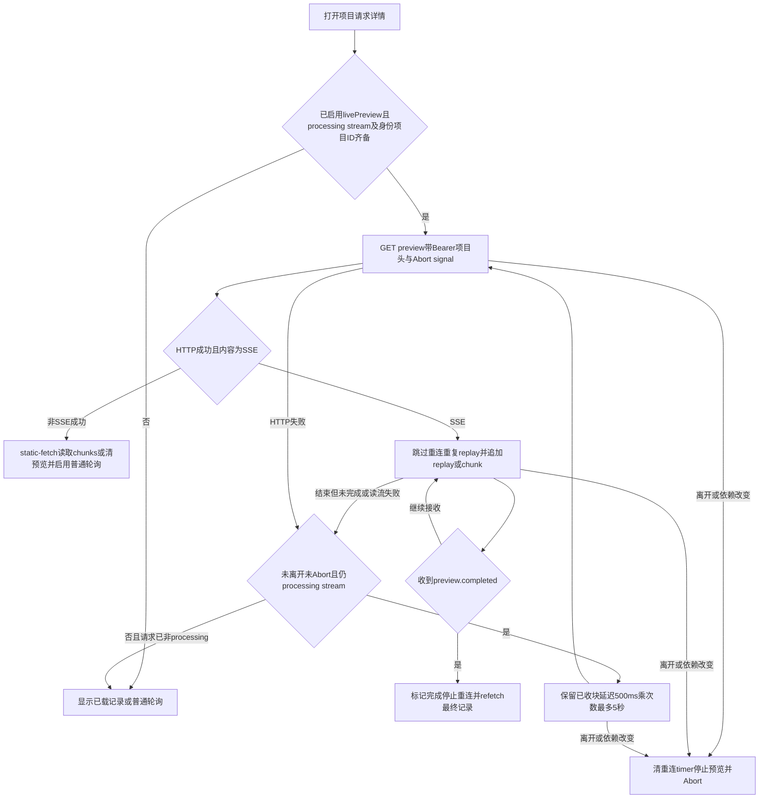

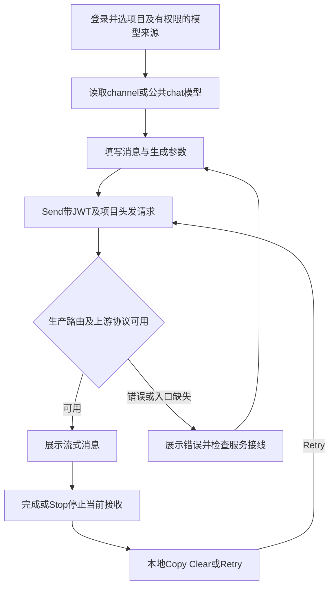
图描述UI请求分支，当前生产router缺/admin/playground/chat，成功分支为条件而非已验证支持。

## API-only根字段操作

最终25根字段：14无当前客户端模板，11有模板无挂载UI；其余229字段有当前UI链映射。API-only不表示后端未实现。所有POST /admin/graphql包括Public health/version仍要求JWT。客户端User/signIn两旧常量不在当前schema，不算254根。

### API-ADMIN-CALL：实际调用步骤

1. REST登录取得本地JWT，确认scope/Owner；项目操作选择有成员权限的Project，系统操作避免不相关项目头。
2. POST已部署base path的/admin/graphql，Content-Type application/json、Authorization Bearer、本地必要X-Project-ID。真实token不进入文档。
3. 从根签名精确选参数与InputObject；Option可省略，Vec列表，ID按typed GUID；注解name/rename_fields优先，不能猜大小写。已有模板复用当前query/mutation及variables类型。
4. body含query/variables；对象选择至少__typename后选择需要字段，bool/string无需selection。计费结果不确定复用原idempotencyKey；不发送本报告示例。
5. 检查HTTP、errors、data.field和业务success。401重新登录；403查scope/项目；非法参数修正；NotFound查正确对象；网络不确定先读最新状态。mutation成功读回，异步接受查结果状态。

| GQL字段 | 专属参数/步骤及结果 | 类型/模板/权限/源 |
| --- | --- | --- |
| health | query { health }固定ok，仅schema非依赖健康 | 无模板query/Public+JWT/lib101 |
| version | query { version }编译package版本 | 无模板query/Public+JWT/lib105 |
| providerObservationHistory | 可见channel GUID、channelId与limit→历史时间/source/price/quota，不触发probe | 无模板query/read_dashboard/lib183/operations返回struct |
| enumCasingProbe | 查询quotaEnforcementModes/autoSyncFrequencies常量样例 | 无模板query/authenticated/lib564，constant-contract-probe |
| connectionProbe | edges/cursor/node和pageInfo selection，当前固定空offset0/25 | 无模板query/authenticated/lib578，constant-contract-probe |
| checkForUpdate | 无args、VersionCheck当前/最新/url；失败回退current，不升级 | 无模板query/authenticated/lib1188/system.rs |
| nodes | ids:[ID!]!，每实体权限，Node union fragment及slot语义 | 无模板query/authenticated/lib1605/node.rs |
| requestStats | 无args，today/week/month/allTime/lastUpdated | 无模板query/read_dashboard/lib1642/dashboard.rs |
| apiKeyAssignableGroups | 无args查询当前分组目录；不代表UI已有分组选择 | 有模板query/read_api_keys/apikeys40 |
| userBalance | userID读用户wallet/ledger，当前UI主项目wallet | 有模板query/read_billing/billing175 |
| myBalance | 自己用户wallet，不当selected project spendable | 有模板query/authenticated/billing180 |
| myProjectWalletComparison | 项目头读迁移/对照状态，不迁移资金 | 有模板query/authenticated/billing185 |
| hourlyRequestStats | date可选String，合法日期或省略默认→小时聚合 | 有模板query/read_dashboard/dashboard290 |
| systemStatus | 无args，SystemStatus选择isInitialized等；匿名状态使用REST而非此JWT query | 有模板query/authenticated/lib511；gql/users203无caller；真实InitializationGuard用REST |
| assignSimpleGroupUsers | input groupID/userIDs完整列表，读授权GUID→明确成员集合→调用→读回 | 无模板mutation/write_groups/simple_group118 |
| updateSimpleGroupModels | input仅groupID/modelIDs，**没有routeIDs**；读授权目录→调用→读回 | 无模板mutation/write_groups/simple_group126 |
| updateSimpleGroupPrice | groupID/multiplierPpm整数，1倍1000000，非负范围服务裁决→保存读回 | 无模板mutation/write_groups/simple_group134/i64 scalar |
| bulkArchiveModels | ids:[ID!]!，先models查询→确认归档→mutation bool→读回 | 无模板mutation/write_channels/mutation1054，UI无bulk archive |
| bulkDeleteModels | ids:[ID!]!，明确永久删除→mutation bool→读回 | 无模板mutation/write_channels/mutation1091，UI无bulk delete |
| saveChannelModelPrices | channelId（小写Id）+input:[SaveChannelModelPriceInput!]!，每项modelID/currencyCode/price；先读当前prices/version→提交明细 | 无模板mutation/write_commercialization/mutation1103/model_ext364；仅staged provider-price changeSet，approve后才生效；[flow-price](#flow-price)+API |
| grantUserCredit | userID/amount/currency?/description?/idempotencyKey，先userBalance，正decimal，同不确定请求复用key→读回 | 有模板mutation/grant_credit/billing186/billing.rs304，UI使用grantProjectCredit |
| bulkCreateChannels | type/name/apiKeys/supportedModels/defaultTestModel与可选baseURL/tags/settings/policies/ordering等；逐key批创建后列表读回 | 有模板mutation/write_channels/channels268/channel_ext2:93；不同于UI bulkImportChannels |
| testChannelAPIKeys | channelID/modelID?整体credential集测试，读逐key结果，可能上游消耗 | 有模板mutation/read_channels/channels559；UI选中循环testChannelAPIKey |
| updateChannelOverrideTemplate | id+input name/description/clear及header/body replace/append/clear；先读→更新→读回；应用另apply | 有模板mutation/write_channels/templates182/channel_override_template_ext94 |
| createModel | 完整CreateModelInput直接创建metadata，models读回；不保证供给路由 | 有模板mutation/write_channels/models137；当前UIcreatePublicModelWithRoutes |

每行均用API-ADMIN-CALL及专属步骤，flow-api-only；saveChannelModelPrices额外flow-price。准确字段line/argumentNames见根清单。无运行验证。

## 根字段步骤的组合别名

**UI-channel-mapping-preview-apply**：按所选操作进入[UI-channel-mapping-preview](#UI-channel-mapping-preview)、[UI-channel-mapping-apply](#UI-channel-mapping-apply)；每项沿用对应字段权限、参数和流程。

**UI-redemption-list-create-revoke**：按所选操作进入[UI-redemption-list](#UI-redemption-list)、[UI-redemption-create](#UI-redemption-create)、[UI-redemption-revoke](#UI-redemption-revoke)；每项沿用对应字段权限、参数和流程。

**UI-billing-plan-create-edit**：按所选操作进入[UI-billing-plan-create](#UI-billing-plan-create)、[UI-billing-plan-edit](#UI-billing-plan-edit)；每项沿用对应字段权限、参数和流程。

**UI-billing-pause-resume-cancel-renew-auto-renew**：按所选操作进入[UI-billing-pause](#UI-billing-pause)、[UI-billing-resume](#UI-billing-resume)、[UI-billing-cancel](#UI-billing-cancel)、[UI-billing-renew](#UI-billing-renew)、[UI-billing-auto-renew](#UI-billing-auto-renew)；每项沿用对应字段权限、参数和流程。

**UI-system-gc-preview-run**：按所选操作进入[UI-system-gc-preview](#UI-system-gc-preview)、[UI-system-gc-run](#UI-system-gc-run)；每项沿用对应字段权限、参数和流程。

**UI-apikey-templates**：按所选操作进入[UI-apikey-template-list](#UI-apikey-template-list)、[UI-apikey-template-create](#UI-apikey-template-create)、[UI-apikey-template-save](#UI-apikey-template-save)、[UI-apikey-template-edit](#UI-apikey-template-edit)、[UI-apikey-template-load](#UI-apikey-template-load)、[UI-apikey-template-delete](#UI-apikey-template-delete)；每项沿用对应字段权限、参数和流程。

**UI-apikey-profiles-quota**：按所选操作进入[UI-apikey-profiles](#UI-apikey-profiles)、[UI-apikey-quota](#UI-apikey-quota)、[UI-apikey-usage](#UI-apikey-usage)；每项沿用对应字段权限、参数和流程。

**UI-model-status-archive-delete-bulk**：按所选操作进入[UI-model-status](#UI-model-status)、[UI-model-archive](#UI-model-archive)、[UI-model-delete](#UI-model-delete)、[UI-model-bulk-enable](#UI-model-bulk-enable)、[UI-model-bulk-disable](#UI-model-bulk-disable)；每项沿用对应字段权限、参数和流程。

**UI-channel-create-edit-duplicate**：按所选操作进入[UI-channel-create](#UI-channel-create)、[UI-channel-edit](#UI-channel-edit)、[UI-channel-duplicate](#UI-channel-duplicate)；每项沿用对应字段权限、参数和流程。

**UI-channel-status-archive-recover-delete**：按所选操作进入[UI-channel-status](#UI-channel-status)、[UI-channel-archive](#UI-channel-archive)、[UI-channel-recover](#UI-channel-recover)、[UI-channel-delete](#UI-channel-delete)、[UI-channel-bulk-enable](#UI-channel-bulk-enable)、[UI-channel-bulk-disable](#UI-channel-bulk-disable)、[UI-channel-bulk-archive](#UI-channel-bulk-archive)、[UI-channel-bulk-recover](#UI-channel-bulk-recover)、[UI-channel-bulk-delete](#UI-channel-bulk-delete)；每项沿用对应字段权限、参数和流程。

**UI-apikey-create-edit**：按所选操作进入[UI-apikey-create](#UI-apikey-create)、[UI-apikey-edit](#UI-apikey-edit)；每项沿用对应字段权限、参数和流程。

**UI-apikey-status-archive-bulk**：按所选操作进入[UI-apikey-status](#UI-apikey-status)、[UI-apikey-archive](#UI-apikey-archive)、[UI-apikey-bulk-enable](#UI-apikey-bulk-enable)、[UI-apikey-bulk-disable](#UI-apikey-bulk-disable)、[UI-apikey-bulk-archive](#UI-apikey-bulk-archive)；每项沿用对应字段权限、参数和流程。

**UI-project-create-edit**：按所选操作进入[UI-project-create](#UI-project-create)、[UI-project-edit](#UI-project-edit)；每项沿用对应字段权限、参数和流程。

**UI-project-archive-activate**：按所选操作进入[UI-project-archive](#UI-project-archive)、[UI-project-activate](#UI-project-activate)；每项沿用对应字段权限、参数和流程。

**UI-user-create-edit-password**：按所选操作进入[UI-user-create](#UI-user-create)、[UI-user-edit](#UI-user-edit)、[UI-user-password](#UI-user-password)；每项沿用对应字段权限、参数和流程。

**UI-user-status-delete**：按所选操作进入[UI-user-status](#UI-user-status)、[UI-user-delete](#UI-user-delete)；每项沿用对应字段权限、参数和流程。

**UI-projectuser-add-edit-remove**：按所选操作进入[UI-projectuser-add](#UI-projectuser-add)、[UI-projectuser-edit](#UI-projectuser-edit)、[UI-projectuser-remove](#UI-projectuser-remove)；每项沿用对应字段权限、参数和流程。

**UI-role-create-edit-delete-bulk**：按所选操作进入[UI-role-create](#UI-role-create)、[UI-role-edit](#UI-role-edit)、[UI-role-delete](#UI-role-delete)、[UI-role-bulk-delete](#UI-role-bulk-delete)；每项沿用对应字段权限、参数和流程。

**UI-prompt-create-edit**：按所选操作进入[UI-prompt-create](#UI-prompt-create)、[UI-prompt-edit](#UI-prompt-edit)；每项沿用对应字段权限、参数和流程。

**UI-prompt-enable-disable-delete-bulk**：按所选操作进入[UI-prompt-enable](#UI-prompt-enable)、[UI-prompt-disable](#UI-prompt-disable)、[UI-prompt-delete](#UI-prompt-delete)、[UI-prompt-bulk-enable](#UI-prompt-bulk-enable)、[UI-prompt-bulk-disable](#UI-prompt-bulk-disable)、[UI-prompt-bulk-delete](#UI-prompt-bulk-delete)；每项沿用对应字段权限、参数和流程。

**UI-protection-create-edit**：按所选操作进入[UI-protection-create](#UI-protection-create)、[UI-protection-edit](#UI-protection-edit)；每项沿用对应字段权限、参数和流程。

**UI-protection-status-delete-bulk**：按所选操作进入[UI-protection-status](#UI-protection-status)、[UI-protection-delete](#UI-protection-delete)、[UI-protection-bulk-enable](#UI-protection-bulk-enable)、[UI-protection-bulk-disable](#UI-protection-bulk-disable)、[UI-protection-bulk-delete](#UI-protection-bulk-delete)；每项沿用对应字段权限、参数和流程。

**UI-storage-create-edit-archive**：按所选操作进入[UI-storage-create](#UI-storage-create)、[UI-storage-edit](#UI-storage-edit)、[UI-storage-archive](#UI-storage-archive)；每项沿用对应字段权限、参数和流程。

**UI-channel-test-bulk-test**：按所选操作进入[UI-channel-test](#UI-channel-test)、[UI-channel-bulk-test](#UI-channel-bulk-test)；每项沿用对应字段权限、参数和流程。

**UI-channel-disabled-key-actions**：按所选操作进入[UI-channel-disabled-keys](#UI-channel-disabled-keys)；每项沿用对应字段权限、参数和流程。

**UI-requestdetail**：本页面复用[具体用户步骤](#UI-request-detail)及相应查询/保存/本地流程。

**UI-threaddetail**：本页面复用[具体用户步骤](#UI-thread-detail)及相应查询/保存/本地流程。

**UI-tracedetail**：本页面复用[具体用户步骤](#UI-trace-detail)及相应查询/保存/本地流程。

**UI-apikey-template-create-save**：[UI-apikey-template-create](#UI-apikey-template-create)、[UI-apikey-template-save](#UI-apikey-template-save)；由同一字段按输入区分操作。

**UI-storage-edit-archive**：[UI-storage-edit](#UI-storage-edit)、[UI-storage-archive](#UI-storage-archive)；由同一字段按输入区分操作。

**UI-channel-status-archive-recover**：[UI-channel-status](#UI-channel-status)、[UI-channel-archive](#UI-channel-archive)、[UI-channel-recover](#UI-channel-recover)；由同一字段按输入区分操作。

**UI-model-status-archive**：[UI-model-status](#UI-model-status)、[UI-model-archive](#UI-model-archive)；由同一字段按输入区分操作。

**UI-apikey-status-archive**：[UI-apikey-status](#UI-apikey-status)、[UI-apikey-archive](#UI-apikey-archive)；由同一字段按输入区分操作。

**UI-user-edit-password**：[UI-user-edit](#UI-user-edit)、[UI-user-password](#UI-user-password)；由同一字段按输入区分操作。

**UI-prompt-status**：[UI-prompt-enable](#UI-prompt-enable)、[UI-prompt-disable](#UI-prompt-disable)；由同一字段按输入区分操作。

## 每个UI操作到流程

| 用户操作 | 正常/错误/权限流程（步骤沿用上文） |
| --- | --- |
| [UI-initialize](#UI-initialize) | [flow-auth](#flow-auth) |
| [UI-signin](#UI-signin) | [flow-auth](#flow-auth) |
| [UI-signup](#UI-signup) | [flow-auth](#flow-auth) |
| [UI-oidc](#UI-oidc) | [flow-auth](#flow-auth) |
| [UI-forgot](#UI-forgot) | [flow-local](#flow-local) |
| [UI-signout](#UI-signout) | [flow-auth](#flow-auth) |
| [UI-projectswitch](#UI-projectswitch) | [flow-read](#flow-read)；[flow-write](#flow-write) |
| [UI-command](#UI-command) | [flow-local](#flow-local) |
| [UI-theme](#UI-theme) | [flow-local](#flow-local) |
| [UI-language](#UI-language) | [flow-read](#flow-read)；[flow-write](#flow-write) |
| [UI-sidebar](#UI-sidebar) | [flow-local](#flow-local) |
| [UI-price-display](#UI-price-display) | [flow-local](#flow-local) |
| [UI-error](#UI-error) | [flow-local](#flow-local) |
| [UI-error404](#UI-error404) | [flow-local](#flow-local) |
| [UI-error503](#UI-error503) | [flow-local](#flow-local) |
| [UI-chats](#UI-chats) | [flow-local](#flow-local) |
| [UI-help](#UI-help) | [flow-local](#flow-local) |
| [UI-permission](#UI-permission) | [flow-local](#flow-local) |
| [UI-permissiondemo](#UI-permissiondemo) | [flow-local](#flow-local) |
| [UI-shell](#UI-shell) | [flow-read](#flow-read)；[flow-write](#flow-write) |
| [UI-channels](#UI-channels) | [flow-read](#flow-read) |
| [UI-channel-list](#UI-channel-list) | [flow-read](#flow-read) |
| [UI-channel-create](#UI-channel-create) | [flow-write](#flow-write) |
| [UI-channel-edit](#UI-channel-edit) | [flow-write](#flow-write) |
| [UI-channel-duplicate](#UI-channel-duplicate) | [flow-write](#flow-write) |
| [UI-channel-status](#UI-channel-status) | [flow-write](#flow-write) |
| [UI-channel-archive](#UI-channel-archive) | [flow-write](#flow-write) |
| [UI-channel-recover](#UI-channel-recover) | [flow-write](#flow-write) |
| [UI-channel-delete](#UI-channel-delete) | [flow-write](#flow-write) |
| [UI-channel-bulk-enable](#UI-channel-bulk-enable) | [flow-write](#flow-write) |
| [UI-channel-bulk-disable](#UI-channel-bulk-disable) | [flow-write](#flow-write) |
| [UI-channel-bulk-archive](#UI-channel-bulk-archive) | [flow-write](#flow-write) |
| [UI-channel-bulk-recover](#UI-channel-bulk-recover) | [flow-write](#flow-write) |
| [UI-channel-bulk-delete](#UI-channel-bulk-delete) | [flow-write](#flow-write) |
| [UI-channel-import](#UI-channel-import) | [flow-write](#flow-write) |
| [UI-channel-order](#UI-channel-order) | [flow-write](#flow-write) |
| [UI-channel-model-sync](#UI-channel-model-sync) | [flow-provider](#flow-provider) |
| [UI-channel-endpoints](#UI-channel-endpoints) | [flow-write](#flow-write) |
| [UI-channel-proxy](#UI-channel-proxy) | [flow-write](#flow-write) |
| [UI-channel-transform](#UI-channel-transform) | [flow-write](#flow-write) |
| [UI-channel-rate-limit](#UI-channel-rate-limit) | [flow-write](#flow-write) |
| [UI-channel-overrides](#UI-channel-overrides) | [flow-write](#flow-write) |
| [UI-channel-mapping-edit](#UI-channel-mapping-edit) | [flow-write](#flow-write) |
| [UI-channel-mapping-preview](#UI-channel-mapping-preview) | [flow-mapping](#flow-mapping) |
| [UI-channel-mapping-apply](#UI-channel-mapping-apply) | [flow-mapping](#flow-mapping) |
| [UI-channel-mapping-automation](#UI-channel-mapping-automation) | [flow-read](#flow-read)；[flow-write](#flow-write) |
| [UI-channel-automation](#UI-channel-automation) | [flow-write](#flow-write) |
| [UI-channel-test](#UI-channel-test) | [flow-provider](#flow-provider) |
| [UI-channel-bulk-test](#UI-channel-bulk-test) | [flow-provider](#flow-provider) |
| [UI-channel-test-keys](#UI-channel-test-keys) | [flow-provider](#flow-provider) |
| [UI-channel-disabled-keys](#UI-channel-disabled-keys) | [flow-write](#flow-write) |
| [UI-channel-resolve-error](#UI-channel-resolve-error) | [flow-write](#flow-write) |
| [UI-channel-history](#UI-channel-history) | [flow-read](#flow-read) |
| [UI-channel-workspace](#UI-channel-workspace) | [flow-read](#flow-read) |
| [UI-channel-quota-probe](#UI-channel-quota-probe) | [flow-provider](#flow-provider) |
| [UI-channel-quota-confirm](#UI-channel-quota-confirm) | [flow-provider](#flow-provider) |
| [UI-channel-prices](#UI-channel-prices) | [flow-changeset](#flow-changeset) |
| [UI-channel-price-probe](#UI-channel-price-probe) | [flow-changeset](#flow-changeset) |
| [UI-channel-system-settings](#UI-channel-system-settings) | [flow-write](#flow-write) |
| [UI-channel-oauth-codex](#UI-channel-oauth-codex) | [flow-oauth-provider](#flow-oauth-provider) |
| [UI-channel-oauth-claudecode](#UI-channel-oauth-claudecode) | [flow-oauth-provider](#flow-oauth-provider) |
| [UI-channel-oauth-antigravity](#UI-channel-oauth-antigravity) | [flow-oauth-provider](#flow-oauth-provider) |
| [UI-channel-oauth-copilot](#UI-channel-oauth-copilot) | [flow-oauth-provider](#flow-oauth-provider) |
| [UI-apikeys](#UI-apikeys) | [flow-read](#flow-read) |
| [UI-apikey-list](#UI-apikey-list) | [flow-read](#flow-read) |
| [UI-apikey-create](#UI-apikey-create) | [flow-write](#flow-write) |
| [UI-apikey-view-copy](#UI-apikey-view-copy) | [flow-read](#flow-read) |
| [UI-apikey-edit](#UI-apikey-edit) | [flow-write](#flow-write) |
| [UI-apikey-status](#UI-apikey-status) | [flow-write](#flow-write) |
| [UI-apikey-archive](#UI-apikey-archive) | [flow-write](#flow-write) |
| [UI-apikey-bulk-enable](#UI-apikey-bulk-enable) | [flow-write](#flow-write) |
| [UI-apikey-bulk-disable](#UI-apikey-bulk-disable) | [flow-write](#flow-write) |
| [UI-apikey-bulk-archive](#UI-apikey-bulk-archive) | [flow-write](#flow-write) |
| [UI-apikey-rotate](#UI-apikey-rotate) | [flow-write](#flow-write) |
| [UI-apikey-profiles](#UI-apikey-profiles) | [flow-write](#flow-write) |
| [UI-apikey-quota](#UI-apikey-quota) | [flow-read](#flow-read) |
| [UI-apikey-usage](#UI-apikey-usage) | [flow-read](#flow-read) |
| [UI-apikey-template-create](#UI-apikey-template-create) | [flow-write](#flow-write) |
| [UI-apikey-template-save](#UI-apikey-template-save) | [flow-write](#flow-write) |
| [UI-apikey-template-edit](#UI-apikey-template-edit) | [flow-write](#flow-write) |
| [UI-apikey-template-load](#UI-apikey-template-load) | [flow-write](#flow-write) |
| [UI-apikey-template-delete](#UI-apikey-template-delete) | [flow-write](#flow-write) |
| [UI-models](#UI-models) | [flow-read](#flow-read)；[flow-write](#flow-write) |
| [UI-model-list](#UI-model-list) | [flow-read](#flow-read)；[flow-local](#flow-local) |
| [UI-model-create](#UI-model-create) | [flow-read](#flow-read)；[flow-write](#flow-write) |
| [UI-model-edit](#UI-model-edit) | [flow-read](#flow-read)；[flow-write](#flow-write) |
| [UI-model-batch-create](#UI-model-batch-create) | [flow-read](#flow-read)；[flow-write](#flow-write) |
| [UI-model-status](#UI-model-status) | [flow-read](#flow-read)；[flow-write](#flow-write) |
| [UI-model-archive](#UI-model-archive) | [flow-read](#flow-read)；[flow-write](#flow-write) |
| [UI-model-delete](#UI-model-delete) | [flow-read](#flow-read)；[flow-write](#flow-write) |
| [UI-model-bulk-enable](#UI-model-bulk-enable) | [flow-read](#flow-read)；[flow-write](#flow-write) |
| [UI-model-bulk-disable](#UI-model-bulk-disable) | [flow-read](#flow-read)；[flow-write](#flow-write) |
| [UI-model-associations](#UI-model-associations) | [flow-read](#flow-read)；[flow-write](#flow-write) |
| [UI-model-unassociated](#UI-model-unassociated) | [flow-read](#flow-read)；[flow-local](#flow-local) |
| [UI-model-settings](#UI-model-settings) | [flow-read](#flow-read)；[flow-write](#flow-write) |
| [UI-model-route](#UI-model-route) | [flow-read](#flow-read)；[flow-write](#flow-write) |
| [UI-model-retail-price](#UI-model-retail-price) | [flow-price](#flow-price) |
| [UI-projects](#UI-projects) | [flow-read](#flow-read)；[flow-write](#flow-write) |
| [UI-project-list](#UI-project-list) | [flow-read](#flow-read)；[flow-local](#flow-local) |
| [UI-project-create](#UI-project-create) | [flow-read](#flow-read)；[flow-write](#flow-write) |
| [UI-project-edit](#UI-project-edit) | [flow-read](#flow-read)；[flow-write](#flow-write) |
| [UI-project-archive](#UI-project-archive) | [flow-read](#flow-read)；[flow-write](#flow-write) |
| [UI-project-activate](#UI-project-activate) | [flow-read](#flow-read)；[flow-write](#flow-write) |
| [UI-project-delete](#UI-project-delete) | [flow-read](#flow-read)；[flow-write](#flow-write) |
| [UI-project-profiles](#UI-project-profiles) | [flow-read](#flow-read)；[flow-write](#flow-write) |
| [UI-roles](#UI-roles) | [flow-read](#flow-read)；[flow-write](#flow-write) |
| [UI-projectroles](#UI-projectroles) | [flow-read](#flow-read)；[flow-write](#flow-write) |
| [UI-role-list](#UI-role-list) | [flow-read](#flow-read)；[flow-local](#flow-local) |
| [UI-role-create](#UI-role-create) | [flow-read](#flow-read)；[flow-write](#flow-write) |
| [UI-role-edit](#UI-role-edit) | [flow-read](#flow-read)；[flow-write](#flow-write) |
| [UI-role-delete](#UI-role-delete) | [flow-read](#flow-read)；[flow-write](#flow-write) |
| [UI-role-bulk-delete](#UI-role-bulk-delete) | [flow-read](#flow-read)；[flow-write](#flow-write) |
| [UI-users](#UI-users) | [flow-read](#flow-read)；[flow-write](#flow-write) |
| [UI-user-list](#UI-user-list) | [flow-read](#flow-read)；[flow-local](#flow-local) |
| [UI-user-create](#UI-user-create) | [flow-read](#flow-read)；[flow-write](#flow-write) |
| [UI-user-edit](#UI-user-edit) | [flow-read](#flow-read)；[flow-write](#flow-write) |
| [UI-user-status](#UI-user-status) | [flow-read](#flow-read)；[flow-write](#flow-write) |
| [UI-user-delete](#UI-user-delete) | [flow-read](#flow-read)；[flow-write](#flow-write) |
| [UI-user-password](#UI-user-password) | [flow-read](#flow-read)；[flow-write](#flow-write) |
| [UI-user-add-project](#UI-user-add-project) | [flow-read](#flow-read)；[flow-write](#flow-write) |
| [UI-user-invite](#UI-user-invite) | [flow-local](#flow-local) |
| [UI-projectusers](#UI-projectusers) | [flow-read](#flow-read)；[flow-write](#flow-write) |
| [UI-projectuser-list](#UI-projectuser-list) | [flow-read](#flow-read)；[flow-local](#flow-local) |
| [UI-projectuser-add](#UI-projectuser-add) | [flow-read](#flow-read)；[flow-write](#flow-write) |
| [UI-projectuser-edit](#UI-projectuser-edit) | [flow-read](#flow-read)；[flow-write](#flow-write) |
| [UI-projectuser-remove](#UI-projectuser-remove) | [flow-read](#flow-read)；[flow-write](#flow-write) |
| [UI-profile](#UI-profile) | [flow-read](#flow-read)；[flow-write](#flow-write) |
| [UI-security-password](#UI-security-password) | [flow-read](#flow-read)；[flow-write](#flow-write) |
| [UI-oidc-link](#UI-oidc-link) | [flow-auth](#flow-auth) |
| [UI-oidc-unlink](#UI-oidc-unlink) | [flow-auth](#flow-auth) |
| [UI-appearance](#UI-appearance) | [flow-local](#flow-local) |
| [UI-display](#UI-display) | [flow-local](#flow-local) |
| [UI-notifications](#UI-notifications) | [flow-local](#flow-local) |
| [UI-prompts](#UI-prompts) | [flow-read](#flow-read)；[flow-write](#flow-write) |
| [UI-prompt-list](#UI-prompt-list) | [flow-read](#flow-read)；[flow-local](#flow-local) |
| [UI-prompt-create](#UI-prompt-create) | [flow-read](#flow-read)；[flow-write](#flow-write) |
| [UI-prompt-edit](#UI-prompt-edit) | [flow-read](#flow-read)；[flow-write](#flow-write) |
| [UI-prompt-enable](#UI-prompt-enable) | [flow-read](#flow-read)；[flow-write](#flow-write) |
| [UI-prompt-disable](#UI-prompt-disable) | [flow-read](#flow-read)；[flow-write](#flow-write) |
| [UI-prompt-delete](#UI-prompt-delete) | [flow-read](#flow-read)；[flow-write](#flow-write) |
| [UI-prompt-bulk-enable](#UI-prompt-bulk-enable) | [flow-read](#flow-read)；[flow-write](#flow-write) |
| [UI-prompt-bulk-disable](#UI-prompt-bulk-disable) | [flow-read](#flow-read)；[flow-write](#flow-write) |
| [UI-prompt-bulk-delete](#UI-prompt-bulk-delete) | [flow-read](#flow-read)；[flow-write](#flow-write) |
| [UI-protection](#UI-protection) | [flow-read](#flow-read)；[flow-write](#flow-write) |
| [UI-protection-list](#UI-protection-list) | [flow-read](#flow-read)；[flow-local](#flow-local) |
| [UI-protection-create](#UI-protection-create) | [flow-read](#flow-read)；[flow-write](#flow-write) |
| [UI-protection-edit](#UI-protection-edit) | [flow-read](#flow-read)；[flow-write](#flow-write) |
| [UI-protection-preview](#UI-protection-preview) | [flow-preview](#flow-preview) |
| [UI-protection-status](#UI-protection-status) | [flow-read](#flow-read)；[flow-write](#flow-write) |
| [UI-protection-delete](#UI-protection-delete) | [flow-read](#flow-read)；[flow-write](#flow-write) |
| [UI-protection-bulk-enable](#UI-protection-bulk-enable) | [flow-read](#flow-read)；[flow-write](#flow-write) |
| [UI-protection-bulk-disable](#UI-protection-bulk-disable) | [flow-read](#flow-read)；[flow-write](#flow-write) |
| [UI-protection-bulk-delete](#UI-protection-bulk-delete) | [flow-read](#flow-read)；[flow-write](#flow-write) |
| [UI-datastorages](#UI-datastorages) | [flow-read](#flow-read)；[flow-write](#flow-write) |
| [UI-storage-list](#UI-storage-list) | [flow-read](#flow-read)；[flow-local](#flow-local) |
| [UI-storage](#UI-storage) | [flow-read](#flow-read)；[flow-write](#flow-write) |
| [UI-storage-create](#UI-storage-create) | [flow-read](#flow-read)；[flow-write](#flow-write) |
| [UI-storage-edit](#UI-storage-edit) | [flow-read](#flow-read)；[flow-write](#flow-write) |
| [UI-storage-archive](#UI-storage-archive) | [flow-read](#flow-read)；[flow-write](#flow-write) |
| [UI-storage-default](#UI-storage-default) | [flow-read](#flow-read)；[flow-write](#flow-write) |
| [UI-billing](#UI-billing) | [flow-read](#flow-read)；[flow-credit](#flow-credit) |
| [UI-billing-select](#UI-billing-select) | [flow-read](#flow-read)；[flow-credit](#flow-credit) |
| [UI-billing-grant-project](#UI-billing-grant-project) | [flow-read](#flow-read)；[flow-credit](#flow-credit) |
| [UI-billing-plan-create](#UI-billing-plan-create) | [flow-read](#flow-read)；[flow-credit](#flow-credit) |
| [UI-billing-plan-edit](#UI-billing-plan-edit) | [flow-read](#flow-read)；[flow-credit](#flow-credit) |
| [UI-billing-subscribe](#UI-billing-subscribe) | [flow-read](#flow-read)；[flow-credit](#flow-credit) |
| [UI-billing-allowance-refresh](#UI-billing-allowance-refresh) | [flow-read](#flow-read)；[flow-credit](#flow-credit) |
| [UI-billing-pause](#UI-billing-pause) | [flow-read](#flow-read)；[flow-credit](#flow-credit) |
| [UI-billing-resume](#UI-billing-resume) | [flow-read](#flow-read)；[flow-credit](#flow-credit) |
| [UI-billing-cancel](#UI-billing-cancel) | [flow-read](#flow-read)；[flow-credit](#flow-credit) |
| [UI-billing-renew](#UI-billing-renew) | [flow-read](#flow-read)；[flow-credit](#flow-credit) |
| [UI-billing-auto-renew](#UI-billing-auto-renew) | [flow-read](#flow-read)；[flow-credit](#flow-credit) |
| [UI-redemption-list](#UI-redemption-list) | [flow-read](#flow-read)；[flow-credit](#flow-credit) |
| [UI-redemption-create](#UI-redemption-create) | [flow-read](#flow-read)；[flow-credit](#flow-credit) |
| [UI-redemption-revoke](#UI-redemption-revoke) | [flow-read](#flow-read)；[flow-credit](#flow-credit) |
| [UI-wallet](#UI-wallet) | [flow-read](#flow-read)；[flow-local](#flow-local) |
| [UI-wallet-redeem](#UI-wallet-redeem) | [flow-read](#flow-read)；[flow-credit](#flow-credit) |
| [UI-system](#UI-system) | [flow-read](#flow-read)；[flow-write](#flow-write) |
| [UI-system-general](#UI-system-general) | [flow-read](#flow-read)；[flow-write](#flow-write) |
| [UI-system-security](#UI-system-security) | [flow-read](#flow-read)；[flow-write](#flow-write) |
| [UI-system-brand](#UI-system-brand) | [flow-read](#flow-read)；[flow-write](#flow-write) |
| [UI-system-storage-policy](#UI-system-storage-policy) | [flow-read](#flow-read)；[flow-write](#flow-write) |
| [UI-system-gc-preview](#UI-system-gc-preview) | [flow-read](#flow-read) |
| [UI-system-gc-run](#UI-system-gc-run) | [flow-maintenance](#flow-maintenance) |
| [UI-system-video-storage](#UI-system-video-storage) | [flow-read](#flow-read)；[flow-write](#flow-write) |
| [UI-system-retry](#UI-system-retry) | [flow-read](#flow-read)；[flow-write](#flow-write) |
| [UI-system-webhook](#UI-system-webhook) | [flow-read](#flow-read)；[flow-write](#flow-write) |
| [UI-system-proxy](#UI-system-proxy) | [flow-read](#flow-read)；[flow-write](#flow-write) |
| [UI-system-quota](#UI-system-quota) | [flow-read](#flow-read)；[flow-write](#flow-write) |
| [UI-quota-refresh](#UI-quota-refresh) | [flow-provider](#flow-provider) |
| [UI-quota-reset](#UI-quota-reset) | [flow-provider](#flow-provider) |
| [UI-system-backup](#UI-system-backup) | [flow-maintenance](#flow-maintenance) |
| [UI-system-restore](#UI-system-restore) | [flow-maintenance](#flow-maintenance) |
| [UI-system-auto-backup](#UI-system-auto-backup) | [flow-maintenance](#flow-maintenance) |
| [UI-system-diagnostics](#UI-system-diagnostics) | [flow-maintenance](#flow-maintenance) |
| [UI-system-about](#UI-system-about) | [flow-read](#flow-read)；[flow-write](#flow-write) |
| [UI-onboarding](#UI-onboarding) | [flow-read](#flow-read)；[flow-write](#flow-write) |
| [UI-onboarding-financial](#UI-onboarding-financial) | [flow-read](#flow-read)；[flow-write](#flow-write) |
| [UI-onboarding-models](#UI-onboarding-models) | [flow-read](#flow-read)；[flow-write](#flow-write) |
| [UI-onboarding-auto-disable](#UI-onboarding-auto-disable) | [flow-read](#flow-read)；[flow-write](#flow-write) |
| [UI-dashboard](#UI-dashboard) | [flow-read](#flow-read)；[flow-local](#flow-local) |
| [UI-channel-success-rates](#UI-channel-success-rates) | [flow-read](#flow-read)；[flow-write](#flow-write) |
| [UI-projectdashboard](#UI-projectdashboard) | [flow-read](#flow-read)；[flow-write](#flow-write) |
| [UI-operations](#UI-operations) | [flow-read](#flow-read)；[flow-local](#flow-local) |
| [UI-requests](#UI-requests) | [flow-read](#flow-read)；[flow-local](#flow-local) |
| [UI-request-detail](#UI-request-detail) | [flow-read](#flow-read)；[flow-local](#flow-local) |
| [UI-globalrequest](#UI-globalrequest) | [flow-read](#flow-read)；[flow-write](#flow-write) |
| [UI-request-live-preview](#UI-request-live-preview) | [flow-live-preview](#flow-live-preview) |
| [UI-request-response-chunks](#UI-request-response-chunks) | [flow-read](#flow-read)；[flow-local](#flow-local) |
| [UI-request-audio-video](#UI-request-audio-video) | [flow-read](#flow-read)；[flow-local](#flow-local) |
| [UI-request-ip-ban](#UI-request-ip-ban) | [flow-write](#flow-write) |
| [UI-threads](#UI-threads) | [flow-read](#flow-read)；[flow-local](#flow-local) |
| [UI-thread-detail](#UI-thread-detail) | [flow-read](#flow-read)；[flow-local](#flow-local) |
| [UI-traces](#UI-traces) | [flow-read](#flow-read)；[flow-local](#flow-local) |
| [UI-trace-detail](#UI-trace-detail) | [flow-read](#flow-read)；[flow-local](#flow-local) |
| [UI-playground](#UI-playground) | [flow-playground](#flow-playground) |

| [UI-apikey-template-list](#UI-apikey-template-list) | [flow-read](#flow-read) |

## 权限与保存反馈的当前约束

平台用户Create/Edit中的Owner复选框仅平台Owner可修改。后端在解析用户写入时先检查平台Owner授予，项目membership Owner的豁免不能授予users.is_owner；项目成员Owner仍是独立权限。已有用户的Owner状态未因复选框不可编辑而被改写。[管理授权](admin-graphql.md#repair-owner-grant)。

Create/Edit返回DuplicateEmail时显示邮箱字段错误并聚焦邮箱；权限拒绝显示联系管理员或核对项目/权限的可行动提示。Create/Update hook显式覆盖应用QueryClient的默认mutation onError；同一次失败由表单处理一次，不另发通用toast；其它失败保留输入。真实QueryClient默认回调、hook options和表单catch的邮件/权限/未知错误回归覆盖此约束。见users-action-dialog.tsx、data/users.ts与data/save-error.test.mjs。

Remember me只改变密码登录的浏览器存储期限，不改变JWT有效期；浏览器可能恢复上一会话的sessionStorage。注册和OIDC保留原默认持久会话。登出和过期同时清两种存储；它们不是服务端令牌撤销。
