# HTTP公共操作、协议和生产边界

# HTTP入口完整清单

公共HTTP清单源自静态探索；本轮执行本地mock与隔离PG修复回归，真实上游未运行。原探索行号是符号定位线索，当前源码与内容清单为准。路由事实入口crates/conduit-http/src/router.rs::build_router_with_asset_source:441。所有路径加server.base_path；非空base_path时根/health不额外暴露。

| 功能ID | 方法与路径 | 身份与条件 | 入口（crates/conduit-http/src/） |
| --- | --- | --- | --- |
| B-HTTP-01 | GET /health；GET /ready | 公共；ready检查PostgreSQL | router.rs:459；health.rs:14,29 |
| B-HTTP-02 | GET /api/system/version；GET /admin/system/status；GET /favicon | 公共版本/初始化品牌/图标 | router.rs:466；admin_handlers.rs:12；system_handlers.rs:203,341 |
| B-HTTP-03 | POST /admin/system/initialize | 公共；未初始化实例 | router.rs:474；system_handlers.rs:236 |
| B-HTTP-04 | POST /admin/auth/signin | 邮箱密码 | router.rs:478；auth_handlers.rs:145 |
| B-HTTP-05 | POST /admin/auth/signup | allow_password_signup=true；已初始化 | router.rs:482；auth_handlers.rs:203 |
| B-HTTP-06 | GET /oauth/oidc/providers；GET /oauth/oidc/authorize/{provider}；GET /oauth/oidc/callback；GET /oauth/oidc/callback/{provider}；POST /oauth/oidc/exchange | OIDC提供方启用/会话有效 | router.rs:491；oidc_handlers.rs:274,307,416,422,548 |
| B-HTTP-07 | GET /admin/oidc/link/{provider} | JWT；关联当前账户 | router.rs:515；oidc_handlers.rs:366 |
| B-HTTP-08 | POST /admin/{provider}/oauth/start；POST /admin/{provider}/oauth/exchange；POST /admin/copilot/oauth/poll；POST /admin/codex/auth/decode | JWT；codex/claudecode/antigravity/copilot | router.rs:519；oauth_handlers.rs:402,503,567,620 |
| B-HTTP-09 | GET /admin/requests/{request_id}/content | JWT+owner/read_requests+X-Project-ID；保存内容 | router.rs:535；request_content_handlers.rs:250 |
| B-HTTP-10 | GET /admin/requests/{request_id}/preview | 同上；实时/静态预览 | router.rs:539；request_preview_handlers.rs:453 |
| B-HTTP-11 | POST /admin/graphql；GET /admin/playground | JWT；字段/项目再授权 | router.rs:543；graphql_handlers.rs:69,189 |
| B-HTTP-12 | POST /openapi/v1/graphql；POST /openapi/webhook/echo | service_account API key | router.rs:560；openapi_graphql_handlers.rs:11；webhook_handlers.rs:23 |
| B-HTTP-13 | POST /internal/v1/graphql | service_account+system:admin；系统owner上下文 | router.rs:585；graphql_handlers.rs:113 |
| B-HTTP-14 | GET /v1/models；GET /v1/models/{*model}；GET /anthropic/v1/models；GET /v1beta/models；GET /gemini/{gemini_api_version}/models | API key；模型授权过滤；model支持斜线 | router.rs:615；openai_handlers.rs:134,198；anthropic_handlers.rs:119；gemini_handlers.rs:168 |
| B-HTTP-15 | POST /v1/chat/completions；POST /v1/responses；POST /v1/completions；POST /v1/responses/compact | API key；可用上游及JSON/流式协议 | router.rs:668；openai_handlers.rs:935,958,982,1006 |
| B-HTTP-16 | POST /v1/messages；POST /anthropic/v1/messages；POST /v1/messages/count_tokens；POST /anthropic/v1/messages/count_tokens | API key；count_tokens走编排 | router.rs:652；anthropic_handlers.rs:142,167 |
| B-HTTP-17 | POST /v1beta/models/{model_action}；POST /gemini/{gemini_api_version}/models/{model_action} | API key；model:generateContent或streamGenerateContent；alt=sse | router.rs:637；gemini_handlers.rs:205,225 |
| B-HTTP-18 | POST /v1/embeddings；POST /jina/v1/embeddings；POST /v1/rerank；POST /jina/v1/rerank | API key；匹配向量/重排上游格式 | router.rs:684；openai_handlers.rs:1028,1050,1098 |
| B-HTTP-19 | POST /v1/images/generations；POST /v1/images/edits | API key；generations JSON；edits multipart 64MiB | router.rs:598,720；openai_handlers.rs:1144,1168,320 |
| B-HTTP-20 | POST /v1/audio/speech；POST /v1/audio/transcriptions；POST /v1/audio/translations | API key；speech JSON/二进制/SSE，后两项multipart 64MiB | router.rs:603,708；openai_handlers.rs:708,1196,1224 |
| B-HTTP-21 | POST /v1/videos；GET /v1/videos/{id}；DELETE /v1/videos/{id} | API key；任务创建/查本地/取消归属校验 | router.rs:712；openai_handlers.rs:803,854,902 |
| B-HTTP-22 | POST /doubao/v3/contents/generations/tasks；GET /doubao/v3/contents/generations/tasks/{id}；DELETE 同路径 | API key；原生任务格式，本地生命周期 | router.rs:696；openai_handlers.rs:1074,854,902 |
| B-HTTP-23 | 静态文件与SPA fallback | 前端assets；embed-frontend条件编译或文件系统 | router.rs:731,935；asset_source.rs/static_files.rs |

metrics单独listener，router.rs::metrics_router:765，路径由配置决定。AI SDK有格式辅助aisdk_handlers.rs与转换器契约，但当前router没有专属AI SDK或/playground推理路由。OpenAI Assistants/Files/Fine-tuning/Batch未注册。

不要沿用旧注释：api_key_auth:348已fail-closed（validator缺500、无效401、quota429），不是只提取key；oauth_handlers.rs:83旧501描述失真，实际有start/exchange/poll。

## 当前生产支持限制（批次2补充）

注册路由不等于完整运行支持。wiring.rs:148-276生产registry只注册5种outbound格式：OpenAiChatCompletions、AnthropicMessages、GeminiContents、OpenAiResponses、OpenAiResponsesCompact。traits.rs:261按确切格式取；pipeline.rs:1767-1779对非空endpoint缺transformer立即拒绝。Embedding/Rerank/Image/Audio/Video/LegacyCompletion的入站虽存在，显式专属api_format的endpoint未注册出站。DefaultEndpointRegistry::endpoint.rs:222每provider仅primary endpoint，candidates.rs:737允许first endpoint回退，可能错误落入chat端点。不能把纯转换fixtures作为生产验证。

multipart三端点images/edits、audio/transcriptions、audio/translations存在生产JSON桥断链。video GET返回本地snapshot，DELETE取消本地状态，无完整上游poll/cancel。六种provider专属outbound阻断，以后续后端支持矩阵为准。OAuth管理流程成功不能证明该provider推理接通。

## 55个已注册method/path

53次route注册，其中video GET/DELETE共享route；不含静态fallback、独立metrics或自动OPTIONS。所有行加server.base_path。表中步骤链接按该路径具体body、结果及失败说明执行；图可复用但每行独立映射。

| ID / method path | 身份及前置 | 专属步骤和流程 | 生产状态 / 源 |
| --- | --- | --- | --- |
| HTTP-01 `GET /health` | 公共；ready检查PostgreSQL | [B-HTTP-01步骤](#B-HTTP-01)；[flow-public](#flow-public) | conditional；静态接线，未运行；[crates/conduit-http/src/router.rs](../../crates/conduit-http/src/router.rs#L459) |
| HTTP-02 `GET /ready` | 公共；ready检查PostgreSQL | [B-HTTP-01步骤](#B-HTTP-01)；[flow-public](#flow-public) | conditional；静态接线，未运行；[crates/conduit-http/src/router.rs](../../crates/conduit-http/src/router.rs#L460) |
| HTTP-03 `GET /api/system/version` | 公共版本/初始化品牌/图标 | [B-HTTP-02步骤](#B-HTTP-02)；[flow-public](#flow-public) | conditional；静态接线，未运行；[crates/conduit-http/src/router.rs](../../crates/conduit-http/src/router.rs#L466) |
| HTTP-04 `GET /admin/system/status` | 公共版本/初始化品牌/图标 | [B-HTTP-02步骤](#B-HTTP-02)；[flow-public](#flow-public) | conditional；静态接线，未运行；[crates/conduit-http/src/router.rs](../../crates/conduit-http/src/router.rs#L470) |
| HTTP-05 `POST /admin/system/initialize` | 公共；未初始化实例 | [B-HTTP-03步骤](#B-HTTP-03)；[flow-initialize](#flow-initialize) | conditional；静态接线，未运行；[crates/conduit-http/src/router.rs](../../crates/conduit-http/src/router.rs#L474) |
| HTTP-06 `POST /admin/auth/signin` | 邮箱密码 | [B-HTTP-04步骤](#B-HTTP-04)；[flow-password-auth](#flow-password-auth) | conditional；静态接线，未运行；[crates/conduit-http/src/router.rs](../../crates/conduit-http/src/router.rs#L478) |
| HTTP-07 `POST /admin/auth/signup` | allow_password_signup=true；已初始化 | [B-HTTP-05步骤](#B-HTTP-05)；[flow-password-auth](#flow-password-auth) | conditional；静态接线，未运行；[crates/conduit-http/src/router.rs](../../crates/conduit-http/src/router.rs#L482) |
| HTTP-08 `GET /favicon` | 公共版本/初始化品牌/图标 | [B-HTTP-02步骤](#B-HTTP-02)；[flow-public](#flow-public) | conditional；静态接线，未运行；[crates/conduit-http/src/router.rs](../../crates/conduit-http/src/router.rs#L486) |
| HTTP-09 `GET /oauth/oidc/providers` | OIDC提供方启用/会话有效 | [B-HTTP-06步骤](#B-HTTP-06)；[flow-oidc](#flow-oidc) | conditional；静态接线，未运行；[crates/conduit-http/src/router.rs](../../crates/conduit-http/src/router.rs#L491) |
| HTTP-10 `GET /oauth/oidc/authorize/{provider}` | OIDC提供方启用/会话有效 | [B-HTTP-06步骤](#B-HTTP-06)；[flow-oidc](#flow-oidc) | conditional；静态接线，未运行；[crates/conduit-http/src/router.rs](../../crates/conduit-http/src/router.rs#L495) |
| HTTP-11 `GET /oauth/oidc/callback` | OIDC提供方启用/会话有效 | [B-HTTP-06步骤](#B-HTTP-06)；[flow-oidc](#flow-oidc) | conditional；静态接线，未运行；[crates/conduit-http/src/router.rs](../../crates/conduit-http/src/router.rs#L499) |
| HTTP-12 `GET /oauth/oidc/callback/{provider}` | OIDC提供方启用/会话有效 | [B-HTTP-06步骤](#B-HTTP-06)；[flow-oidc](#flow-oidc) | conditional；静态接线，未运行；[crates/conduit-http/src/router.rs](../../crates/conduit-http/src/router.rs#L503) |
| HTTP-13 `POST /oauth/oidc/exchange` | OIDC提供方启用/会话有效 | [B-HTTP-06步骤](#B-HTTP-06)；[flow-oidc](#flow-oidc) | conditional；静态接线，未运行；[crates/conduit-http/src/router.rs](../../crates/conduit-http/src/router.rs#L507) |
| HTTP-14 `GET /admin/oidc/link/{provider}` | JWT；关联当前账户 | [B-HTTP-07步骤](#B-HTTP-07)；[flow-oidc](#flow-oidc) | conditional；静态接线，未运行；[crates/conduit-http/src/router.rs](../../crates/conduit-http/src/router.rs#L515) |
| HTTP-15 `POST /admin/{provider}/oauth/start` | JWT；codex/claudecode/antigravity/copilot | [B-HTTP-08步骤](#B-HTTP-08)；[flow-provider-oauth](#flow-provider-oauth) | conditional；静态接线，未运行；[crates/conduit-http/src/router.rs](../../crates/conduit-http/src/router.rs#L519) |
| HTTP-16 `POST /admin/{provider}/oauth/exchange` | JWT；codex/claudecode/antigravity/copilot | [B-HTTP-08步骤](#B-HTTP-08)；[flow-provider-oauth](#flow-provider-oauth) | conditional；静态接线，未运行；[crates/conduit-http/src/router.rs](../../crates/conduit-http/src/router.rs#L523) |
| HTTP-17 `POST /admin/copilot/oauth/poll` | JWT；codex/claudecode/antigravity/copilot | [B-HTTP-08步骤](#B-HTTP-08)；[flow-provider-oauth](#flow-provider-oauth) | conditional；静态接线，未运行；[crates/conduit-http/src/router.rs](../../crates/conduit-http/src/router.rs#L527) |
| HTTP-18 `POST /admin/codex/auth/decode` | JWT；codex/claudecode/antigravity/copilot | [B-HTTP-08步骤](#B-HTTP-08)；[flow-provider-oauth](#flow-provider-oauth) | conditional；静态接线，未运行；[crates/conduit-http/src/router.rs](../../crates/conduit-http/src/router.rs#L531) |
| HTTP-19 `GET /admin/requests/{request_id}/content` | JWT+owner/read_requests+X-Project-ID；保存内容 | [B-HTTP-09步骤](#B-HTTP-09)；[flow-request-content](#flow-request-content) | conditional；静态接线，未运行；[crates/conduit-http/src/router.rs](../../crates/conduit-http/src/router.rs#L535) |
| HTTP-20 `GET /admin/requests/{request_id}/preview` | 同上；实时/静态预览 | [B-HTTP-10步骤](#B-HTTP-10)；[flow-request-content](#flow-request-content) | conditional；静态接线，未运行；[crates/conduit-http/src/router.rs](../../crates/conduit-http/src/router.rs#L539) |
| HTTP-21 `POST /admin/graphql` | JWT；字段/项目再授权 | [B-HTTP-11步骤](#B-HTTP-11)；[flow-management-api](#flow-management-api) | conditional；静态接线，未运行；[crates/conduit-http/src/router.rs](../../crates/conduit-http/src/router.rs#L543) |
| HTTP-22 `GET /admin/playground` | JWT；字段/项目再授权 | [B-HTTP-11步骤](#B-HTTP-11)；[flow-management-api](#flow-management-api) | conditional；静态接线，未运行；[crates/conduit-http/src/router.rs](../../crates/conduit-http/src/router.rs#L547) |
| HTTP-23 `POST /openapi/v1/graphql` | service_account API key | [B-HTTP-12步骤](#B-HTTP-12)；[flow-management-api](#flow-management-api) | conditional；静态接线，未运行；[crates/conduit-http/src/router.rs](../../crates/conduit-http/src/router.rs#L561) |
| HTTP-24 `POST /openapi/webhook/echo` | service_account API key | [B-HTTP-12步骤](#B-HTTP-12)；[flow-management-api](#flow-management-api) | conditional；静态接线，未运行；[crates/conduit-http/src/router.rs](../../crates/conduit-http/src/router.rs#L568) |
| HTTP-25 `POST /internal/v1/graphql` | service_account+system:admin；系统owner上下文 | [B-HTTP-13步骤](#B-HTTP-13)；[flow-management-api](#flow-management-api) | conditional；静态接线，未运行；[crates/conduit-http/src/router.rs](../../crates/conduit-http/src/router.rs#L586) |
| HTTP-26 `POST /v1/images/edits` | API key；generations JSON；edits multipart 64MiB | [B-HTTP-19步骤](#B-HTTP-19)；[flow-inference](#flow-inference) | gap；生产multipart走JSON桥断链；[crates/conduit-http/src/router.rs](../../crates/conduit-http/src/router.rs#L599) |
| HTTP-27 `POST /v1/audio/transcriptions` | API key；speech JSON/二进制/SSE，后两项multipart 64MiB | [B-HTTP-20步骤](#B-HTTP-20)；[flow-inference](#flow-inference) | gap；生产multipart走JSON桥断链；[crates/conduit-http/src/router.rs](../../crates/conduit-http/src/router.rs#L603) |
| HTTP-28 `POST /v1/audio/translations` | API key；speech JSON/二进制/SSE，后两项multipart 64MiB | [B-HTTP-20步骤](#B-HTTP-20)；[flow-inference](#flow-inference) | gap；生产multipart走JSON桥断链；[crates/conduit-http/src/router.rs](../../crates/conduit-http/src/router.rs#L607) |
| HTTP-29 `GET /v1/models` | API key；模型授权过滤；model支持斜线 | [B-HTTP-14步骤](#B-HTTP-14)；[flow-model-list](#flow-model-list) | conditional；静态接线，未运行；[crates/conduit-http/src/router.rs](../../crates/conduit-http/src/router.rs#L615) |
| HTTP-30 `GET /v1/models/{*model}` | API key；模型授权过滤；model支持斜线 | [B-HTTP-14步骤](#B-HTTP-14)；[flow-model-list](#flow-model-list) | conditional；静态接线，未运行；[crates/conduit-http/src/router.rs](../../crates/conduit-http/src/router.rs#L619) |
| HTTP-31 `GET /anthropic/v1/models` | API key；模型授权过滤；model支持斜线 | [B-HTTP-14步骤](#B-HTTP-14)；[flow-model-list](#flow-model-list) | conditional；静态接线，未运行；[crates/conduit-http/src/router.rs](../../crates/conduit-http/src/router.rs#L628) |
| HTTP-32 `GET /v1beta/models` | API key；模型授权过滤；model支持斜线 | [B-HTTP-14步骤](#B-HTTP-14)；[flow-model-list](#flow-model-list) | conditional；静态接线，未运行；[crates/conduit-http/src/router.rs](../../crates/conduit-http/src/router.rs#L632) |
| HTTP-33 `POST /v1beta/models/{model_action}` | API key；model:generateContent或streamGenerateContent；alt=sse | [B-HTTP-17步骤](#B-HTTP-17)；[flow-inference](#flow-inference) | conditional；静态接线，未运行；[crates/conduit-http/src/router.rs](../../crates/conduit-http/src/router.rs#L637) |
| HTTP-34 `GET /gemini/{gemini_api_version}/models` | API key；模型授权过滤；model支持斜线 | [B-HTTP-14步骤](#B-HTTP-14)；[flow-model-list](#flow-model-list) | conditional；静态接线，未运行；[crates/conduit-http/src/router.rs](../../crates/conduit-http/src/router.rs#L641) |
| HTTP-35 `POST /gemini/{gemini_api_version}/models/{model_action}` | API key；model:generateContent或streamGenerateContent；alt=sse | [B-HTTP-17步骤](#B-HTTP-17)；[flow-inference](#flow-inference) | conditional；静态接线，未运行；[crates/conduit-http/src/router.rs](../../crates/conduit-http/src/router.rs#L645) |
| HTTP-36 `POST /v1/messages` | API key；count_tokens走编排 | [B-HTTP-16步骤](#B-HTTP-16)；[flow-inference](#flow-inference) | conditional；静态接线，未运行；[crates/conduit-http/src/router.rs](../../crates/conduit-http/src/router.rs#L652) |
| HTTP-37 `POST /v1/messages/count_tokens` | API key；count_tokens走编排 | [B-HTTP-16步骤](#B-HTTP-16)；[flow-inference](#flow-inference) | conditional；静态接线，未运行；[crates/conduit-http/src/router.rs](../../crates/conduit-http/src/router.rs#L656) |
| HTTP-38 `POST /anthropic/v1/messages` | API key；count_tokens走编排 | [B-HTTP-16步骤](#B-HTTP-16)；[flow-inference](#flow-inference) | conditional；静态接线，未运行；[crates/conduit-http/src/router.rs](../../crates/conduit-http/src/router.rs#L660) |
| HTTP-39 `POST /anthropic/v1/messages/count_tokens` | API key；count_tokens走编排 | [B-HTTP-16步骤](#B-HTTP-16)；[flow-inference](#flow-inference) | conditional；静态接线，未运行；[crates/conduit-http/src/router.rs](../../crates/conduit-http/src/router.rs#L664) |
| HTTP-40 `POST /v1/chat/completions` | API key；可用上游及JSON/流式协议 | [B-HTTP-15步骤](#B-HTTP-15)；[flow-inference](#flow-inference) | conditional；静态接线，未运行；[crates/conduit-http/src/router.rs](../../crates/conduit-http/src/router.rs#L668) |
| HTTP-41 `POST /v1/responses` | API key；可用上游及JSON/流式协议 | [B-HTTP-15步骤](#B-HTTP-15)；[flow-inference](#flow-inference) | conditional；静态接线，未运行；[crates/conduit-http/src/router.rs](../../crates/conduit-http/src/router.rs#L672) |
| HTTP-42 `POST /v1/completions` | API key；可用上游及JSON/流式协议 | [B-HTTP-15步骤](#B-HTTP-15)；[flow-inference](#flow-inference) | gap；legacy专属出站未注册；[crates/conduit-http/src/router.rs](../../crates/conduit-http/src/router.rs#L676) |
| HTTP-43 `POST /v1/responses/compact` | API key；可用上游及JSON/流式协议 | [B-HTTP-15步骤](#B-HTTP-15)；[flow-inference](#flow-inference) | conditional；静态接线，未运行；[crates/conduit-http/src/router.rs](../../crates/conduit-http/src/router.rs#L680) |
| HTTP-44 `POST /v1/rerank` | API key；匹配向量/重排上游格式 | [B-HTTP-18步骤](#B-HTTP-18)；[flow-inference](#flow-inference) | gap；专属出站registry未注册；[crates/conduit-http/src/router.rs](../../crates/conduit-http/src/router.rs#L684) |
| HTTP-45 `POST /jina/v1/rerank` | API key；匹配向量/重排上游格式 | [B-HTTP-18步骤](#B-HTTP-18)；[flow-inference](#flow-inference) | gap；专属出站registry未注册；[crates/conduit-http/src/router.rs](../../crates/conduit-http/src/router.rs#L688) |
| HTTP-46 `POST /jina/v1/embeddings` | API key；匹配向量/重排上游格式 | [B-HTTP-18步骤](#B-HTTP-18)；[flow-inference](#flow-inference) | gap；专属出站registry未注册；[crates/conduit-http/src/router.rs](../../crates/conduit-http/src/router.rs#L692) |
| HTTP-47 `POST /doubao/v3/contents/generations/tasks` | API key；原生任务格式，本地生命周期 | [B-HTTP-22步骤](#B-HTTP-22)；[flow-inference](#flow-inference) | gap；专属出站registry未注册；[crates/conduit-http/src/router.rs](../../crates/conduit-http/src/router.rs#L696) |
| HTTP-48 `GET /doubao/v3/contents/generations/tasks/{id}` | API key；原生任务格式，本地生命周期 | [B-HTTP-22步骤](#B-HTTP-22)；[flow-video-local](#flow-video-local) | implemented local-only；无provider轮询或取消；[crates/conduit-http/src/router.rs](../../crates/conduit-http/src/router.rs#L700) |
| HTTP-49 `DELETE /doubao/v3/contents/generations/tasks/{id}` | API key；原生任务格式，本地生命周期 | [B-HTTP-22步骤](#B-HTTP-22)；[flow-video-local](#flow-video-local) | implemented local-only；无provider轮询或取消；[crates/conduit-http/src/router.rs](../../crates/conduit-http/src/router.rs#L700) |
| HTTP-50 `POST /v1/embeddings` | API key；匹配向量/重排上游格式 | [B-HTTP-18步骤](#B-HTTP-18)；[flow-inference](#flow-inference) | gap；专属出站registry未注册；[crates/conduit-http/src/router.rs](../../crates/conduit-http/src/router.rs#L704) |
| HTTP-51 `POST /v1/audio/speech` | API key；speech JSON/二进制/SSE，后两项multipart 64MiB | [B-HTTP-20步骤](#B-HTTP-20)；[flow-inference](#flow-inference) | gap；专属出站registry未注册；[crates/conduit-http/src/router.rs](../../crates/conduit-http/src/router.rs#L708) |
| HTTP-52 `POST /v1/videos` | API key；任务创建/查本地/取消归属校验 | [B-HTTP-21步骤](#B-HTTP-21)；[flow-inference](#flow-inference) | gap；专属出站registry未注册；[crates/conduit-http/src/router.rs](../../crates/conduit-http/src/router.rs#L712) |
| HTTP-53 `GET /v1/videos/{id}` | API key；任务创建/查本地/取消归属校验 | [B-HTTP-21步骤](#B-HTTP-21)；[flow-video-local](#flow-video-local) | implemented local-only；无provider轮询或取消；[crates/conduit-http/src/router.rs](../../crates/conduit-http/src/router.rs#L716) |
| HTTP-54 `DELETE /v1/videos/{id}` | API key；任务创建/查本地/取消归属校验 | [B-HTTP-21步骤](#B-HTTP-21)；[flow-video-local](#flow-video-local) | implemented local-only；无provider轮询或取消；[crates/conduit-http/src/router.rs](../../crates/conduit-http/src/router.rs#L716) |
| HTTP-55 `POST /v1/images/generations` | API key；generations JSON；edits multipart 64MiB | [B-HTTP-19步骤](#B-HTTP-19)；[flow-inference](#flow-inference) | gap；专属出站registry未注册；[crates/conduit-http/src/router.rs](../../crates/conduit-http/src/router.rs#L720) |

## HTTP操作步骤与流程

BASE为实际地址加server.base_path。API消费者先由管理员配置模型、已启用渠道、项目有效offer和API key。API授权支持Authorization Bearer、X-Goog-Api-Key、key查询参数（依次优先）；推荐header。JWT与API key不同。未初始化/配置失败先查脱敏日志；没有运行上游验证。

### flow-public

B-HTTP-01/02：运维/访客GET /health取liveness；GET /ready查PostgreSQL readiness，失败503；GET /api/system/version看编译版本；GET /admin/system/status看初始化/品牌；GET /favicon取品牌或内置图标。ready失败查主DB/schema；health不证明上游可用。health.rs:14,29；router.rs:459；wiring_route_health.rs::PgReadinessService；system_handlers.rs:203,341。

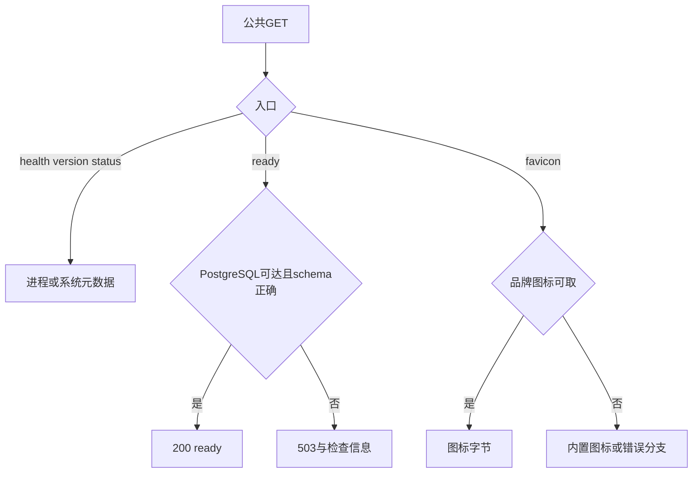

### flow-initialize

B-HTTP-03：部署者，尚未初始化；先GETstatus，POSTinitialize JSON owner_email、owner_password（后端至少6字符）、owner_first_name、owner_last_name、brand_name、prefer_language；财务字段accounting_currency_code/credit_display_name/credits_per_accounting_unit或defer_financial_setup=true。成功success/message后signin；字段非法/已初始化400、状态/初始化失败500。事务创建，不能重复提交绕过状态。system_handlers.rs:119,236；wiring_postgres_system_initialize.rs；wiring.rs::DbSystemService:4416。UI更严格要求至少8字符。

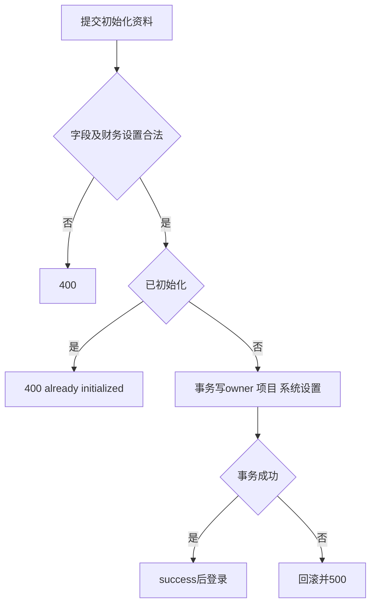

### flow-password-auth

B-HTTP-04/05：用户signin POSTemail/password→user/token→后续admin Bearer JWT。signup需api_auth.allow_password_signup，POSTemail/password（至少8字符）及可选firstName/lastName，邮箱规范化，201返回user/token。格式400；登录密码错401/停用403；注册禁用403/重复邮箱或系统未初始化409/限流429/内部500。auth_handlers.rs:145,203；wiring_postgres_auth.rs::PgSignupService；wiring.rs:4622。

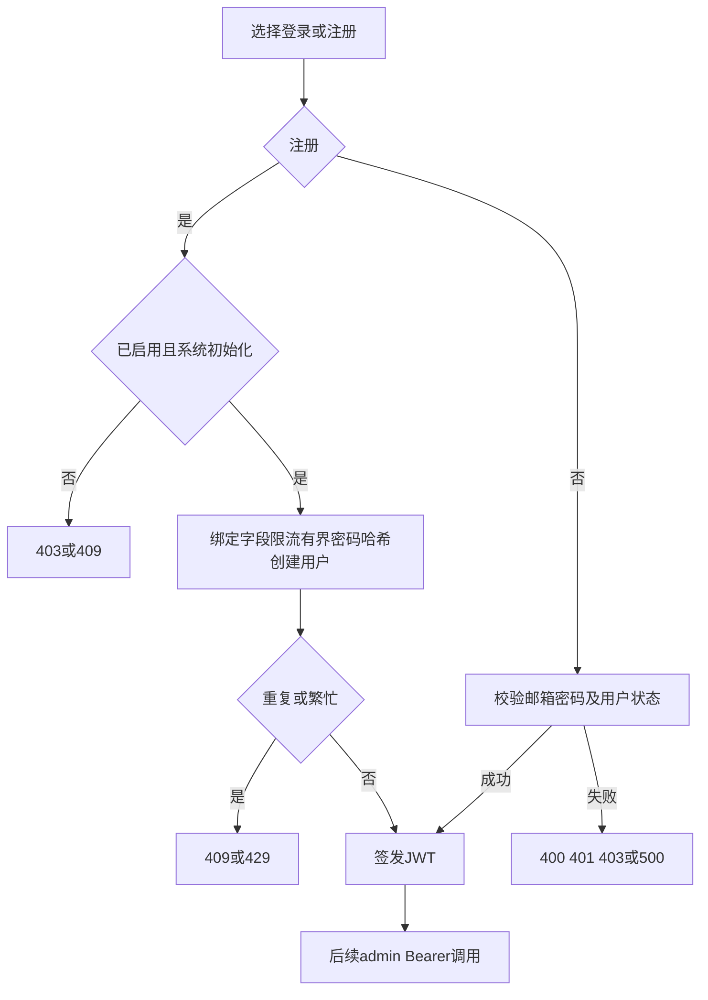

### flow-oidc

B-HTTP-06/07：用户，关联还需JWT；GETproviders选启用provider→登录GETauthorize/{provider}或关联GETadmin/oidc/link/{provider}→跳转返回URL→身份提供方callback（单或多provider）→POSTexchange一次性ticket取本地JWT。回调验证state、一次性会话、code换token、JWKS签名/issuer/audience/nonce、verified email与issuer/subject。过期/无效/关联冲突重新发起，不重复消费ticket；redirect错误检查publicURL/受信代理。oidc_handlers.rs:274,307,366,416,548；wiring_oidc.rs:720-765；pg_oidc_repo.rs。

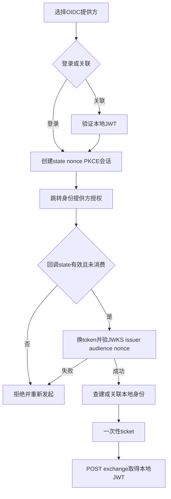

### flow-provider-oauth

B-HTTP-08：持JWT渠道维护者，保存渠道受schema写权限。Codex/ClaudeCode POSTstart空JSON→授权URL→POSTexchange(session_id/callback_url)→credentials用于配置；Antigravity start可project_id；Copilot start空body或proxy→verification URL/device code→poll session_id，pending继续、slow_down放慢、complete保存；Codex已有auth文件可POSTdecode auth_json。未知provider404、缺字段/过期/state400、上游502、配置/编码500。取得credentials不证明推理，registry阻断codex/claudecode/antigravity/github_copilot聊天outbound。oauth_handlers.rs:402,503,567,620；wiring_oauth_admin.rs；wiring.rs:254-272。

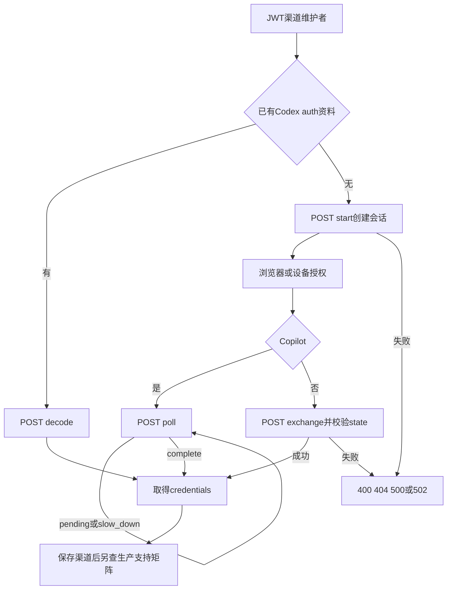

### flow-request-content

B-HTTP-09/10：owner或read_requests JWT；选项目和request_id，GETcontent/preview带X-Project-ID；content读已存文件；processing流式preview有replay/chunk/completed，否则static-fetch responseChunks。未授权/跨项目/不存在/未保存/存储key前缀错404；非法id/project头400；存储500；SSE idle3分钟结束，可重连读快照。request_content_handlers.rs:250-335；request_preview_handlers.rs:453-590；wiring_request_content.rs。

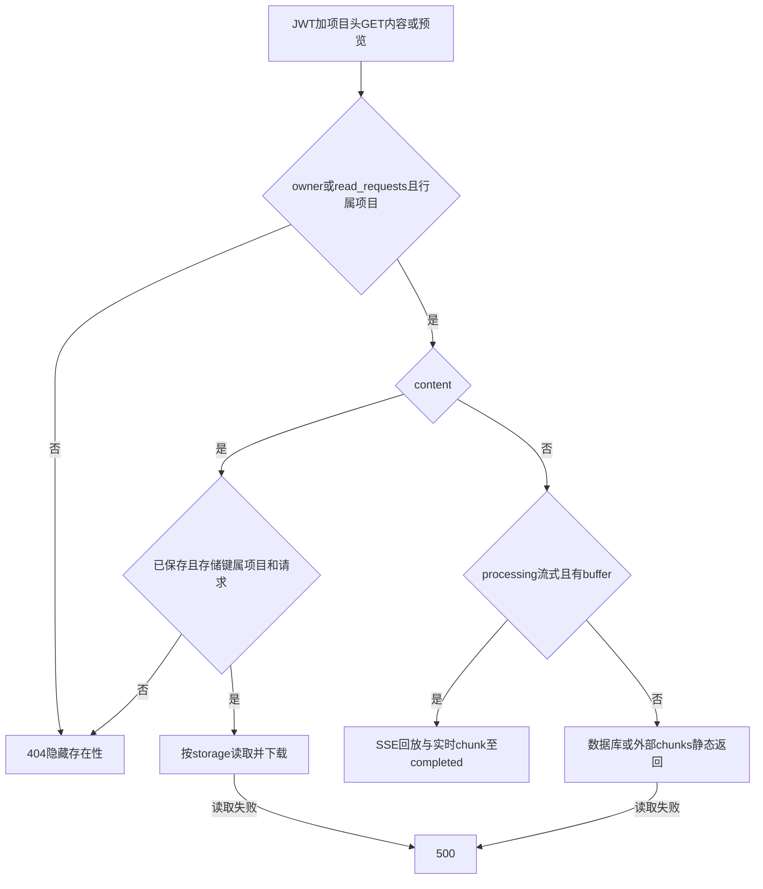

### flow-management-api

B-HTTP-11/12/13：浏览器POSTadmin/graphql(query/variables/operationName)，JWT GETadmin/playground调试；service_account API key POSTopenapi/v1/graphql，5根操作见后端页；POSTopenapi/webhook/echo提交测试载荷、敏感headers过滤；系统自动化key还需system:admin，POSTinternal/v1/graphql采用完整admin schema并提升owner上下文，目标由resolver输入。必须检查errors，HTTP200不等于成功。普通user key访问openapi401，缺system:admin403，schema未接线503。graphql_handlers.rs:69,113；openapi_graphql_handlers.rs:11；router.rs:557-593；wiring.rs:797-929。

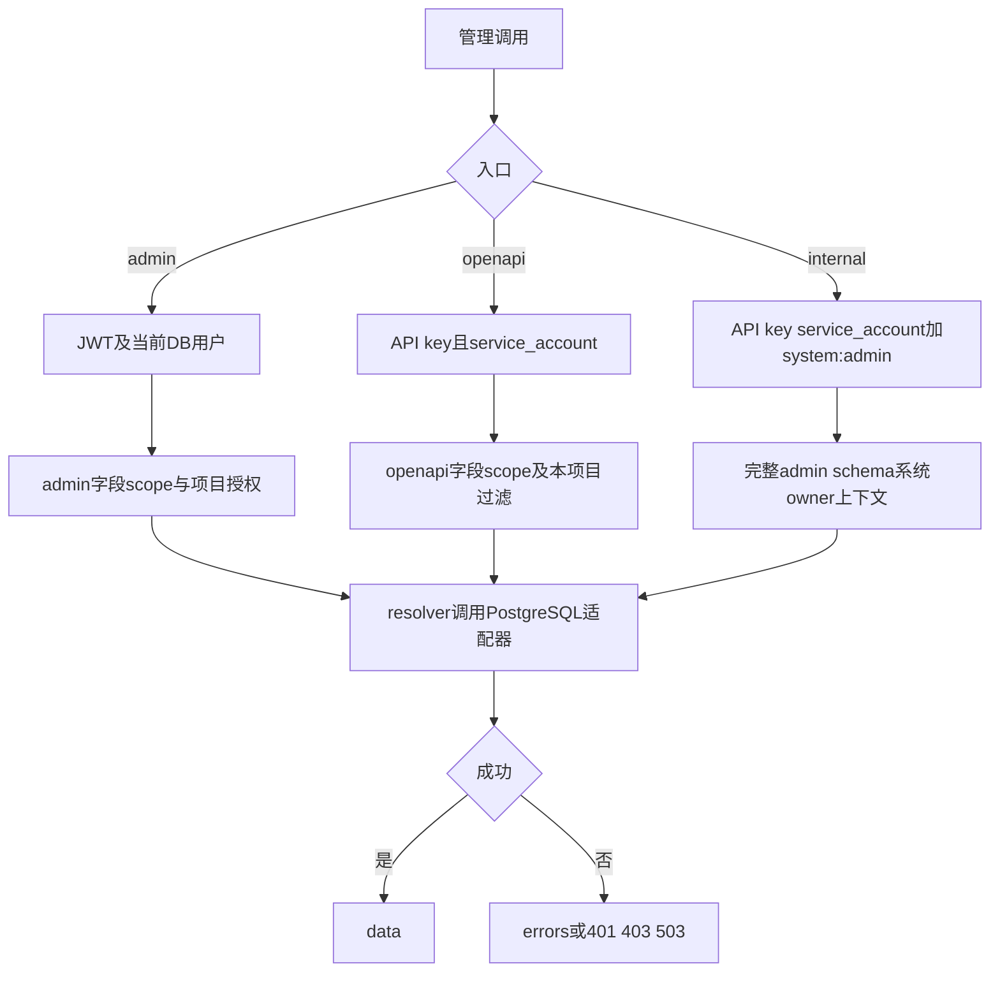

### flow-model-list

B-HTTP-14：API消费者，有效key和项目模型权限。GET /v1/models选择可用id；GET /v1/models/{model}取单项（model可含斜线）；Anthropic/Gemini分别用其列表路径。OpenAI include可请求扩展字段。无效401，模型不可见按过滤/隐藏处理，读服务错500。DbModelService读取有效项目目录；模型存在不保证channel协议接通。openai_handlers.rs:134,198,2266；wiring.rs::DbModelService:4817。

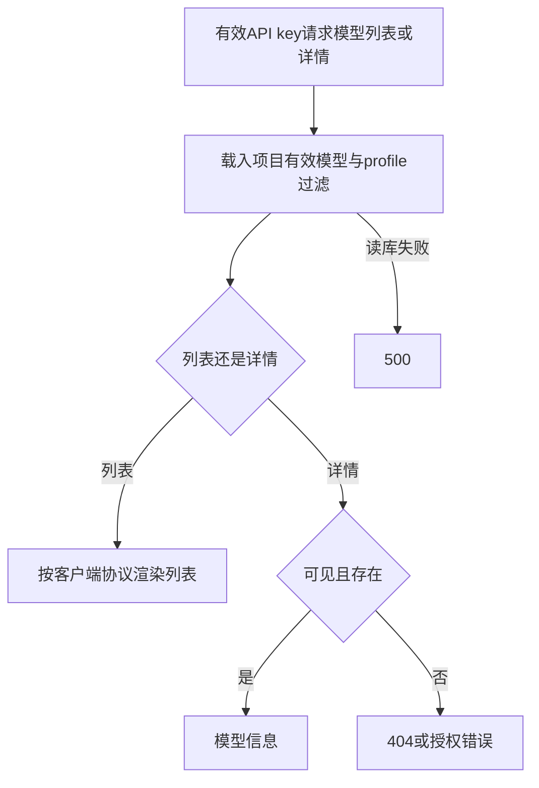

## 推理操作矩阵

B-HTTP-15至20及21/22创建：1 使用BASE和有效API key；2 选已授权model、协议和Content-Type；3 按表body POST；4 非流式读完整响应，流式读至协议terminal；5 用响应trace/request header在管理请求页看选路、attempt、usage。每行映射flow-inference，不省略个别格式。

| 操作 | body与调用步骤补充 | 结果与生产边界 |
| --- | --- | --- |
| chat/completions | JSON model+messages，stream=true为SSE | chat出站接通，条件provider可用 |
| responses | JSON model+input，可previous_response_id/prompt_cache_key | Responses事件/id用于亲和 |
| completions | JSON model+prompt | 专属legacy completion出站未注册，显式endpoint拒绝 |
| responses/compact | 紧凑Responses JSON | compact注册，共享Responses transformer；不保证所有字段/提供方 |
| messages及anthropic alias | JSON model+messages+max_tokens，version/beta header | Anthropic结构/事件，可跨已接通chat格式 |
| messages/count_tokens及alias | 原生结构计数请求 | 入站和编排存在，需核对endpoint计数能力，未真实provider验证 |
| Gemini两prefix generateContent/streamGenerateContent | model在URL，JSON contents；alt=sse | Gemini chat出站接通，默认JSON流或SSE |
| embeddings及Jina alias | JSON model+input，Jina可task | 入站/契约有，专属出站未注册 |
| rerank两alias | JSON model+query+documents，可top_n | jina/rerank出站未注册 |
| images/generations | JSON model+prompt等 | generation入站/契约有，专属出站未注册 |
| images/edits | multipart model/image，可mask/prompt | 64MiB；误走要求JSON的ChatInbound，无multipart解析链 |
| audio/speech | JSON model+input+voice，stream_format选字节/SSE | binary/SSE逻辑有，专属audio_speech出站未注册 |
| audio/transcriptions | multipart file+model | 64MiB；生产上传执行链缺失 |
| audio/translations | multipart file+model | 同上，normalizer单测不证明生产可用 |
| videos创建 | JSON model与视频payload | body helper有，专属video出站未注册 |
| Doubao tasks创建 | JSON原生model/content等 | DoubaoVideoInbound有，seedance/video出站未注册 |

证据：wiring.rs::build_outbound_transformer_registry:148仅5聊天格式；traits.rs::TransformerRegistry::outbound:261精确匹配；pipeline.rs:1767拒绝缺transformer；candidates.rs:720/737 endpoint能力选择可回退first；endpoint.rs:222每provider默认仅primary。手工endpoint.path回退不能证明跨协议完整支持。

multipart断链：wiring.rs:5621-5623三upload映射ChatCompletions→openai_bridge.rs:203→OpenAiChatInbound::inbound_request:1032要求JSON/application/json；HTTPdispatch:1477保留原body，没有multipart解析。

失败：401核对key，403模型/项目/IP/CORS，429或403 quota_exceeded检查key/channel/provider额度与钱包，404查模型/offer，400查body/Content-Type/transport，504查deadline。上游失败按协议envelope，重试耗尽看最后attempt；流开始后错误是协议事件/断开，不能期待改发HTTP状态。

### flow-inference

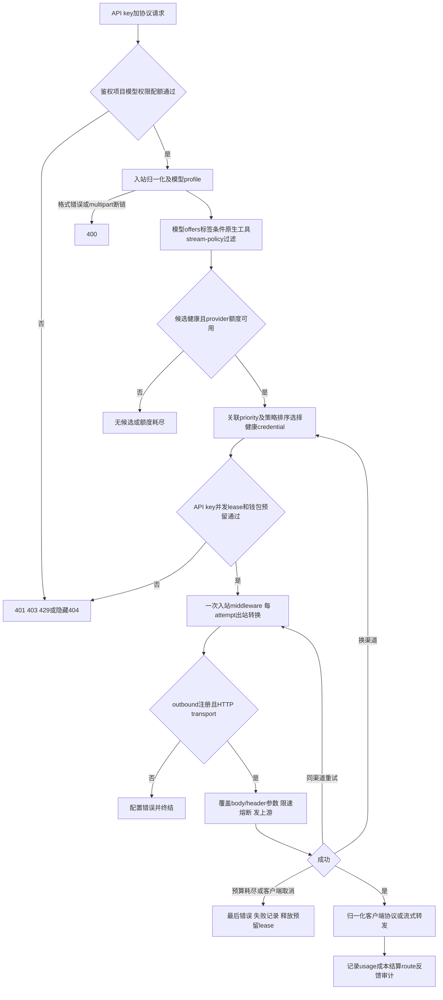

### flow-video-local

B-HTTP-21/22读取删除：同项目API key；取得external task id→GET videos/{id}或Doubao tasks/{id}返回本地response_body（无body为{}）→DELETE本地改canceled（已canceled幂等）。跨项目404；terminal状态不可取消invalid_request；DB失败500。不发上游GET/DELETE，不证明停止生成或退款；storage扫描不能替代提供方poll。wiring_video.rs::get_task_by_external_id:84、delete_task_by_external_id:136；openai_handlers.rs:854,902。

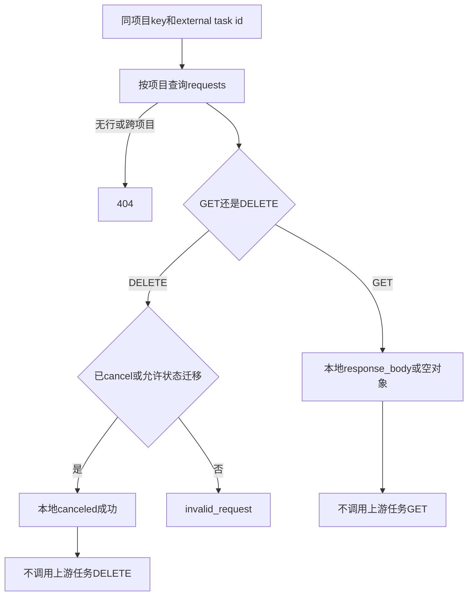

### flow-static

B-HTTP-23：浏览器打开BASE/；embed-frontend或文件根取资源，SPA允许路径返index进入UI鉴权。缺资源404；路径穿越/错误base拒绝；API缺失不能视为可用页面。embed feature需前端已构建。router.rs:731,935；asset_source.rs；static_files.rs。

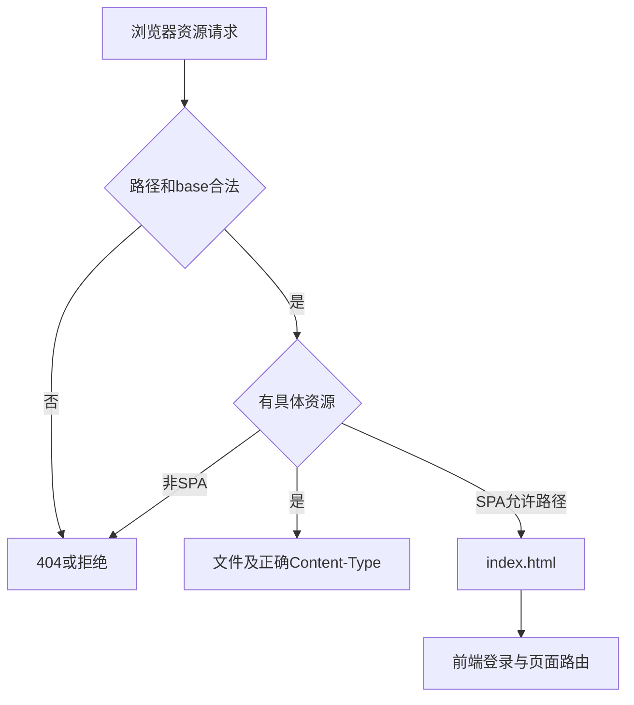

## 请求期限与计量持久化

流从准入开始受完整llm_request_timeout约束，背压等待也在期限内；取消和deadline取消上游并一致记录request/execution。成功stream terminal在usage白名单WAL fsync接受后才发送，PG不可用时保留journal重放；journal失败不能以成功终结。完整步骤和失败恢复见[计量流程](backend.md#flow-durable-usage)，记录的body/chunks依storagePolicy，历史流事件与字节有有限预算。未新增不支持协议的出站能力。
