# 启动、配置、开发与运维

本页绑定 [输入清单](source-manifest.md) 的源码基线。操作来自现有源码、部署配置与脚本；本次没有启动产品、变更数据库、调用真实上游或执行发布。用户执行部署/测试时产生的副作用与这里的静态探索证据分开。

主 router 的 HTTP 路径须加 `server.base_path`；metrics 使用独立 listener 及自身配置路径，不自动加主服务前缀。配置源是 [模型](../../crates/conduit-config/src/model.rs)、[加载器](../../crates/conduit-config/src/loader.rs)、[验证器](../../crates/conduit-config/src/validate.rs) 和 [完整示例](../../config.example.yml)；运行中的管理设置还可能来自 PostgreSQL，不把所有 UI 设置等同于配置文件。

## 配置方式

优先级为默认值 → 配置 YAML → `CONDUIT_*` 环境变量 → loader 的调用方 overrides。当前可执行程序只暴露 `--config`，没有 `--port`；不能将 loader 的 `CliOverrides.server_port` 误写成实际命令行参数。默认缺少 `config.yml` 时依次搜索当前目录、`/etc/conduit`、用户 `.config/conduit`、`./conf`；显式指定的文件必须存在。

| 类别 | 用户用途与前置条件 | 当前实现与操作流程 |
| --- | --- | --- |
| server | 地址、端口、base_path、public_url、超时、CORS、trusted_proxies、trace、dashboard | 修改环境/YAML → [校验与启动](#flow-config)；base_path 必须合法，OIDC 要求可信规范外部 URL；代理白名单默认空 |
| db | PostgreSQL DSN、池大小、超时、自动迁移、read_replica | [数据库准备](#flow-database)；仅 postgres/postgresql/pg；副本落后按 fallback 配置拒绝或禁用副本 |
| log | 级别、JSON/文本、stdout、目录及滚动文件 | [观测](#flow-observe)；输出目录需运行用户写权限；文件目前DAILY轮转和max_backups，max_size/max_age/compress未接入 |
| metrics | enabled、host、port、path | [观测](#flow-observe)；独立端口可与主监听分别失败 |
| cache | noop、memory、redis、two_level 与 route_affinity TTL | Redis 需要 `redis` Cargo feature；参考[后端自动功能](backend.md)，重启应用配置 |
| gc | stale_processing、请求与用量日志保留/清理 | 自动维护由运行装配启用；参考[后端自动功能](backend.md)，清理请求/日志默认关闭 |
| provider_quota | 轮询间隔、警戒比例及供应商设置 | 条件自动启用；没有提供商凭据时不可视为探测成功 |
| oidc | 提供方、scopes、redirect_base_url、state_ttl | 条件启用；登录步骤见[前端](frontend.md)与[HTTP](http-api.md) |
| api_auth | JWT、session_ttl、bcrypt_cost、公开密码注册 | 注册默认关闭；具体入口权限见[HTTP](http-api.md) |
| retry | 开关、次数、延迟、策略、错误传递与超时 | 编排流程见[后端](backend.md)；配置 timeout 不能超过 600s |
| 构建 feature | redis、otel、embed-frontend、embedded-postgres、release-binary | feature 名存在不代表完整能力：otel 未形成完整 OpenTelemetry 出口；release-binary 聚合 Redis、嵌入前端和 Windows 数据库 |
| 运行额外环境 | `CONDUIT_DATABASE_MODE`、`CONDUIT_EMBEDDED_POSTGRES_DIR`、`CONDUIT_BACKUP_ENCRYPTION_KEY`、提供方 OAuth client 配置 | 分别由数据库准备、备份、OAuth 装配读取；秘密值通过部署环境注入，文档只保留变量名称 |

## 启动与数据库操作

证据：[CLI](../../crates/conduit-bin/src/cli.rs)、[Windows 数据库](../../crates/conduit-bin/src/embedded_postgres.rs)、[Dockerfile](../../Dockerfile)、[Compose](../../compose.yml)、[生产部署](../production-deployment.md)。

| ID / 操作 / 类型 | 角色、前置与入口 | 步骤 | 预期结果与失败处理 | 流程 |
| --- | --- | --- | --- | --- |
| I-01 Compose 配置检查、构建及启动 / 运维CLI | 机器运维者；Docker/Compose 与部署密钥；仓库根 | 1 配置 `CONDUIT_POSTGRES_PASSWORD` 为 URI-unreserved 字符；2 `docker compose config --quiet`；3 `docker compose up --build -d`；4 检查 ps 与 base_path 下 health/ready；5 打开首页完成 owner 初始化 | PostgreSQL 健康后启动网关，默认绑定主机127.0.0.1:8090；缺密码在渲染时失败；数据库未健康、端口占用或迁移问题先查脱敏日志，不删除卷 | [启动](#flow-start) |
| I-02 源码构建及启动 / 开发CLI | 开发者；Rust1.96.0、Node22.23.2、pnpm10.23.0、外部PostgreSQL | 1 `pnpm --dir frontend install --frozen-lockfile`；2 `pnpm --dir frontend build`；3 `cargo build --locked -p conduit-bin --bin conduit-api`；4 配置应用DSN；5 `conduit-api --config <文件>`（按构建目录定位binary） | 服务读 frontend/dist；只有后端时管理资源可能缺失；默认 cargo feature 不包含Redis/嵌入前端；编译、配置、DB失败修复后重启 | [启动](#flow-start) |
| I-03 Windows 托管本地 PostgreSQL / CLI | Windows官方带embedded-postgres发布包、当前用户目录可写；首次启动 | 1 运行 conduit-api.exe；2 无外部配置且交互终端时选Managed local PostgreSQL；3 等待数据库准备；4 打开控制台初始化 | 持久数据默认 `%LOCALAPPDATA%/Conduit API/embedded-postgresql`，重启复用；显式 `CONDUIT_DATABASE_MODE=embedded` 与 `CONDUIT_DB_DSN` 冲突会拒绝；非支持构建用external；已有数据不随程序删除 | [数据库](#flow-database) |
| I-04 外部数据库 bootstrap / CLI | 有一次性PostgreSQL管理员连接及应用DSN；维护DB与目标在同主机端口 | 1 在受控环境设置 `CONDUIT_DB_ADMIN_DSN` 和 `CONDUIT_DB_DSN`；2 `conduit-api database bootstrap --confirm <目标数据库名>`；3 清除admin变量；4 用应用账户启动 | 创建缺失role/DB；已有DB不改；名称确认不匹配、连接跨主机端口、admin连到目标DB或权限不足会失败；核对配置后再执行 | [数据库](#flow-database) |
| I-05 owner密码重置 / CLI | 部署管理员；已初始化的数据库；新密码至少8字符 | 1 用受控环境提供 `CONDUIT_ADMIN_RESET_PASSWORD`；2 `conduit-api --config <文件> admin reset-password [邮箱]`；3 清除变量；4 owner重新登录 | 重置既有系统owner，不是普通用户批量重置；邮箱可省略，需匹配owner；配置/DB/账户失败先核对目标；密码不放argv | [恢复账户](#flow-reset) |
| I-06 配置preview / CLI | 运维者；YAML/环境有效 | 1 `conduit-api --config <文件> config preview`；2 检查脱敏后的合并配置；3 修正源配置 | 校验后按key名称mask；`db.dsn`未被该mask规则覆盖，可能输出连接密码，须在受控终端检查，不能把完整preview收集入日志。解析/环境错误2，校验3 | [配置](#flow-config) |
| I-07 配置validate / CLI | 同上 | 1 `conduit-api --config <文件> config validate`；2 核对退出码与config valid | 不启动服务、不验证实际DB连通性；修复报错字段再检查 | [配置](#flow-config) |
| I-08 配置get / CLI | 本机受信运维者；有效配置 | 1 `conduit-api --config <文件> config get <key>`；2 读取所选值 | 仅支持server.port/name/base_path/debug与db.dialect/dsn；未知key返回4。`db.dsn`直接输出原值，可能含密码；只在受控终端使用，不收集到任务日志 | [配置](#flow-config) |
| I-09 version / CLI | 任何本机用户；binary存在 | 1 `conduit-api version`；2 核对版本 | 打印编译版本，不加载数据库；不同版本核对下载/构建来源 | [本机查询](#flow-info) |
| I-10 build-info / CLI | 同上 | 1 `conduit-api build-info`；2 核对version/commit/build_time/branch | 与部署记录比较；本地metadata可能为回退值，不把它等同于签名验证 | [本机查询](#flow-info) |
| I-11 help/--help / CLI | 同上 | 1 `conduit-api help`或`conduit-api --help`；2 根据子命令help取参数 | 显示当前CLI，错误参数由clap拒绝；没有CLI登录、创建渠道或创建API key子命令 | [本机查询](#flow-info) |
| I-12 停止服务 / 运维CLI+自动 | 进程/容器操作者；会有在途请求 | 1 原生Ctrl+C或发送SIGTERM；Compose用 `docker compose stop`；2 等待graceful timeout；3 检查退出 | HTTP优雅停止，metrics task中止并等待，maintenance关闭；超时/进程未退出核对目标进程后处理。卷保留；本次探索未运行这些动作 | [停止](#flow-stop) |

### flow-start

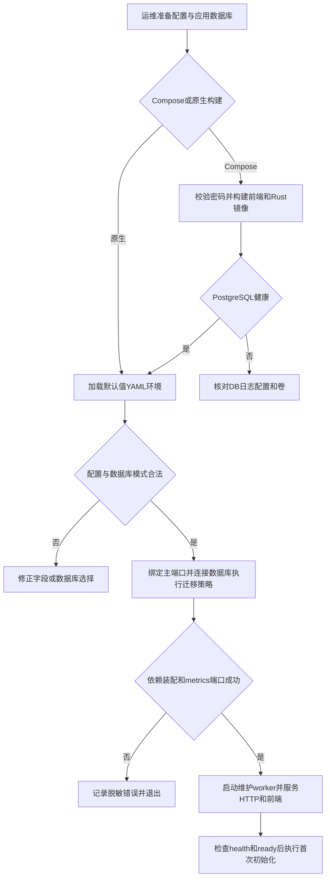

### flow-database

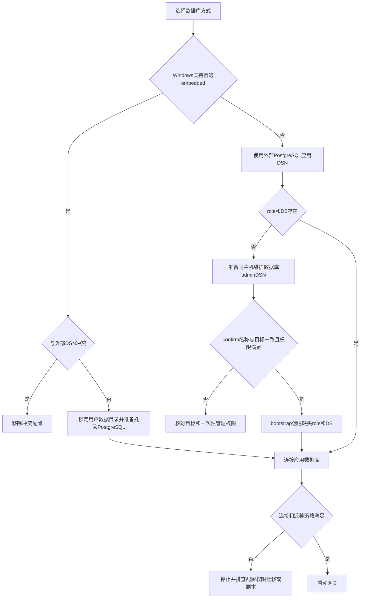

### flow-reset

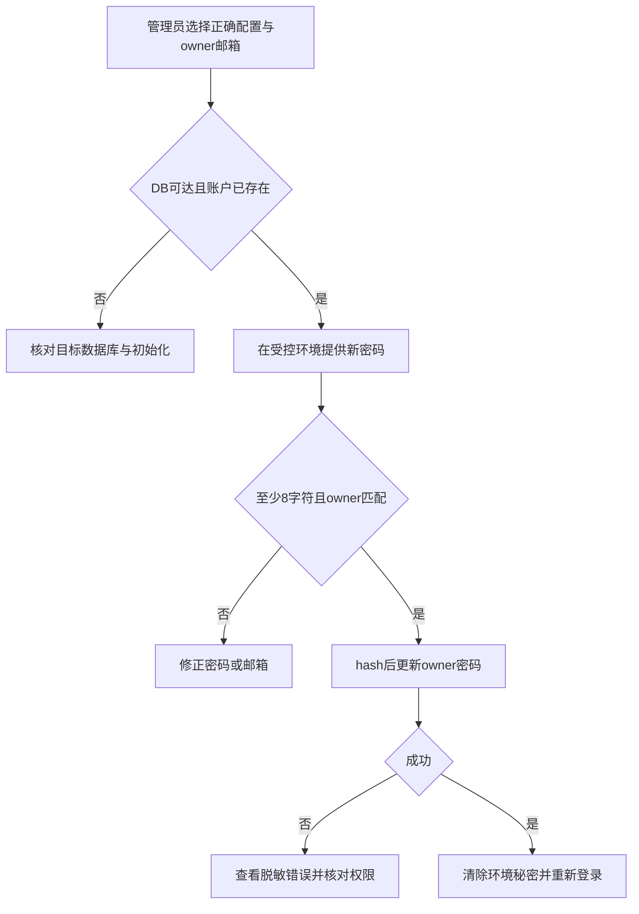

### flow-config

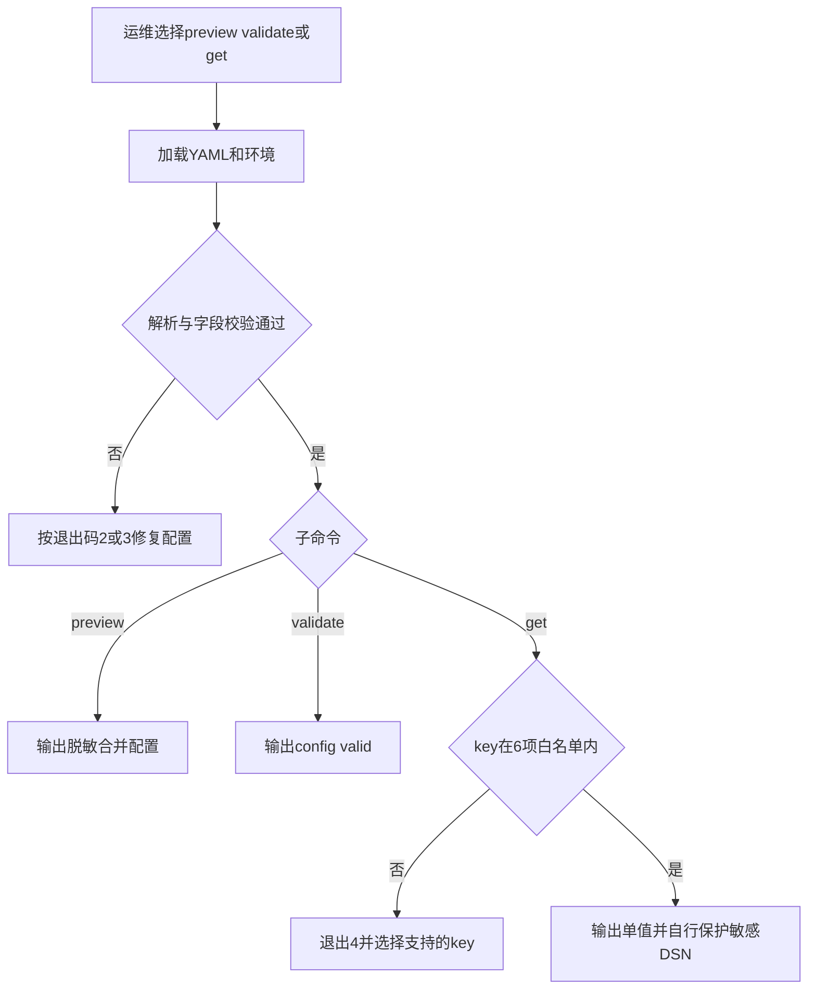

### flow-info

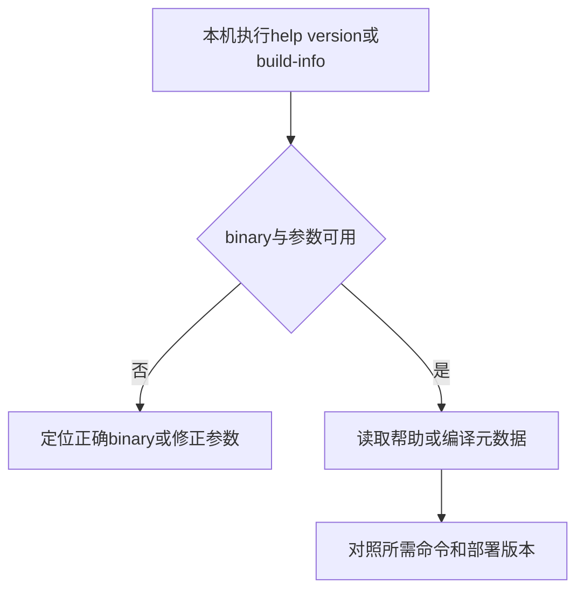

### flow-stop

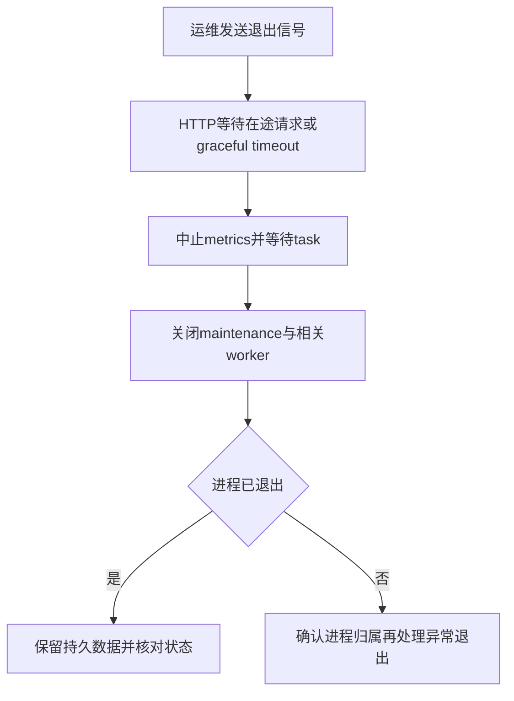

## 观测、备份与更新

| ID / 类型 | 角色与前置 / 入口 | 步骤 | 结果与失败处理 | 流程 |
| --- | --- | --- | --- | --- |
| I-13 读取health/ready / HTTP | 运维/探针；部署地址可达 | 1 GET base_path/health；2 GET base_path/ready；3 据状态区分进程存活与DB readiness | health不等于上游可用；ready失败查DB，代理路径错误查base_path；完整公共路径见[HTTP](http-api.md) | [观测](#flow-observe) |
| I-14 日志与metrics / 运维+自动 | 运维者；log目录权限/metrics启用和可达 | 1 配置log级别与输出；2 配置metrics host/port/path；3 重启；4 采集stdout/滚动日志并GET metrics独立端口；5 建立告警 | metrics端口绑定失败会使启动失败；禁用时无listener；只读取脱敏运维数据，不能把tracing feature名视为完整OpenTelemetry集成 | [观测](#flow-observe) |
| I-15 PostgreSQL备份及恢复演练 / 外部工具 | DB运维者；备份权限/独立恢复目标 | 1 用PostgreSQL pg_dump创建逻辑备份；2 校验备份；3 用pg_restore在可丢弃数据库演练；4 检查登录、余额和账本；5 记录加密/访问策略 | 这是PostgreSQL运维能力，不是应用内一键完整财务备份。应用JSON备份不包含完整wallet ledger/兑换状态；失败保留原DB并修复演练目标 | [更新恢复](#flow-upgrade) |
| I-16 更新及回滚 / 运维CLI | 运维者；旧image/source与可恢复DB快照，生产部署指南 | 1 先做完整DB备份；2 保存当前image digest；3 构建/拉取候选并重建服务；4 检查health/ready登录、模型、用量、metrics；5 失败时恢复相匹配旧image和DB快照 | 自动迁移可能不可逆，不能只回滚binary；副本/禁自动迁移条件见后端；失败查当前schema版本，不重命名既有迁移 | [更新恢复](#flow-upgrade) |

### flow-observe

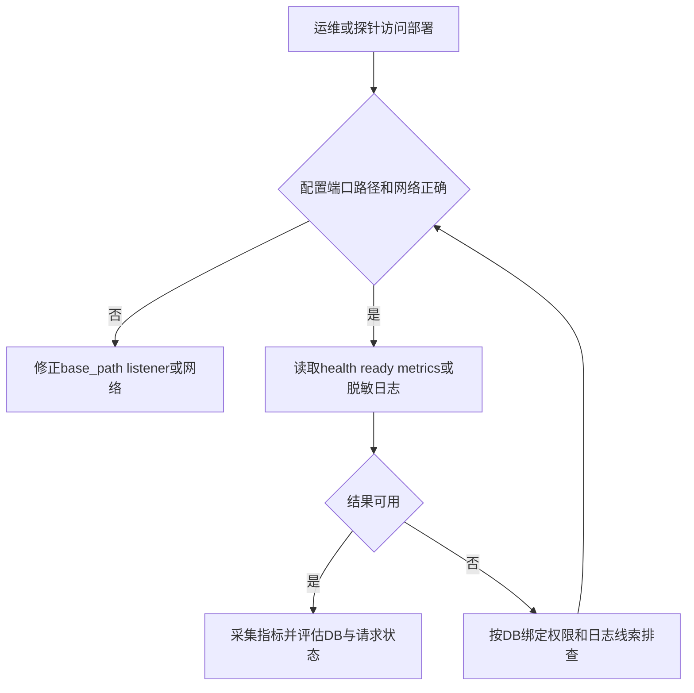

### flow-upgrade

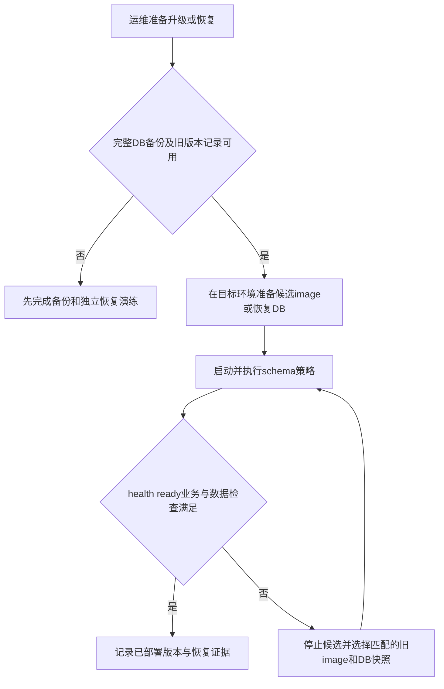

## 开发、验证及自动发布

证据：[AGENTS](../../AGENTS.md)、[Makefile](../../Makefile)、[发布门禁](../../RELEASE_GATES.md)、[E2E说明](../../scripts/e2e/README.md)、[真实提供商说明](../../scripts/provider-compatibility/README.md)。下表介绍用户能够运行的操作，不声称本次运行过这些产品门禁。

| ID / 操作 / 类型 | 角色、前置及入口 | 步骤 | 结果与失败处理 | 流程 |
| --- | --- | --- | --- | --- |
| I-17 Rust局部/工作区门禁 / 开发CLI | 开发者；已安装workspace toolchain/依赖 | 1 cargo metadata --no-deps --format-version 1；2 cargo fmt --all -- --check；3 cargo test -p受影响包；4 cargo clippy -p受影响包 --all-targets；共享契约/装配改动用workspace --all-targets test/clippy | 失败定位具体包，不减弱断言。make rust-test/rust-test-fast/rust-lint/rust-fmt/check/rust-build为对应快捷入口 | [开发检查](#flow-check) |
| I-18 PostgreSQL仓库/迁移检查 / 开发CLI | 开发者；隔离conduit_test数据库，不能用生产DSN | 1 bash scripts/db/verify_migrations_layout.sh；2 设置CONDUIT_TEST_POSTGRES_DSN；3 cargo test -p conduit-db；或make migration-test-rust | 目录仅postgres，32份当前SQL名称NNNNNN；编号缺口不是遗漏文件。未设置DSN时不能把DB测试跳过视为DB行为通过 | [开发检查](#flow-check) |
| I-19 前端门禁与本地开发 / 开发CLI | 前端开发者；锁定Node/pnpm和依赖 | 1 pnpm --dir frontend format:check；2 lint；3 test:unit；4 build；开发时dev并使用命令给出的本地URL；preview检查构建结果 | Makefile build同时产出frontend和release binary；前端build不等于TS全量独立typecheck；失败按命令报告处理 | [开发检查](#flow-check) |
| I-20 E2E preflight / 开发CLI | 开发者；本机工具、空闲端口、E2E配置 | 1 pnpm --dir frontend test:e2e:check；2 根据报告补工具和安全目标 | preflight不连DB、不建删DB、不启动服务；不能代替运行套件 | [开发检查](#flow-check) |
| I-21 隔离浏览器E2E / 开发CLI | 本机PostgreSQL createdb权限、Playwright Chromium、缓存构建依赖 | 1 设置loopback且dbname为conduit_e2e或conduit_e2e_*的CONDUIT_E2E_POSTGRES_DSN；2 test:e2e（可headed/ui/debug/setup）；3 查看test:e2e:report | harness先drop/recreate指定DB、启动mock/backend/Vite，末尾停止子进程并删DB；--keep-db仅显式诊断。拒绝生产样式DB名/外部URL/被占端口；失败先确认自身资源清理 | [隔离测试](#flow-e2e) |
| I-22 真实提供商兼容探测 / 条件CLI+CI | 获准使用的测试部署/提供商账户；可产生费用 | 1 设CONDUIT_TEST_REAL_PROVIDER=1、CONDUIT_COMPAT_GATEWAY_URL/API_KEY/MODEL/PROTOCOLS；2 node scripts/provider-compatibility/provider-smoke.mjs；3 只检查名字与状态码 | 远程URL要求HTTPS，loopback可HTTP；默认/PR不调用live。定时CI还需CONDUIT_REAL_PROVIDER_ENABLED=1和environment secrets；失败核对测试key、模型/协议及上游 | [条件探测](#flow-provider-check) |
| I-23 schema与license生成/检查 / 开发CLI | Rust与平台所需cargo-about0.9.2；bash | 1 bash scripts/generate_config_schema.sh --check；2 修改模型时显式无--check重新生成schema；3 bash scripts/licenses/check-rust-third-party.sh --check（更新授权时--write） | check只检查目标文件漂移；工具仍会创建编译/临时文件。license脚本非Linux需预装正确cargo-about，失败先核对平台/工具 | [开发检查](#flow-check) |
| I-24 安全与契约检查 / 开发CLI | Node/Rust工具；当前源 | 1 node scripts/rust/security-static-check.mjs及--self-test；2 node --test scripts/provider-compatibility/provider-smoke.test.mjs；3 make contract-test；4 运行workspace契约相关测试 | contract-test只证明snapshot文件存在；静态安全检查是本仓库规则，不是全程序SAST。crate testkit提供fake_provider/fixtures/golden/stream/测试DB；无生产端点 | [开发检查](#flow-check) |
| I-25 mock路由normal/fault切换 / 测试CLI | 开发者；显式隔离mock数据和psql；不能继承普通部署DSN | 1 检查目标仅为测试库；2 scripts/db/set_mock_route_mode.ps1 -Mode normal或fault -DatabaseUrl受控测试DSN；3 核对mock-chat路由；4 测试后normal恢复 | 脚本在事务中直接更新测试channel/deployment/routes；本身没有E2E harness的安全dbname/host校验；对象缺失会失败，不是生产路由管理UI替代品 | [隔离测试](#flow-e2e) |
| I-26 发布门禁及CI / 自动 | 仓库维护者；PR/main或workflow_call、隔离CI PostgreSQL | 1 提交经授权的开发变更进入仓库CI；2 查看release-gates；3 Rust/frontend/审计/E2E成功后container smoke；4 CodeQL独立检查JS/TS | CI未在本次探索执行；每门禁绑当前commit；失败修复再运行。CodeQL配置只分析JS/TS | [发布](#flow-release) |
| I-27 immutable release发布 / 条件自动 | 仓库维护者另行授权发布；v* tag匹配workspace版本，commit属于main且release尚未存在 | 1 完成release门禁；2 经独立发布授权创建正确tag；3 工作流检查remote tag未移动；4 查看multiarch image/native/source/SBOM/attestation/SHA256SUMS；5 用digest部署 | tag移动、重复version、门禁失败会拒绝。Windows官方包启用release-binary；Linux包要求外部PostgreSQL；本次没有创建tag、推送或发布 | [发布](#flow-release) |
| I-28 本地Rust smoke / 开发CLI | Bash及Rust工具 | 1 bash scripts/rust/smoke.sh；2 按需要配置CONDUIT_SMOKE_TEST_PACKAGES；3 核对每步骤与跳过项 | 默认仅测试conduit-core，另做workspace check；skip变量会缩减检查，不能称完整release gates | [开发检查](#flow-check) |

### flow-check

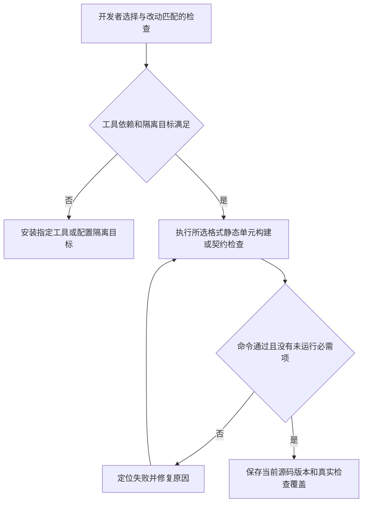

### flow-e2e

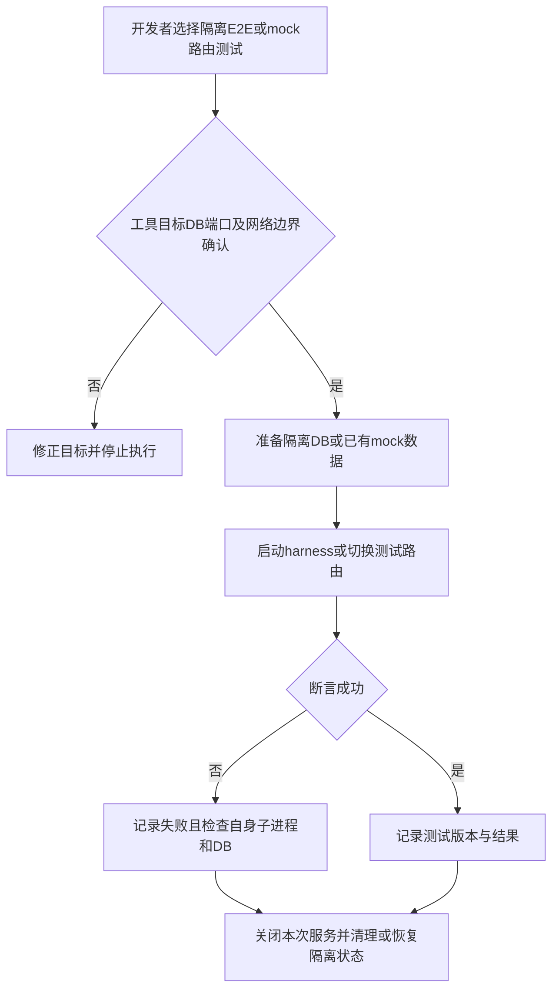

### flow-provider-check

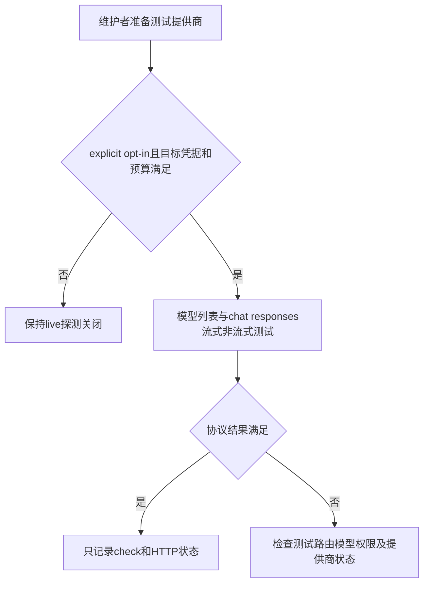

### flow-release

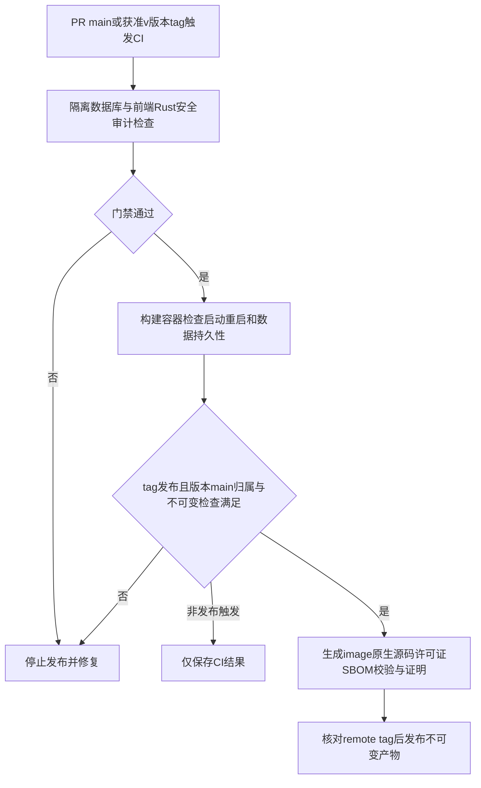

### flow-deploy

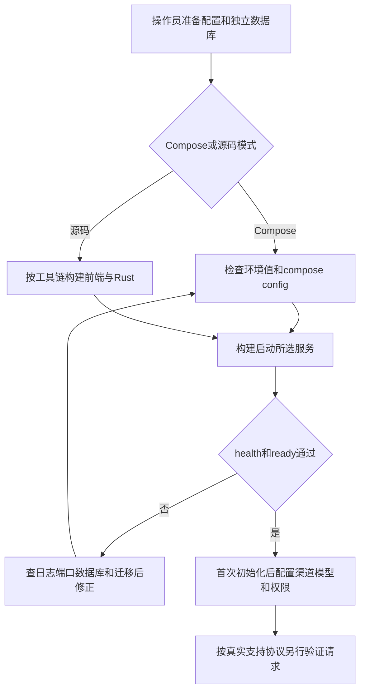

## 原生CLI九项到步骤与流程

| 原生命令ID | 命令 | 具体步骤/前置/错误 | 流程 |
| --- | --- | --- | --- |
| B-CLI01 | `conduit-api --config config.yml` | [I-02](#I-02) | [flow-start](#flow-start) |
| B-CLI02 | `conduit-api --config config.yml config preview` | [I-06](#I-06) | [flow-config](#flow-config) |
| B-CLI03 | `conduit-api --config config.yml config validate` | [I-07](#I-07) | [flow-config](#flow-config) |
| B-CLI04 | `conduit-api --config config.yml config get <key>` | [I-08](#I-08) | [flow-config](#flow-config) |
| B-CLI05 | `conduit-api --config config.yml admin reset-password [owner-email]` | [I-05](#I-05) | [flow-reset](#flow-reset) |
| B-CLI06 | `conduit-api --config config.yml database bootstrap --confirm <exact-database-name>` | [I-04](#I-04) | [flow-database](#flow-database) |
| B-CLI07 | `conduit-api version` | [I-09](#I-09) | [flow-info](#flow-info) |
| B-CLI08 | `conduit-api build-info` | [I-10](#I-10) | [flow-info](#flow-info) |
| B-CLI09 | `conduit-api help / --help` | [I-11](#I-11) | [flow-info](#flow-info) |

## 持久计量journal部署与恢复

启动配置新增usage_recovery，默认directory=data/usage-journal、max_bytes=1073741824、max_event_bytes=65536、replay_interval_seconds=5、replay_batch_size=100。对应环境变量为CONDUIT_USAGE_RECOVERY_DIRECTORY、CONDUIT_USAGE_RECOVERY_MAX_BYTES、CONDUIT_USAGE_RECOVERY_MAX_EVENT_BYTES、CONDUIT_USAGE_RECOVERY_REPLAY_INTERVAL_SECONDS、CONDUIT_USAGE_RECOVERY_REPLAY_BATCH_SIZE；改变启动配置须重启。示例与config.schema.json同步；容量须至少覆盖两倍单事件预算加1024字节。

1. 每实例选择独立、仅实例帐号可写的持久卷目录；容器临时层不可作为可恢复journal。只部署一个进程到同一目录，独占锁冲突会拒绝启动。
   默认compose挂独占conduit-usage-journal到/data/usage-journal，Dockerfile预建UID/GID10001、0700目录供空named volume初始化。已有卷或bind mount不会自动修正错误权限，部署者先确认UID10001可读写，不能用同一volume对服务盲目scale；多实例分别指定独立卷。
2. 保留WAL、ready索引和锁文件；卷备份含尚未PG commit的计量输入。不得在实例运行时复制目录给第二实例，或删除文件以解除容量/损坏错误。
3. 部署000036_recovery_lifecycle迁移，检查usage_recovery_receipts、maintenance_claims、artifact_deletion_queue及活动/过期列。仅关闭自动迁移不能跳过schema版本检查。
4. PG恢复后原实例从同一目录启动，检查replay错误、receipt/outbox与待定请求；事务幂等receipt防止不确定commit重复收费。容量满先恢复PG交接/排查未ack事件，不能释放未确认输入。
5. checksum损坏或payload冲突保留证据并拒绝新上游；由运维确认正确卷和备份。孤立metering_pending记录需核对原请求和事件，当前不自动猜测成功usage。

详细[计量流程](backend.md#flow-durable-usage)、[删除流程](backend.md#flow-artifact-delete)与[关停流程](backend.md#flow-supervision)。journal及本任务PG/runtime被.cbmignore排除，不得纳入源码图或日志原始业务载荷；默认目录及WAL/ready/quarantine/lock排除见[索引维护](indexing.md)。
